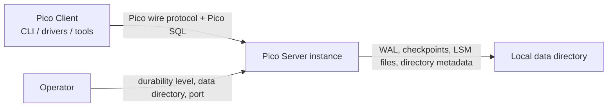
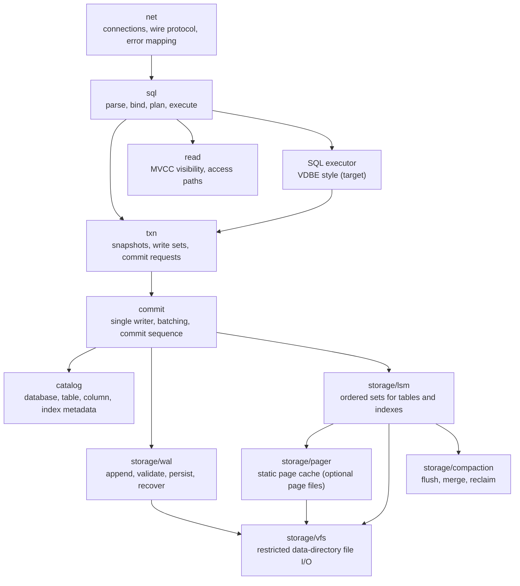
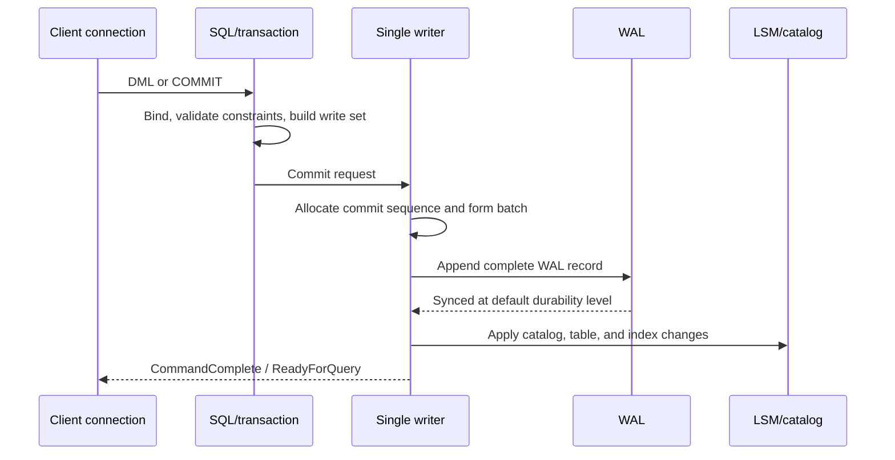

# Pico Architecture

## Decision Summary

Pico Server is a lightweight, single-node, network-accessible OLTP database. It is a standalone product; Pico Client is a separate product. Each instance owns one data directory and exposes the supported Pico SQL subset to Pico Client through the versioned Pico wire protocol. It is not an embedded library, a cluster, or a PostgreSQL-compatible implementation.

The target implementation uses a single writer as the commit-ordering point, MVCC snapshots for parallel reads, the WAL as the source of truth for recovery, and independent LSM ordered sets for tables and secondary indexes. By default, the WAL is durable before a successful commit response; checkpoints advance persistence within the data directory and are not user backups.

This document records target boundaries; it does not claim that Phase 1 is fully implemented. See [README](../README.md) for current status: in-memory tables and a versioned, CRC32-validated WAL are available, while persistent LSM storage, MVCC, transaction isolation, group commit, and the extended query protocol remain under development.

The detailed runtime boundaries for connection state, I/O backpressure, commit scheduling, and MVCC snapshots are in [Runtime, Connections, and Concurrency Control](architecture/runtime-and-concurrency.md). Version visibility, isolation levels, write-write contention, and reclamation invariants are in the [Concurrency Control Contract](architecture/concurrency-control.md). The data-directory file abstraction is in [VFS](architecture/vfs.md); fixed-size pages and the static cache are in [Pager and Static Page Cache](architecture/pager-and-static-cache.md); the target SQL executor shape is in [Execution Engine (VDBE Style)](architecture/vdbe.md).

The two-phase write-path and transaction-commit model is in [Write Path and WriteBatch](architecture/write-path.md). WAL frame format, recovery, and validation invariants are in [WAL and Crash Recovery](architecture/wal-and-recovery.md). The complete LSM design (MemTable, SST, Compaction, and Manifest) is in [LSM Storage Engine Design](architecture/lsm-storage.md).

## Rationale, Tradeoffs, and Non-Goals

Accepted ADR-0001 and ADR-0004 through ADR-0009 constrain this architecture. Priorities are:

1. Commit semantics remain recoverable after a crash, and unknown formats or corrupt complete records are never interpreted speculatively.
2. The write path remains predictable under contention, with one observable commit order.
3. Pico wire protocol and Pico SQL form an independent, deliberately bounded client contract.
4. Clear module boundaries and fault injection keep Zig storage code evolvable.
5. Single-instance deployment, resource usage, and startup remain simple.

Pico keeps its correctness arguments local and explicit. VFS fences storage to one data directory; the Pager has a fixed resource budget and does not define transaction safety; the execution program creates effects only through transaction and commit boundaries; and WAL, checkpoints, immutable LSM files, and fault injection establish the recovery story. These boundaries are deliberately smaller than the product: Pico does not provide page-level multi-process coordination, replaceable storage backends, replication, consensus, cross-instance repair, or a second durability path.

Explicit non-goals: multi-instance replication, sharding, failover, PostgreSQL compatibility, in-place B-Tree writes, and treating checkpoints as backups or PITR.

## Pico's Operating Story

An operator starts one **instance** against one **data directory**. A **connection** carries Pico Wire Protocol messages and Pico SQL statements into the server; it never receives a storage-file handle or relies on a server-internal module. A statement either produces rows from a stable **snapshot** or builds a private transaction write set. Neither path changes shared state by itself.

At commit, the single writer gives accepted work one observable order. It validates the write set against that order, records the complete logical change in the WAL, reaches the selected **durability level**, publishes catalog/table/index visibility, advances the commit watermark, and only then confirms success. This order is Pico's answer to two different failures: a crash cannot leave a confirmed logical change without recovery evidence, and a reader cannot see part of a published transaction.

The data files are an acceleration structure for the committed history, not a competing truth. Checkpoints and compaction make ordered LSM state efficient to read and bound WAL retention, but they may lag commits. On startup, recovery rebuilds a consistent state from the latest valid checkpoint plus the verified WAL prefix. If Pico cannot establish that prefix, it refuses to accept connections rather than inventing a repair.

This story also sets the resource behavior. A slow connection is backpressured at its own output boundary; a full commit queue rejects new work explicitly; a cache without an evictable page returns `CacheFull`; and maintenance yields to recovery and confirmed commits. Pico chooses visible, bounded degradation over hidden queue growth, an unbounded allocation path, or a weaker default durability guarantee.

## System Context

Pico Client depends only on the wire protocol, public error model, and published SQL support matrix; it does not depend on storage-file formats or server-internal modules. Pico Server uses only its local data directory and does not replicate state to other instances. This architecture makes no commitment about authentication, authorization, or TLS policy; those concerns must be designed separately. Product responsibilities and release boundaries are in [Pico Product Boundaries](products.md).

## Modules and Ownership

| Module | Sole responsibility | Owned state | May depend on |
| --- | --- | --- | --- |
| `net` | Protocol encoding/decoding, authentication entry point, and error mapping for one connection | Connection and session state | `sql`, `util` |
| `sql` | Lexing, parsing, binding, and execution scheduling for the SQL subset (target: a step-able executor) | Parsed statements, executor, short-lived execution state | `txn`, `catalog`, `util` |
| `catalog` | Database, table, column, and index definitions | Catalog metadata | `storage`, `util` |
| `txn` | Snapshots, write sets, logical conflict-range collection, and commit requests | Active transactions, MVCC timestamps, and private conflict ranges | `catalog`, `storage`, `util` |
| `commit` | Unique commit order, group commit, conflict-history validation, and write application | Bounded commit queue, next commit sequence, and published write-range history | `txn`, `catalog`, `storage`, `util` |
| `storage/wal` | WAL format, append, validation, and recovery | WAL files and durability boundary | `storage/vfs`, `util` |
| `storage/lsm` | Reads/writes for table and index ordered sets, and the manifest | Memtables, immutable tables, and manifest | `storage/vfs`, `storage/pager` (if page files), `util` |
| `storage/compaction` | LSM flush, merge, and file reclamation | Bounded task queue and candidate set | `storage/lsm`, `storage/vfs`, `util` |
| `storage/vfs` | Data-directory filename validation, handle lifecycle, and positioned I/O | Open directory, instance lock, and file handles | `util` |
| `storage/pager` | Fixed-size page cache, pinning, and dirty writeback | Compile-time-fixed page frames and owned file | `storage/vfs`, `util` |

### Current Implementation Mapping (Phase 0: In-Memory Tables + WAL)

The target `catalog` / `commit` / `lsm` modules do not yet exist independently. These files currently carry transitional responsibilities, avoiding further accumulation of constraints, row storage, and durability orchestration in one file:

| Module | Target mapping | Sole responsibility | May depend on |
| --- | --- | --- | --- |
| `storage/table` | `catalog` column definitions + `lsm` in-memory-table subset | Rows, primary-key index, constraint validation, and predicate matching for one table | `storage/value`, `util` |
| `storage/engine` | `commit` single-writer facade | Table registration, validate -> WAL append -> apply to `table`, and startup recovery | `storage/table`, `storage/wal`, `util` |

- `sql` / `net` depend only on the public `storage/engine` facade (`Engine` re-exports types such as `Table` / `Pred`).
- `storage/table` knows nothing about WAL; durability ordering and recovery replay belong only to `engine`.
- When independent `catalog` / `lsm` / `commit` modules arrive, move registration and persistent ordered sets out of `engine`/`table` rather than returning the logic to one file.

`net` must not import `storage`; `sql` must not read or write WAL or LSM files; `storage` must not know SQL text or Pico frames. `commit` is the sole writer allowed to change catalog, WAL, and LSM-visible state. Background compaction may prepare new files in parallel, but it makes them visible to new readers only through the `commit`/manifest publication path. `storage/pager` `flush`/`sync` is not a user commit; the user-table main path must not devolve into page overwrites without WAL protection.

## Data Ownership and Invariants

| Data | Source of truth | Sole writer | Readers | Recovery responsibility |
| --- | --- | --- | --- | --- |
| Catalog metadata | Catalog records and their persistent representation | `commit` | `sql`, `txn`, recovery | Replay WAL over checkpoint state |
| Committed logical changes | Durable WAL | `commit` | Recovery | Replay in order from the latest valid checkpoint |
| Table primary storage and secondary indexes | Immutable files referenced by the LSM manifest | Published by `commit`, prepared by `compaction` | `read` | Checkpoint + WAL |
| Active write sets and snapshots | In-memory `txn` state | Each transaction; ordered for commit only by `commit` | `txn`, `read` | Discard uncommitted write sets after a crash |
| Connection state | In-memory `net` state | The corresponding connection | `net` | Discard after a crash |

The following invariants must hold:

1. At the default durability level, before a successful `COMMIT` response, the complete commit record has been written and the WAL synced; data files may lag.
2. Only complete, supported, validated WAL records may be replayed. A truncated tail record may be removed; a checksum failure in a complete record, unknown format, or missing middle record must make the instance reject recovery.
3. Commit order, catalog changes, table changes, and every secondary-index change are one atomic effect of one commit sequence; recovery must not expose a half-applied index update.
4. Reads use a snapshot selected at start, cannot see uncommitted versions, and do not block on ordinary writes.
5. An LSM manifest references only fully written and validated immutable files; file reclamation waits until no visible snapshot references a file.
6. Every storage filename in the data directory is validated by VFS and resolved relative to that directory; the storage layer must not accept arbitrary paths.

## Key Runtime Paths

### Write and Commit

On WAL sync failure, record-encoding failure, or constraint conflict, `commit` does not publish the write set and the connection receives an explicit error. A looser durability level may change when sync occurs, but must be explicitly configured and observable and must not be the default. Batching may reduce the cost of shared sync across commits, but cannot change their visibility order.

### Checkpoints, Compaction, and Recovery

A checkpoint persists the applied LSM/catalog state together with the WAL position it covers; only afterward may old WAL be reclaimed. Compaction creates new files from existing immutable tables, validates them, updates the manifest, and reclaims old files after every snapshot has moved past their visible range.

At startup: open and validate data-directory metadata, select the newest valid checkpoint, scan the WAL after that position, replay complete records in commit order, and then accept connections. If only the WAL tail is truncated, remove the tail and recover (see [WAL and Crash Recovery](architecture/wal-and-recovery.md)); a checksum error in a complete record, unknown format, or inconsistent checkpoint must reject startup and preserve evidence rather than attempt speculative repair. A single instance has no peer from which it can repair data, so checksums detect and isolate faults rather than supplying repair.

Detailed compaction and LSM flushing are in [LSM Storage Engine Design](architecture/lsm-storage.md). The write commit path and batching target are in [Write Path and WriteBatch](architecture/write-path.md).

## Compatibility, Observability, and Verification

The public boundary is the versioned Pico wire protocol and published Pico SQL support matrix. New semantics require updating the matrix and official Pico-client regressions; unsupported statements must fail explicitly. WAL, manifest, and checkpoint formats are internal: breaking format changes require a version, migration, or explicit rejection policy, and new bytes must never be interpreted as an old format. The current PG adapter is not a compatibility promise.

The system must emit and test: commit-queue depth and batch size, commit and WAL-sync latency, durability level, recovery duration and replay count, WAL size, checkpoint progress, compaction backlog/read amplification/space amplification, checksum failures, and recovery-rejection reasons.

Minimum verification:

1. `zig build test`: WAL encoding/decoding, format rejection, corrupt complete frames, truncated tails, catalog/index atomicity, MVCC visibility, and VFS path constraints.
2. Crash matrix: terminate the instance at every failure point in WAL write, sync, LSM-file write, manifest publication, and checkpoint advancement; after restart, expose only the prefix of confirmed commits.
3. Wire-protocol integration: use the official Pico CLI and at least one official Pico driver for supported and rejected cases in the matrix.
4. Compaction pressure: with concurrent reads, writes, and compaction, verify snapshot visibility, index consistency, and no premature file reclamation.

Executable module boundaries, data-write ownership, and initial quality gates are in [architecture-contract.yml](architecture-contract.yml). Until CI enforces them, this is a proposed architecture contract, not an automatically satisfied claim.

## Evolution Order and Failure Signals

1. Fix the current WAL's version, tail-truncation, and complete-record-corruption semantics and establish crash regressions.
2. Add persistent catalog metadata, checkpoint positions, and the minimal in-memory/immutable-table LSM path; recovery remains based only on checkpoint + WAL.
3. Extract commit ordering into a bounded single-writer queue, adding group commit, write-set conflicts, and Read Committed snapshots.
4. Add secondary indexes, atomic manifest publication, compaction, and reclamation, then extend reads from in-memory tables to LSM lookup.
5. Expand Pico SQL and the Pico wire protocol only at stages where each semantic is verified.

If the single writer becomes unacceptable under measured workloads, first use commit-queue, WAL-sync, and LSM/compaction metrics to locate the cause. Only after confirming that commit ordering itself is the limit should sharding be evaluated through a new ADR; do not insert fine-grained locks, cross-instance coordination, or implicit asynchronous durability into the existing path.

## Pico Architecture Map

- [ADRs](adr/): accepted Pico product, protocol, SQL, storage, concurrency, durability, and language decisions; ADR-0009 supersedes ADR-0002's external protocol choice.
- [VFS](architecture/vfs.md): data-directory fencing, instance lock, positioned I/O, and atomic publication.
- [Pager and Static Page Cache](architecture/pager-and-static-cache.md): fixed-size page pinning, eviction, and compile-time cache hard limits.
- [Execution Engine (VDBE Style)](architecture/vdbe.md): target layering from Pico SQL to a step-able execution program, with cursors and write sets on MVCC, LSM, and a single writer.
- [Runtime, Connections, and Concurrency Control](architecture/runtime-and-concurrency.md): connection lifecycle, cancellation, bounded scheduling, commit ordering, and snapshot publication.
- [I/O Scheduling Contract](architecture/io-scheduling.md): defines completion/callback separation, critical-I/O capacity reservation, connection fairness, backpressure, and failure handling; platform backends may vary, but commit and durability semantics may not.
- [WAL and Crash Recovery](architecture/wal-and-recovery.md): Pico WAL frame format, record types, recovery process, CRC invariants, and fault model.
- [Write Path and WriteBatch](architecture/write-path.md): autocommit and explicit-transaction write APIs, the `txn_batch` atomic model, two-phase staging and commit, group-commit target, durability levels, and sync strategy.
- [LSM Storage Engine Design](architecture/lsm-storage.md): ordered storage, SST format, compaction, manifest publication, snapshot reclamation, and space management.
