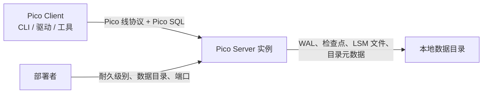
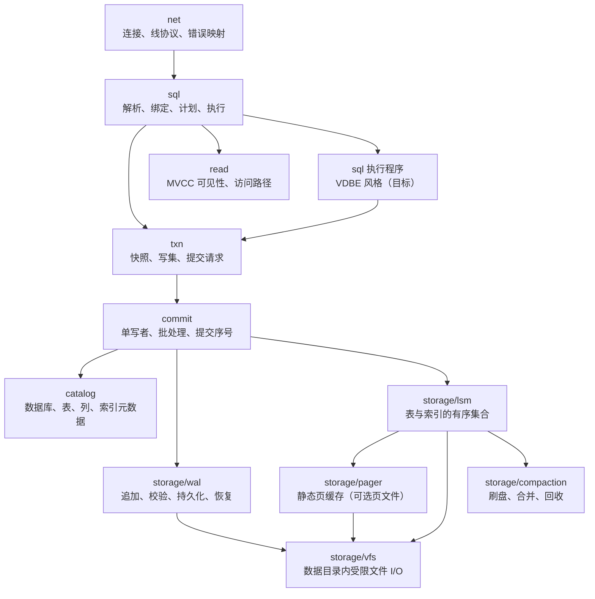
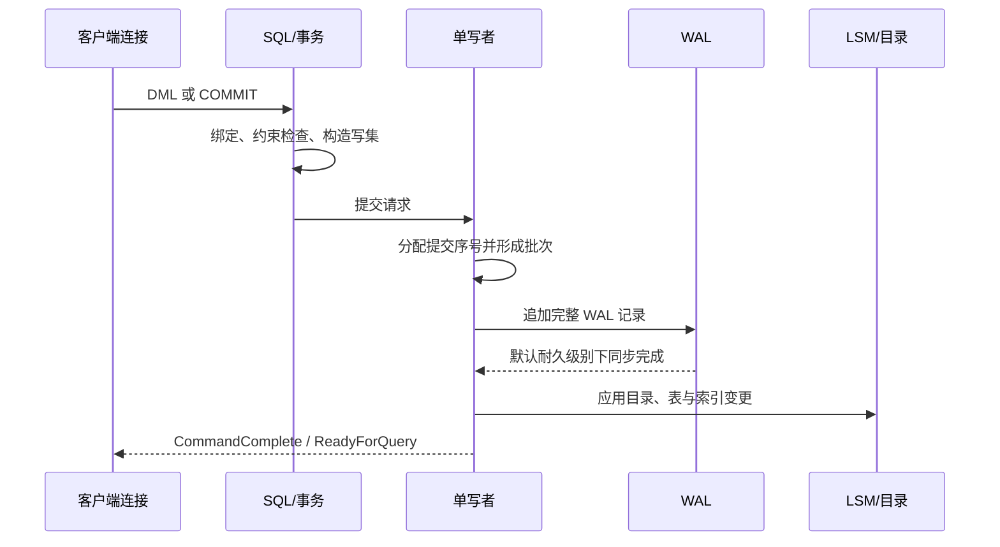

# Pico 架构

## 决策摘要

Pico Server 是一个单机、轻量、可网络访问的 OLTP 数据库。它是独立的 Pico Server
产品，Pico Client 是另一个独立产品。一个实例拥有一个数据目录，通过版本化 Pico
线协议为 Pico Client 提供已声明的 Pico SQL。它不是嵌入式库、集群或 PostgreSQL
兼容实现。

目标实现以单写者为提交排序点、以 MVCC 快照服务并行读、以 WAL 为恢复事实来源，并将表和二级索引落在独立的 LSM 有序集合中。WAL 默认在确认提交前持久化；检查点只推进数据目录内部的持久化进度，不是用户备份。

本文件记录目标边界，而不是声称 Phase 1 已全部实现。当前状态以 [README](../README.md) 为准：内存表与版本化、CRC32 校验的 WAL 已可用；持久 LSM、MVCC、事务隔离、group commit 和扩展查询协议仍在演进。

连接状态机、I/O 背压、提交调度与 MVCC 快照的具体运行时边界见
[运行时、连接与并发控制](architecture/runtime-and-concurrency.md)。
版本可见性、隔离级别、写写争用与回收的不变量见
[并发控制契约](architecture/concurrency-control.md)。
数据目录文件抽象见 [VFS](architecture/vfs.md)；定长页与静态缓存见
[Pager 与静态页缓存](architecture/pager-and-static-cache.md)；SQL 执行程序目标形态见
[执行引擎（VDBE 风格）](architecture/vdbe.md)。

## 依据、取舍与非目标

已接受的 ADR-0001、ADR-0004 至 ADR-0009 是本架构的约束来源。决定架构的优先级依次为：

1. 崩溃后提交语义可恢复，且未知格式或完整记录损坏不猜测恢复。
2. 高争用下写路径可预期，提交顺序唯一而可观察。
3. 以 Pico 线协议和 Pico SQL 建立独立、严格限定的客户端契约。
4. 以清晰模块边界和故障注入维持 Zig 存储代码的可演进性。
5. 保持单实例部署、资源占用与启动路径简单。

SQLite 的 VFS、pager 不变量、静态 `PAGECACHE` 池和 VDBE 执行循环提供了方法参考：把平台 I/O、页缓存上限、崩溃安全假设和语句执行拆成可验证的层。其 B-Tree 页更新、多进程锁/SHM、可插拔多 VFS 注册和 rollback journal 主路径不适用于 Pico 的 LSM 与单写者模型。TigerBeetle 说明了 WAL、检查点、不可变 LSM 文件和故障注入如何组成可验证的持久化设计；其复制、共识、跨副本修复和单线程运行时均不属于 Pico v1。

明确非目标：多实例复制、分片、故障转移、PostgreSQL 兼容、原地 B-Tree 写路径、检查点作为备份或 PITR。

## 系统上下文

Pico Client 只依赖线协议、公开错误模型和已发布的 SQL 支持矩阵；它不依赖存储文件
格式或服务端内部模块。Pico Server 只使用本地数据目录，不向其他实例复制状态。认证、
授权和 TLS 的具体策略在单独设计前不由本架构承诺。产品职责和发布边界见
[Pico 产品边界](products.md)。

## 模块与所有权

| 模块 | 唯一职责 | 拥有的状态 | 可依赖 |
| --- | --- | --- | --- |
| `net` | 一个连接上的协议编解码、认证入口、错误映射 | 连接与会话状态 | `sql`、`util` |
| `sql` | SQL 子集的词法、解析、绑定与执行调度（目标为可步进执行程序） | 已解析语句、执行程序与短生命周期执行状态 | `txn`、`catalog`、`util` |
| `catalog` | 数据库、表、列和索引定义 | 目录元数据 | `storage`、`util` |
| `txn` | 快照、写集、冲突判断、提交请求 | 活跃事务与 MVCC 时间戳 | `catalog`、`storage`、`util` |
| `commit` | 唯一提交顺序、group commit 与写入应用 | 有界提交队列和下一个提交序号 | `txn`、`catalog`、`storage`、`util` |
| `storage/wal` | WAL 格式、追加、校验、恢复扫描 | WAL 文件和耐久边界 | `storage/vfs`、`util` |
| `storage/lsm` | 表/索引有序集合的读写、manifest | 内存表、不可变表与 manifest | `storage/vfs`、`storage/pager`（若页文件）、`util` |
| `storage/compaction` | LSM 刷盘、合并与文件回收 | 受限任务队列和候选集 | `storage/lsm`、`storage/vfs`、`util` |
| `storage/vfs` | 数据目录的文件名验证、句柄生命周期与位置 I/O | 已打开目录、实例锁和文件句柄 | `util` |
| `storage/pager` | 定长页的静态缓存、pin、脏写回 | 编译期固定页框与所拥有文件 | `storage/vfs`、`util` |

### 当前实现映射（Phase 0：内存表 + WAL）

目标图中的 `catalog` / `commit` / `lsm` 尚未独立成模块。现阶段由下列文件承担过渡职责，避免把约束、行存储与耐久编排继续堆在同一文件：

| 模块 | 对应目标 | 唯一职责 | 可依赖 |
| --- | --- | --- | --- |
| `storage/table` | `catalog` 列定义 + `lsm` 内存表子集 | 单表的行、主键索引、约束校验、谓词匹配 | `storage/value`、`util` |
| `storage/engine` | `commit` 的单写者门面 | 表名登记、校验→WAL 追加→应用到 `table`、启动恢复 | `storage/table`、`storage/wal`、`util` |

- `sql` / `net` 只依赖 `storage/engine` 的公开门面（`Engine` 再导出 `Table` / `Pred` 等类型）。
- `storage/table` **不**知道 WAL；耐久顺序与恢复重放只在 `engine`。
- 引入独立 `catalog` / `lsm` / `commit` 时，应把登记与持久有序集合从 `engine`/`table` 迁出，而不是再把逻辑打回单文件。

`net` 不得导入 `storage`；`sql` 不得读写 WAL 或 LSM 文件；`storage` 不得了解 SQL 文本或 Pico 报文。`commit` 是修改目录、WAL 与 LSM 可见状态的唯一写入方。后台压缩可以并行准备新文件，但只能通过 `commit`/manifest 发布路径让其对新读者可见。`storage/pager` 的 `flush`/`sync` 不是用户提交；用户表主路径不得退化为无 WAL 保护的页覆盖写。

## 数据归属与不变量

| 数据 | 事实来源 | 唯一写入方 | 读者 | 恢复责任 |
| --- | --- | --- | --- | --- |
| 目录元数据 | 目录记录及其持久化表示 | `commit` | `sql`、`txn`、恢复 | WAL 重放到检查点后状态 |
| 已提交逻辑变更 | 已持久化 WAL | `commit` | 恢复 | 从最新有效检查点顺序重放 |
| 表主存储与二级索引 | LSM manifest 指向的不可变文件 | `commit` 发布，`compaction` 准备 | `read` | 检查点 + WAL |
| 活跃写集和快照 | `txn` 内存状态 | 各事务；提交仅由 `commit` 排序 | `txn`、`read` | 崩溃后丢弃未提交写集 |
| 连接状态 | `net` 内存状态 | 对应连接 | `net` | 崩溃后丢弃 |

必须保持以下不变量：

1. 默认耐久级别下，`COMMIT` 成功响应前，完整提交记录已写入并同步 WAL；数据文件可滞后。
2. 只有完整、格式受支持且校验通过的 WAL 记录可以重放。末尾截断记录可截去；完整记录校验失败、未知格式或中段缺失必须让实例拒绝恢复。
3. WAL 的提交顺序、目录变更、表变更和每个二级索引变更是同一个提交序号的原子效果；恢复不得暴露半个索引更新。
4. 读操作以开始时选定的快照判断可见性，不能读取未提交版本，也不能因普通写入而阻塞。
5. 一个 LSM manifest 只引用已完整写入并校验的不可变文件；文件回收只能在没有可见快照引用它之后执行。
6. 数据目录中所有存储文件名必须由 VFS 验证并相对该目录解析；存储层不得接受任意路径。

## 关键运行路径

### 写入与提交

在 WAL 同步失败、记录编码失败或约束冲突时，`commit` 不发布写集，连接收到明确错误。较松耐久级别可以改变“何时同步”的保证，但必须显式配置、可观察，且不成为默认值。批处理只可缩短多个提交共享同步的成本，不能改写批次内的可见顺序。

### 检查点、压缩与恢复

检查点把已应用的 LSM/目录状态与已覆盖的 WAL 位置一起持久化；随后才允许回收旧 WAL。压缩从既有不可变表生成新文件，验证完整后更新 manifest；旧文件在所有快照越过其可见区间后回收。

实例启动时依次：打开并验证数据目录元数据，选择最新有效检查点，扫描此位置后的 WAL，按提交序号重放完整记录，然后开始接受连接。若 WAL 只在末尾被截断，移除尾部后恢复；若发现完整记录校验错误、未知格式或无法建立一致检查点，则拒绝启动并保留证据，不进行猜测性修复。单实例没有可用于自动修复的副本，因此校验和用于检测与隔离故障，不承诺 TigerBeetle 式跨副本修复。

## 兼容性、可观测性与验证

对外边界是版本化 Pico 线协议和公开 Pico SQL 支持矩阵。新增语义须先更新支持矩阵与官方 Pico 客户端回归；不支持语句必须明确报错。WAL、manifest 与检查点都是内部格式：格式破坏性变化必须有版本、迁移或明确拒绝策略，绝不将新字节按旧格式解释。当前 PG 适配层不构成兼容承诺。

必须输出并测试以下信号：提交队列深度和批次大小、提交与 WAL 同步延迟、耐久级别、恢复耗时与重放记录数、WAL 大小、检查点进度、压缩积压/读写放大/空间放大、校验失败数和拒绝恢复原因。

最低验证集：

1. `zig build test`：WAL 编解码、格式拒绝、完整帧损坏、末尾截断、目录与索引原子性、MVCC 可见性和 VFS 路径约束。
2. 崩溃矩阵：在 WAL 写入、同步、LSM 文件写入、manifest 发布、检查点推进的每个故障点终止实例；重启后只能看到已确认提交的前缀。
3. 线协议集成：官方 Pico CLI 与至少一种官方 Pico 驱动执行支持矩阵中的成功和拒绝用例。
4. 压缩压力：并发读、写和压缩下验证快照可见性、索引一致性及无过早文件回收。

可执行模块边界、数据写权和初始质量门槛见 [architecture-contract.yml](architecture-contract.yml)。在 CI 引入边界检查之前，它是待实施的架构契约，而不是已自动满足的声明。

## 演进顺序与失效信号

1. 固化当前 WAL 的版本、尾部截断与完整记录损坏语义，建立崩溃回归。
2. 引入目录持久化、检查点位置和内存表/不可变表的最小 LSM 路径，恢复仍只依赖“检查点 + WAL”。
3. 将提交排序抽出为有界单写者队列，加入 group commit、写集冲突和 Read Committed 快照。
4. 加入二级索引、manifest 原子发布、压缩与回收，再将读路径从内存表扩展为 LSM 查找。
5. 在每个语义已验证的阶段扩展 Pico SQL 和 Pico 线协议。

若单写者在已测工作负载下成为不可接受的瓶颈，应先用提交队列、WAL 同步和 LSM/压缩指标定位原因。只有确认提交排序本身是限制时，才以新 ADR 评估分片；不得把细粒度锁、跨实例协调或隐式异步耐久塞入现有路径。

## 参考材料

- [ADRs](adr/)：Pico 已接受的产品、协议、SQL、存储、并发、耐久与语言决策；ADR-0009
  取代了 ADR-0002 的对外协议选择。
- [VFS](architecture/vfs.md)：数据目录围栏、实例锁、位置 I/O 与原子发布；对照 SQLite `sqlite3_vfs` 而收窄为单实例存储边界。
- [Pager 与静态页缓存](architecture/pager-and-static-cache.md)：定长页 pin/驱逐与编译期缓存硬顶；对照 SQLite Pager/PCache/`PAGECACHE`，不继承 rollback journal 主路径。
- [执行引擎（VDBE 风格）](architecture/vdbe.md)：SQL 子集到可步进执行程序的目标分层；对照 SQLite VDBE，游标与写集落在 MVCC+LSM+单写者上。
- [SQLite pager invariants](https://github.com/sqlite/sqlite/blob/924626e603a36cc48ce87bc3a3eeddc61af1a72f/doc/pager-invariants.txt)：将崩溃一致性写成检查式不变量的参考。
- [SQLite WAL locking](https://github.com/sqlite/sqlite/blob/924626e603a36cc48ce87bc3a3eeddc61af1a72f/doc/wal-lock.md)：恢复与检查点并发边界的反例参考；Pico 采用单实例单写者，而非其锁模型。
- SQLite 源码锚点（与上列不变量同一提交）：[`os.h`](https://github.com/sqlite/sqlite/blob/924626e603a36cc48ce87bc3a3eeddc61af1a72f/src/os.h)、[`pager.h`](https://github.com/sqlite/sqlite/blob/924626e603a36cc48ce87bc3a3eeddc61af1a72f/src/pager.h)、[`pcache1.c`](https://github.com/sqlite/sqlite/blob/924626e603a36cc48ce87bc3a3eeddc61af1a72f/src/pcache1.c)、[`vdbe.h`](https://github.com/sqlite/sqlite/blob/924626e603a36cc48ce87bc3a3eeddc61af1a72f/src/vdbe.h)。
- [TigerBeetle architecture](https://github.com/tigerbeetle/tigerbeetle/blob/97c7a8ef385270ebe0e1b75959d3d21d134629df/docs/ARCHITECTURE.md) 与 [data file](https://github.com/tigerbeetle/tigerbeetle/blob/97c7a8ef385270ebe0e1b75959d3d21d134629df/docs/internals/data_file.md)：WAL、检查点和 LSM 持久化关系的参考；复制与修复不在 Pico v1 范围。
- [运行时、连接与并发控制](architecture/runtime-and-concurrency.md)：以 DuckDB 的连接生命周期边界、TigerBeetle 的完成事件调度和 PostgreSQL 的快照一致性要求细化 Pico 运行时；只采纳与单实例、单写者约束相容的部分。
- [I/O 调度契约](architecture/io-scheduling.md)：定义完成事件与回调分离、关键 I/O 容量保留、连接级公平、背压与故障处理；平台后端可替换，提交与耐久语义不可改变。
