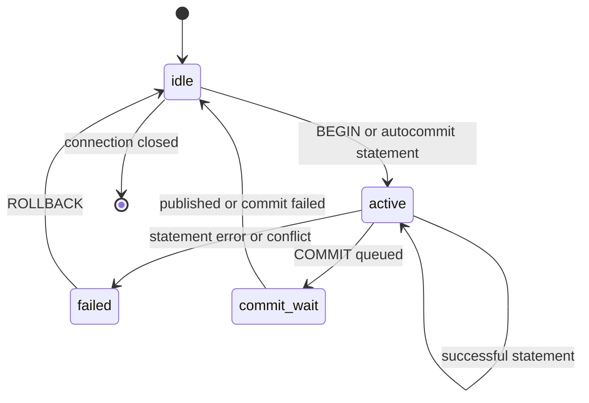

# Concurrency Control Contract

## Status and Scope

This document refines ADR-0005's "single-writer commit ordering + MVCC reads" and defines the semantic boundaries Pico must satisfy when implementing transactions, versioned storage, and background reclamation. It describes the target architecture; it does not claim that Phase 0 already provides these capabilities.

In Phase 0, `BEGIN`, `COMMIT`, and `ROLLBACK` are compatibility labels in the wire protocol/SQL subset. Each DML statement directly modifies an in-memory table and writes to the WAL; there are no cross-statement write sets, MVCC versions, or transaction-isolation guarantees yet. The only promise about current behavior is the support matrix in [README](../../README.md). Until the implementation reaches the phase described here, these labels must not be advertised as transaction support.

This document constrains concurrency within a single Pico **instance**. It does not define cross-instance coordination, replication, distributed transactions, user-visible lock syntax, `SAVEPOINT`, `SELECT FOR UPDATE`, or complete PostgreSQL isolation levels. The wire protocol's ability to carry related SQL does not mean that the Pico SQL subset supports its semantics.

## Design Conclusions

Pico uses MVCC so readers see only stable versions without waiting on the write path. A write transaction first operates on the connection's private write set, then is revalidated and published at the sole commit-ordering point. A single writer prevents multiple committers from changing committed state simultaneously, but it does **not** automatically eliminate contention between write sets formed from old snapshots. Pre-commit validation is therefore a correctness boundary; serially queueing requests is not enough.

Pico borrows from PostgreSQL its snapshot-consistency requirement, not its multi-backend lock management: if one published commit depends on another published commit, no snapshot may see the former without seeing the latter. PostgreSQL coordinates snapshot acquisition and transaction exit with `ProcArrayLock`; Pico avoids an active-transaction array and heavyweight locks by publishing a commit watermark through the single writer while preserving the same visibility closure.

## Time and Version Model

### Commit Sequence Numbers

`commit_seq` is a monotonically increasing 64-bit commit sequence number allocated only by the single writer. It is not a connection identifier, a WAL byte position, or physical time, and it is not allocated when a transaction begins. Each successful commit consumes one contiguous sequence number; the catalog, tables, secondary indexes, and deletion markers for one transaction share that number.

The runtime maintains atomically readable `published_commit_seq`. It may advance from `n - 1` to `n` only after all of the following have succeeded:

1. The write set has passed conflict and constraint validation.
2. A WAL record containing the complete write set and commit intent has been appended and has reached the request's durability level.
3. The catalog, table, and secondary-index versions can be located by the read path.
4. The in-memory version/index publication is atomic to concurrent readers.

The success response may be sent only after step 4. If any step fails, `published_commit_seq` must not advance and no reader-visible partial commit may remain. Failed or cancelled queued requests may consume internal queue positions, but they must not create visible gaps in commit sequence numbers.

### Versions and Visibility

Each persistent row version has at least an immutable logical primary key, a creation commit sequence number, and an optional deletion commit sequence number. `UPDATE` creates a new version and ends the old version's visibility interval; `DELETE` only ends the old version's visibility interval. An implementation may encode these fields in an LSM key, value, or sidecar version metadata, but it must not use physical file order to determine visibility.

For a version `v` without local modifications, the visibility predicate at snapshot watermark `s` is:

```
visible(v, s) = v.created_seq <= s
             and (v.deleted_seq is absent or s < v.deleted_seq)
```

Reads must also merge the transaction's private write set: versions inserted or updated by the transaction are visible to itself, and versions deleted by it are invisible to itself even before the transaction commits. Other connections can never read a private write set. Consequently, an uncommitted write set must enter neither the shared memtable/LSM read path nor catalog or secondary-index state visible to other connections.

When a statement takes a snapshot, it first reads the published watermark `s`, then interprets only complete commits at or before `s`. The single writer must not advance the watermark before publishing an affected table or index, nor publish a version before advancing the watermark. Readers do not need the commit-queue lock; they only need a stable watermark and the visibility predicate above.

## Transactions, Statements, and Isolation

The target transaction states are:



An autocommit statement owns a temporary transaction and returns to `idle` through `commit_wait` after success; on failure it discards its write set. An explicit transaction accumulates a private write set in `active`. After an execution error or commit conflict it enters `failed`; every SQL statement other than `ROLLBACK` must be rejected rather than silently continuing with a partial write set. Closing a connection is equivalent to rolling back any transaction that has not crossed the irreversible commit point.

The initial deliverable isolation level is **Read Committed**: each statement takes a fresh snapshot watermark at the start and always sees earlier private modifications from the same transaction. It prohibits dirty reads, but two `SELECT` statements in one explicit transaction may see commits made by other transactions between them. Pico does not accept `READ UNCOMMITTED` as a weaker promise, nor does it treat PostgreSQL's mapping for it as supported syntax.

"Optional snapshot reads" may be enabled only when explicitly listed in the SQL support matrix. Their snapshot must be fixed before the transaction's first read/write and retained until commit or rollback; this still does not equal `SERIALIZABLE`. Until predicate-dependency tracking, a read/write conflict graph, and a rollback-retry protocol exist, `REPEATABLE READ`, `SERIALIZABLE`, and imported/exported snapshots must return an explicit "unsupported" error rather than being downgraded.

## Write-Write Contention and Constraints

While building a write set, a write transaction records the "observed version" or an equivalent version stamp for each write target. Once it reaches the single writer, the latest **published** state is revalidated in commit-queue order:

| Write-set operation | Commit-time validation | Result if not satisfied |
| --- | --- | --- |
| Insert primary key | The key does not exist in published state, and is not inserted twice in the same batch | Unique-constraint error |
| Update primary key | The target still refers to the visible version observed by the write set | Write-write conflict; transaction fails |
| Delete primary key | The target still refers to the visible version observed by the write set | Write-write conflict; transaction fails |
| Update/delete a row that no longer exists | The target was deleted or did not appear after the transaction's snapshot | Write-write conflict; transaction fails |
| Secondary unique key | Every affected index key is unique within the commit batch and published state | Unique-constraint error |

Conflict outcomes must be deterministic and observable: the same commit-queue order and write sets must produce the same success, unique-constraint error, or write-write-conflict result. Pico v1 does not wait on row locks, re-execute `WHERE` predicates at commit, or silently implement "last writer wins." Cases requiring a client retry must use an explicit SQL error category; error codes and wire-protocol mapping are defined together with the SQL subset/protocol.

Neither Read Committed nor future snapshot reads prevent write skew from multi-row or range predicates. For example, two transactions can read the same set and then update different primary keys, both passing the version checks above. Applications must use a single conditional update or a retry protocol for such workloads; until serializability is implemented, Pico must not claim to prevent phantoms or serialization anomalies.

DDL and catalog changes also enter the same single-writer queue. Each statement is bound to the catalog version used during parsing/binding; if the catalog changes before commit so that object identity, column definitions, or constraint interpretation becomes ambiguous, the statement fails and must be reparsed. Background compaction may change physical layout, but must not create a new `commit_seq` or change logical conflict outcomes.

## WAL, Recovery, and Reclamation

For every successful commit, the WAL must first contain a complete commit record sufficient to reconstruct all logical changes in the transaction; only then may data files or the manifest depend on those changes. At the default durability level, the WAL must cross the durability boundary before the response. A looser durability level may change whether a responded commit survives power loss, but must not change commit ordering, visibility, or conflict validation.

Recovery starts from the last consistent checkpoint and replays only complete, verified transactions with commit records, rebuilding the published watermark from `commit_seq`. A write set without a complete commit record is always treated as rolled back. Read/write connections must not be opened before recovery finishes; afterward, `published_commit_seq` must equal exactly the highest contiguous recovered commit sequence number.

Active snapshots register their watermarks. The runtime maintains `oldest_active_snapshot_seq`, or `published_commit_seq + 1` when no snapshot is active. Compaction or file reclamation may remove only versions invisible to every active snapshot and unfinished write set. For a version interval `[created_seq, deleted_seq)`, reclamation is allowed only when `deleted_seq < oldest_active_snapshot_seq`; the newest version, while not deleted, is never reclaimed by this rule. Snapshot registration and deregistration must occur on every statement-cancellation, transaction-failure, connection-close, and normal-completion path. Leaked snapshots should be observed as reclamation stalls, not guessed away by the compactor.

## Required Invariants

Before implementing concurrency control, at least the following deterministic tests and fault injections should exist:

1. While a long-running `SELECT` runs alongside continuous commits, its result contains only versions allowed by its starting watermark; reads do not wait for writes.
2. When two connections update or delete the same primary key from the same old version, the earlier queued transaction commits and the later one receives a write-write conflict; no update is lost.
3. Concurrent same-key inserts and secondary unique-key conflicts allow only one commit; the other receives a unique-constraint error.
4. An explicit transaction reads its own write set; other connections cannot see it before publication, and never see it after rollback.
5. After a transaction error, statements other than `ROLLBACK` are rejected; disconnecting releases the write set and snapshot.
6. Inject crashes between WAL append, sync, version publication, and watermark advancement; recovery exposes only the contiguous prefix of confirmed commits.
7. An active old snapshot prevents version reclamation; after the snapshot is released, compaction can reclaim versions without changing results for new snapshots.

At minimum record commit-queue wait, commit batch size, WAL durability latency, conflict type, active snapshot count, oldest snapshot watermark, unreclaimable version count, and compaction wait time. Group metrics by durability level so latency under different crash guarantees is not combined into one percentile.

## References

- PostgreSQL's [MVCC documentation](https://github.com/postgres/postgres/blob/0fd30e2119ede879080cef426abf4f9b304e3f51/doc/src/sgml/mvcc.sgml) describes statement snapshots, Read Committed behavior, and the boundary of stronger isolation; Pico does not adopt its unsupported locking, SSI, or complete SQL semantics.
- PostgreSQL's [transaction README](https://github.com/postgres/postgres/blob/0fd30e2119ede879080cef426abf4f9b304e3f51/src/backend/access/transam/README) states the correctness condition for consistent ordering between snapshots and transaction exit; Pico implements that condition with the single writer's published watermark.
- [ADR-0005](../adr/0005-single-writer-mvcc.md) is the adoption decision for this design; [Runtime, Connections, and Concurrency Control](runtime-and-concurrency.md) defines the runtime boundaries for the commit queue, cancellation, and I/O.
