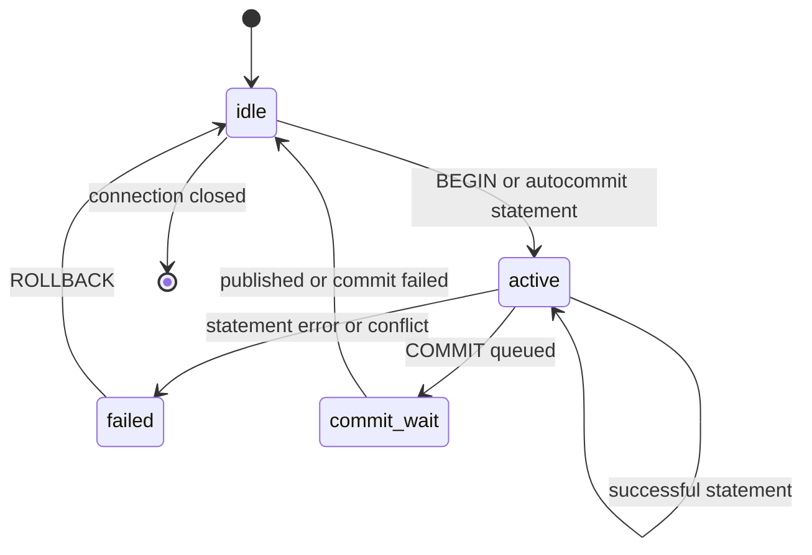

# Concurrency Control Contract

## Status and Scope

This document refines ADR-0005's "single-writer commit ordering + MVCC reads" and defines the semantic boundaries RunaDB must satisfy when implementing transactions, versioned storage, and background reclamation. It describes the target architecture; it does not claim that Phase 0 already provides these capabilities.

The current public Flow/IR slice is read-only and has no transaction-control operations. The transaction ownership area (`txn`), the single-writer commit coordinator (`commit`), group commit, observed-version write-write conflict detection, bounded admission, and the durable commit watermark are implemented as a development slice and deterministically tested at the engine level; the wire protocol does not yet expose them. Internal table mutation methods write through the coordinator, but they are not public transaction support. Until the implementation reaches the phase described here, transaction syntax or isolation must not be advertised.

This document constrains concurrency within a single RunaDB **instance**. It does not define cross-instance coordination, replication, distributed transactions, user-visible lock operations, savepoints, or PostgreSQL isolation compatibility. A future Flow/IR shape does not become supported merely because the Wire Protocol can carry it.

## Design Conclusions

RunaDB uses MVCC so readers see only stable versions without waiting on the write path. A write transaction first operates on the connection's private write set, then is revalidated and published at the sole commit-ordering point. A single writer prevents multiple committers from changing committed state simultaneously, but it does **not** automatically eliminate contention between write sets formed from old snapshots. Pre-commit validation is therefore a correctness boundary; serially queueing requests is not enough.

RunaDB's snapshot-consistency requirement is local: if one published commit depends on another published commit, no snapshot may see the former without seeing the latter. RunaDB publishes a commit watermark through the single writer, avoiding an active-transaction array and heavyweight locks while preserving that visibility closure.

## Time and Version Model

### Commit Sequence Numbers

`commit_seq` is a monotonically increasing 64-bit commit sequence number allocated only by the single writer. It is not a connection identifier, a WAL byte position, or physical time, and it is not allocated when a transaction begins. Each successful commit consumes one contiguous sequence number; the catalog, tables, secondary indexes, and deletion markers for one transaction share that number.

The runtime maintains atomically readable `published_commit_seq`. It may advance from `n - 1` to `n` only after all of the following have succeeded:

1. The write set has passed conflict and constraint validation.
2. A WAL record containing the complete write set and commit intent has been appended and has reached the request's durability level.
3. The catalog, table, and secondary-index versions can be located by the read path.
4. The in-memory version/index publication is atomic to concurrent readers.

The success response may be sent only after step 4. If any step fails, `published_commit_seq` must not advance and no reader-visible partial commit may remain. Failed or cancelled queued requests may consume internal queue positions, but they must not create visible gaps in commit sequence numbers.

### Versions and Visibility

Each persistent row version has at least an immutable logical primary key, a creation commit sequence number, and an optional deletion commit sequence number. `UPDATE` creates a new version and ends the old version's visibility interval; `DELETE` only ends the old version's visibility interval. An implementation may encode these fields in an LSM key, value, or sidecar version metadata, but it must not use physical file order to determine visibility.

For a version `v` without local modifications, the visibility predicate at snapshot watermark `s` is:

```
visible(v, s) = v.created_seq <= s
             and (v.deleted_seq is absent or s < v.deleted_seq)
```

Reads must also merge the transaction's private write set: versions inserted or updated by the transaction are visible to itself, and versions deleted by it are invisible to itself even before the transaction commits. Other connections can never read a private write set. Consequently, an uncommitted write set must enter neither the shared memtable/LSM read path nor catalog or secondary-index state visible to other connections.

When a statement takes a snapshot, it first reads the published watermark `s`, then interprets only complete commits at or before `s`. The single writer must not advance the watermark before publishing an affected table or index, nor publish a version before advancing the watermark. Readers do not need the commit-queue lock; they only need a stable watermark and the visibility predicate above.

## Transactions, Statements, and Isolation

The target transaction states are:



An autocommitted Request owns a temporary transaction and returns to `idle` through `commit_wait` after success; on failure it discards its write set. An explicit transaction accumulates a private write set in `active`. After an execution error or commit conflict it enters `failed`; every Request other than rollback must be rejected rather than silently continuing with a partial write set. Closing a Connection is equivalent to rolling back any transaction that has not crossed the irreversible commit point.

The initial mutation-capable deliverable isolation level is **Read Committed**: each Request takes a fresh snapshot watermark at the start and always sees earlier private modifications from the same transaction. It prohibits dirty reads, but two reads in one explicit transaction may see commits made by other transactions between them. Weaker isolation is not accepted implicitly.

Optional snapshot reads may be enabled only when explicitly defined in Runa Flow and Runa Query IR. Their snapshot must be fixed before the transaction's first read/write and retained until commit or rollback; this still does not equal strict serializability. Until dependency tracking, a read/write conflict graph, and a rollback-retry protocol exist, stronger isolation and imported/exported snapshots must return an explicit unsupported error rather than being downgraded.

## Write-Write Contention and Constraints

While building a write set, a write transaction records the "observed version" or an equivalent version stamp for each write target. Once it reaches the single writer, the latest **published** state is revalidated in commit-queue order:

| Write-set operation | Commit-time validation | Result if not satisfied |
| --- | --- | --- |
| Insert primary key | The key does not exist in published state, and is not inserted twice in the same batch | Unique-constraint error |
| Update primary key | The target still refers to the visible version observed by the write set | Write-write conflict; transaction fails |
| Delete primary key | The target still refers to the visible version observed by the write set | Write-write conflict; transaction fails |
| Update/delete a row that no longer exists | The target was deleted or did not appear after the transaction's snapshot | Write-write conflict; transaction fails |
| Secondary unique key | Every affected index key is unique within the commit batch and published state | Unique-constraint error |

Conflict outcomes must be deterministic and observable: the same commit-queue order and write sets must produce the same success, unique-constraint error, or write-write-conflict result. RunaDB v1 does not wait on row locks, re-evaluate filters at commit, or silently implement "last writer wins." Cases requiring a client retry must use an explicit Flow/IR error category defined with the Wire Protocol mapping.

Neither Read Committed nor future snapshot reads prevent write skew from multi-row or range predicates. For example, two transactions can read the same set and then update different primary keys, both passing the version checks above. Applications must use a single conditional update or a retry protocol for such workloads; until serializability is implemented, RunaDB must not claim to prevent phantoms or serialization anomalies.

DDL and catalog changes also enter the same single-writer queue. Each statement is bound to the catalog version used during parsing/binding; if the catalog changes before commit so that object identity, column definitions, or constraint interpretation becomes ambiguous, the statement fails and must be reparsed. Background compaction may change physical layout, but must not create a new `commit_seq` or change logical conflict outcomes.

## Deferred: Strictly Consistent OCC

Strict serializability is not a RunaDB v1 isolation promise. This section records the design to adopt only after a new ADR, Flow/IR contracts, and Wire Protocol error mapping make that promise explicit. It defines optimistic conflict validation for RunaDB's single-instance commit path; it does not introduce distributed transaction roles, resolver sharding, replication, or a fixed transaction lifetime.

The design has four non-negotiable properties:

1. A transaction validates logical dependencies formed from one read watermark; it does not validate storage files, page numbers, or an execution plan's transient details.
2. The single writer is the only authority that accepts or rejects a transaction and assigns its `commit_seq`. Work may be prepared concurrently, but validation decisions are ordered exactly as publication decisions.
3. A retryable serialization conflict, a non-retryable constraint error, and retryable overload are distinct outcomes. They have different causes and must remain distinct in Runa Flow, Runa Query IR, and Wire Protocol error mapping.
4. Range history and active snapshots are bounded resources. RunaDB must reject work that exceeds an announced age or resource limit rather than retaining conflict metadata indefinitely or weakening isolation.

### Range Collection Lifecycle

Range collection begins when the transaction obtains `read_seq`, before the first read whose result can affect a later write. The execution layer records each dependency while it still knows the IR operation, access path, predicate bounds, and catalog objects used for binding. It then canonicalizes and coalesces compatible overlapping ranges in the private transaction state. Coalescing may widen a range within the same logical namespace, but it must never omit a dependency or combine ranges from different databases, tables, indexes, or catalog domains.

The transaction submits its immutable read ranges, write ranges, observed-version stamps, and logical write set as one commit request. `commit` owns the accepted request thereafter; `txn` must not mutate it while the request is queued. Cancellation before the irreversible commit point discards the request and deregisters its snapshot. Cancellation after that point may suppress the response but cannot revoke validation, WAL persistence, or publication.

Range collection is part of semantic execution, not a diagnostic side channel. A failed predicate evaluation still records the range needed to establish that no qualifying row was visible when the result controls a later write. Conversely, a statement that reads only its own private write set adds no shared read range because no committed-state dependency was observed.

### Read and Write Ranges

At the first consistent read (or before committing a write-only transaction), a transaction captures `read_seq = published_commit_seq`. It records logical ranges, never physical LSM files or pages:

| IR operation | Read conflict range | Write conflict range |
| --- | --- | --- |
| Primary-key point lookup | That table and primary-key point | None |
| Primary-key insert/update/delete | Any row or index key inspected for constraints and the target's observed row | The changed primary key and every changed secondary-index or unique key |
| Index range scan | The qualifying interval in that index, plus primary rows dereferenced by the plan | None unless modified |
| Table scan or predicate without a usable ordered access path | The table's complete logical key range | None unless modified |
| Catalog lookup or DDL | The affected catalog-object range | The changed catalog-object range |

Ranges use a canonical ordered encoding that includes database, table, index, and key boundaries. A half-open range `[begin, end)` is required so equality, prefixes, and empty ranges are unambiguous. The optimizer must not narrow a range unless the chosen access path proves the narrower range contains every row or index entry whose change could alter the statement result. A conservative wider range is correct, although it creates more retryable contention.

The transaction's private write set remains read-your-writes: reads satisfied solely by an earlier private write add no read conflict range. Every mutation adds its write conflict ranges even when it is a blind write. Constraint validation may add read ranges; this preserves declared primary-key and uniqueness semantics rather than treating a blind write as automatically conflict-free.

### Commit-Time Validation

The single writer keeps an in-memory, commit-sequence-ordered history of published write ranges. For a transaction with `read_seq`, validation in FIFO commit-queue order is:

1. Reject the transaction when a write range from any commit in `(read_seq, next_commit_seq)` intersects one of its read ranges.
2. Validate primary-key, unique-key, foreign-key, and catalog invariants against the state produced by all earlier accepted requests in the same group-commit round.
3. On success, allocate `commit_seq`, append the complete WAL record, publish its versions, and add its write ranges to the history before validating a later queued request.

The first rule detects read-write and predicate conflicts, including phantoms. The second is still necessary: declared constraints and modifications derived from observed values cannot be weakened to unconditional blind-write behavior. A rejected transaction creates no WAL record, publishes nothing, and returns a distinct retryable serialization-conflict outcome. A constraint violation remains a non-retryable constraint error. The client must rerun the full transaction against a new snapshot; RunaDB Server does not rerun Requests, repeat external side effects, or silently change the transaction's isolation.

The history is retained until no active strict transaction can have a `read_seq` that needs it. Before admitting or validating a transaction, RunaDB may reject it with a distinct retryable "transaction too old" outcome when its snapshot falls behind the retained history horizon or its age/resource limits. The future RunaDB Wire Protocol error code remains to be designed. This bounds memory and avoids turning long-running snapshots into unbounded conflict metadata retention. The exact maximum age, range count, and range-byte limits are configuration and observability concerns, not language semantics.

### Strictness Boundary

The read watermark must be issued from the same publication order as commits. Therefore, if RunaDB has responded successfully to commit A before connection B starts a strict transaction, B's `read_seq` is at least A's `commit_seq`; B cannot read a state preceding A. Commit responses remain ordered after WAL durability and publication. Together with range validation, this supplies a single-instance strict serial order without locks on ordinary reads or writes.

Snapshot or explicitly non-conflicting reads would weaken this guarantee. They must be separately named, explicitly documented future Flow/IR operations; the normal strict mode cannot quietly omit their conflict ranges.

### Why RunaDB Uses Logical Ranges

Request dependencies are logical, not physical. A predicate may be satisfied by a memtable today and an immutable table after compaction, but it is still a dependency on the same table/index keys. Recording physical files, page numbers, or a selected access path would make the isolation result change when compaction changes layout. A canonical logical range keeps the result stable across recovery, checkpoints, and planning changes.

The conservative rule is intentional. If RunaDB cannot prove that an index interval covers every row that could change a predicate result, it records the whole table's logical range. This can cause an avoidable retry under high contention, but it cannot admit a phantom-dependent commit. Improving the optimizer may narrow a range only when it preserves that proof; it may never make a transaction silently less isolated.

### Contention and Workload Shape

The single writer orders commits; it does not make a repeatedly modified logical key inexpensive. A hot primary key, unique key, or strict read range can create conflicts even when WAL and CPU capacity are available. RunaDB must report those outcomes separately from commit-queue saturation and device latency, because the remedies differ.

For application work that permits it, distribute independently accumulated values across separate rows and combine them in a later read, or append independent work records and apply their order-sensitive effects in a controlled transaction. These are data-model choices, not a hidden weakening of transaction semantics. A future atomic-update operation, snapshot read, or range-conflict exception requires Flow/IR definitions, logical conflict ranges, WAL representation, recovery rules, metrics, and an ADR before it becomes available.

### Required Strict-OCC Tests

When this mode is implemented, extend the required tests with:

1. Two transactions that read the same predicate and update different rows: the later commit conflicts when either update changes the predicate result.
2. An index range scan and a concurrent insert into that interval: the scan transaction conflicts rather than committing a phantom-dependent write.
3. A full-table predicate without an ordered access path: concurrent row insertion conflicts, proving conservative range collection.
4. Two blind writes to distinct keys: both may commit; two mutations whose constraint checks overlap retain the constraint result.
5. A transaction beyond the conflict-history horizon fails retryably and leaves no WAL record or visible version.
6. Repeated runs with the same queue order, ranges, and writes produce the same commit/conflict decisions.

## WAL, Recovery, and Reclamation

For every successful commit, the WAL must first contain a complete commit record sufficient to reconstruct all logical changes in the transaction; only then may data files or the manifest depend on those changes. At the default durability level, the WAL must cross the durability boundary before the response. A looser durability level may change whether a responded commit survives power loss, but must not change commit ordering, visibility, or conflict validation.

Recovery starts from the last consistent checkpoint and replays only complete, verified transactions with commit records, rebuilding the published watermark from `commit_seq`. A write set without a complete commit record is always treated as rolled back. Read/write connections must not be opened before recovery finishes; afterward, `published_commit_seq` must equal exactly the highest contiguous recovered commit sequence number.

Active snapshots register their watermarks. The runtime maintains `oldest_active_snapshot_seq`, or `published_commit_seq + 1` when no snapshot is active. Compaction or file reclamation may remove only versions invisible to every active snapshot and unfinished write set. For a version interval `[created_seq, deleted_seq)`, reclamation is allowed only when `deleted_seq < oldest_active_snapshot_seq`; the newest version, while not deleted, is never reclaimed by this rule. Snapshot registration and deregistration must occur on every statement-cancellation, transaction-failure, connection-close, and normal-completion path. Leaked snapshots should be observed as reclamation stalls, not guessed away by the compactor.

## Required Invariants

Before implementing concurrency control, at least the following deterministic tests and fault injections should exist:

1. While a long-running `SELECT` runs alongside continuous commits, its result contains only versions allowed by its starting watermark; reads do not wait for writes.
2. When two connections update or delete the same primary key from the same old version, the earlier queued transaction commits and the later one receives a write-write conflict; no update is lost.
3. Concurrent same-key inserts and secondary unique-key conflicts allow only one commit; the other receives a unique-constraint error.
4. An explicit transaction reads its own write set; other connections cannot see it before publication, and never see it after rollback.
5. After a transaction error, statements other than `ROLLBACK` are rejected; disconnecting releases the write set and snapshot.
6. Inject crashes between WAL append, sync, version publication, and watermark advancement; recovery exposes only the contiguous prefix of confirmed commits.
7. An active old snapshot prevents version reclamation; after the snapshot is released, compaction can reclaim versions without changing results for new snapshots.

At minimum record commit-queue wait, commit batch size, WAL durability latency, conflict type, active snapshot count, oldest snapshot watermark, unreclaimable version count, and compaction wait time. Group metrics by durability level so latency under different crash guarantees is not combined into one percentile.

## RunaDB Decisions

- [ADR-0005](../adr/0005-single-writer-mvcc.md) is the adoption decision for this design.
- [Runtime, Connections, and Concurrency Control](runtime-and-concurrency.md) defines the runtime boundaries for the commit queue, cancellation, and I/O.
- [Write Path and WriteBatch](write-path.md) defines bounded admission and WAL durability rounds.
