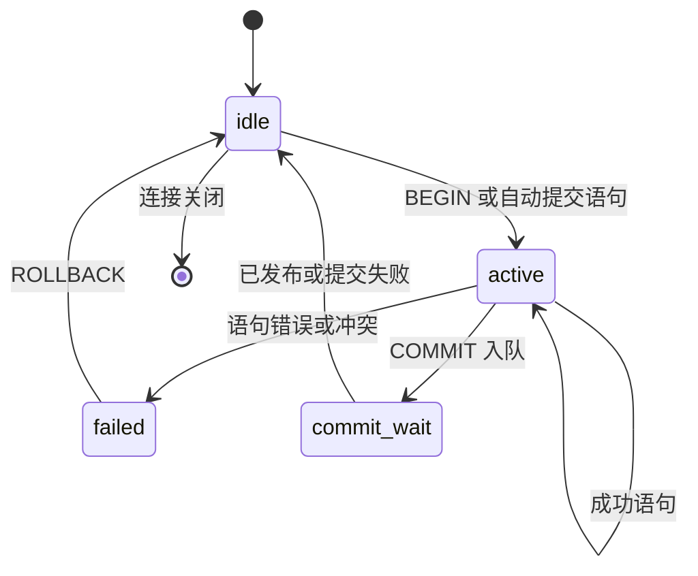

# 并发控制契约

## 状态与范围

本文细化 ADR-0005 的“单写者提交排序 + MVCC 读”，定义 Pico 在实现事务、
版本化存储和后台回收时必须满足的语义边界。它是目标架构，不表示 Phase 0
已经实现这些能力。

当前 Phase 0 中，`BEGIN`、`COMMIT` 和 `ROLLBACK` 只是线协议/SQL 子集的
兼容标签；每条 DML 语句直接修改内存表并写入 WAL，尚没有跨语句写集、MVCC
版本或事务隔离保证。对当前行为的唯一承诺以 [README](../../README.md) 的
支持矩阵为准。实现进入本文所述阶段前，不能把这些标签宣传为事务支持。

本文只约束单个 Pico **实例**内的并发。它不定义跨实例协调、复制、分布式
事务、用户可见的锁语法、`SAVEPOINT`、`SELECT FOR UPDATE` 或完整 PostgreSQL
隔离级别。线协议能够传输相关 SQL，不等于 Pico 的 SQL 子集支持该语义。

## 设计结论

Pico 采用 MVCC，使读操作只解释稳定版本而不等待写路径；写事务先在连接的
私有写集中执行，在唯一的提交排序点重新验证后发布。单写者消除了多个提交者
同时改变已提交状态的可能，但**不**自动消除基于旧快照形成写集的争用；因此，
提交前验证是正确性边界，不能被“已经串行进入队列”替代。

借鉴 PostgreSQL 的不是其多后端锁管理，而是其快照一致性要求：若一个已发布
提交依赖另一已发布提交，任一快照都不能只看见前者而看不见后者。PostgreSQL
为此以 `ProcArrayLock` 协调快照与事务退出；Pico 以单写者发布提交水位，避免
活动事务数组和重量锁，但仍须维护相同的可见性闭包。

## 时间与版本模型

### 提交序号

`commit_seq` 是单调递增、只由单写者分配的 64 位提交序号。它不是连接标识、
WAL 字节位置、物理时间，也不在事务开始时分配。一个成功提交只占用一个连续
序号；同一事务的目录、表、二级索引和删除标记共享该序号。

运行时维护原子读取的 `published_commit_seq`。它只能在下列操作全部成功后从
`n - 1` 推进为 `n`：

1. 写集已经过冲突和约束验证。
2. 包含完整写集和提交意图的 WAL 记录已追加，并达到该请求的耐久级别。
3. 目录、表和二级索引的版本已经可被读取路径定位。
4. 内存中的版本/索引发布对并行读者是原子的。

成功响应只能在第 4 步之后发送。任一步失败时，`published_commit_seq` 不得
前进，也不得留下读者可见的半提交效果。允许为失败或取消的排队请求消耗内部
队列位置，但不得制造可见提交序号空洞。

### 版本与可见性

每个持久行版本至少有不可变的逻辑主键、创建提交序号和可选删除提交序号；
`UPDATE` 创建新版本并结束旧版本的可见区间，`DELETE` 只结束旧版本的可见区间。
实现可以把这些字段编码在 LSM 键、值或旁路版本元数据中，但不能把物理文件
顺序当作可见性规则。

对不含本地修改的版本 `v`，快照水位 `s` 下的可见谓词为：

```
visible(v, s) = v.created_seq <= s
             and (v.deleted_seq is absent or s < v.deleted_seq)
```

读取还必须合并本事务私有写集：本事务插入/更新后的版本对自己可见，本事务
删除的版本对自己不可见，即使事务尚未提交。其他连接永远不能读取私有写集。
因此未提交写集既不能进入共享 memtable/LSM 的读路径，也不能进入可被其他
连接解释的目录或二级索引。

一个语句取得快照时，先读取已发布水位 `s`，然后只解释 `s` 及之前的完整提交。
单写者不得先推进水位再发布某个受影响的表或索引，也不得先发布版本再推进水位。
读者不需要持有提交队列锁；它们只需要取得稳定水位并按上述谓词过滤版本。

## 事务、语句与隔离

目标实现的事务状态为：



自动提交语句拥有一个临时事务，成功后经 `commit_wait` 回到 `idle`；失败时丢弃
写集。显式事务在 `active` 中累积私有写集。发生执行错误或提交冲突后进入
`failed`，除 `ROLLBACK` 外的 SQL 语句必须被拒绝，不能悄悄继续使用部分写集。
连接关闭等价于对尚未跨过不可逆提交点的事务执行 `ROLLBACK`。

初始可交付的隔离级别是 **Read Committed**：每条语句在开始时取得新的快照水位，
并总能看见本事务较早语句的私有修改。它禁止脏读，但同一显式事务中两条
`SELECT` 可以看见其他事务之间新提交的结果。Pico 不接受 `READ UNCOMMITTED`
作为更弱承诺，也不把 PostgreSQL 对它的映射当作已支持语法。

“可选快照读”只有在 SQL 支持矩阵明确列出时才可开放。其快照必须在事务首次
读/写前固定，并持续到提交或回滚；它仍不等于 `SERIALIZABLE`。在没有谓词
依赖追踪、读写冲突图与回滚重试协议之前，`REPEATABLE READ`、`SERIALIZABLE`
和导入/导出快照均须明确报“不支持”，而非降级执行。

## 写写争用与约束

写事务在构造写集时记录每个写目标的“已观察版本”或等价的版本戳。到达单写者
后，按提交队列顺序对最新**已发布**状态重新验证：

| 写集操作 | 提交时验证 | 不满足时的结果 |
| --- | --- | --- |
| 插入主键 | 主键在发布状态中不存在，且同批次没有重复插入 | 唯一约束错误 |
| 更新主键 | 目标仍指向写集观察到的可见版本 | 写写冲突，事务失败 |
| 删除主键 | 目标仍指向写集观察到的可见版本 | 写写冲突，事务失败 |
| 更新/删除已不存在的行 | 目标在本事务快照后被删除或未出现 | 写写冲突，事务失败 |
| 二级唯一键 | 全部受影响索引键在提交批次与已发布状态中唯一 | 唯一约束错误 |

冲突结果必须确定且可观测：同一提交队列顺序和相同写集只能得到相同的成功、
唯一约束错误或写写冲突结果。Pico v1 不等待行锁、不在提交时重新执行 `WHERE`
谓词、也不隐式“最后写者获胜”。客户端需要重试的情况应以明确的 SQL 错误类别
表达；错误码和对线协议的映射在 SQL 子集/协议设计中统一定义。

Read Committed 与未来快照读都不能防止跨多行或范围谓词形成的写偏差。例如两个
事务分别读取同一集合后更新不同主键，可能都通过上述版本验证。对这类业务，
应用必须使用单个条件更新或重试协议；Pico 在实现可串行化之前不得声称避免
幻读或序列化异常。

DDL 与目录修改也进入同一单写者队列。每个语句绑定其解析/绑定时使用的目录
版本；若提交时目录已改变而使对象身份、列定义或约束解释发生歧义，则该语句
失败并要求重新解析。后台压缩只能改变物理布局，不能创建新的 `commit_seq` 或
改变逻辑冲突结果。

## WAL、恢复与回收

对每个成功提交，WAL 必须先包含足以重建该事务所有逻辑变更的完整提交记录，
然后才允许数据文件或 manifest 依赖该变更。默认耐久级别下，响应前 WAL 必须
跨过持久化边界；更宽松的耐久级别只能改变“断电后是否保留已响应提交”的保证，
不能改变提交排序、可见性或冲突验证。

恢复从最后一致的检查点开始，只重放完整、校验通过且有提交记录的事务，并按
`commit_seq` 重建发布水位。没有完整提交记录的写集一律视为回滚。恢复完成前
不得开放读写连接；完成后 `published_commit_seq` 必须恰好等于恢复出的最大连续
提交序号。

活跃快照登记其水位；运行时维护 `oldest_active_snapshot_seq`，无活跃快照时为
`published_commit_seq + 1`。压缩或文件回收只能移除对所有活跃快照和未完成写集
都不可见的版本。对版本区间 `[created_seq, deleted_seq)`，仅当
`deleted_seq < oldest_active_snapshot_seq` 时才可回收；尚未删除的最新版本永不因
该规则回收。注册与撤销快照必须在语句取消、事务失败、连接关闭和正常完成的
每条路径执行，泄漏的快照应被监测为回收停滞，而不能由压缩器猜测释放。

## 必测不变量

实现并发控制前，至少应有以下确定性测试和故障注入：

1. 长时间 `SELECT` 与连续提交并行时，结果只含开始水位允许的版本；读不等待写。
2. 两个连接基于同一旧版本更新或删除同一主键时，队列前者提交，后者得到写写冲突；不得丢失更新。
3. 同键并发插入和二级唯一键冲突只允许一个提交，另一个得到唯一约束错误。
4. 显式事务能读取自己的写集；其他连接在提交发布前看不到它，回滚后永远看不到它。
5. 事务错误后，除 `ROLLBACK` 外的语句被拒绝；断连释放写集和快照。
6. 在 WAL 追加、同步、版本发布和水位推进之间注入崩溃；恢复只暴露连续的已确认提交前缀。
7. 活跃旧快照阻止版本回收；快照释放后压缩可以回收，且新快照结果不变。

至少记录提交队列等待、提交批次大小、WAL 持久化延迟、冲突类型、活跃快照数、
最老快照水位、不可回收版本数量和压缩等待时间。指标按耐久级别分组，避免把
不同崩溃保证下的延迟混为同一分位数。

## 参考

- PostgreSQL 的 [MVCC 文档](https://github.com/postgres/postgres/blob/0fd30e2119ede879080cef426abf4f9b304e3f51/doc/src/sgml/mvcc.sgml) 说明语句快照、Read Committed 行为与更强隔离的边界；Pico 不采纳其未支持的锁、SSI 或完整 SQL 语义。
- PostgreSQL 的 [事务 README](https://github.com/postgres/postgres/blob/0fd30e2119ede879080cef426abf4f9b304e3f51/src/backend/access/transam/README) 给出“快照与提交退出一致排序”的正确性条件；Pico 用单写者发布水位实现该条件。
- [ADR-0005](../adr/0005-single-writer-mvcc.md) 是本设计的采纳决策；[运行时、连接与并发控制](runtime-and-concurrency.md) 定义提交队列、取消与 I/O 的运行时边界。
