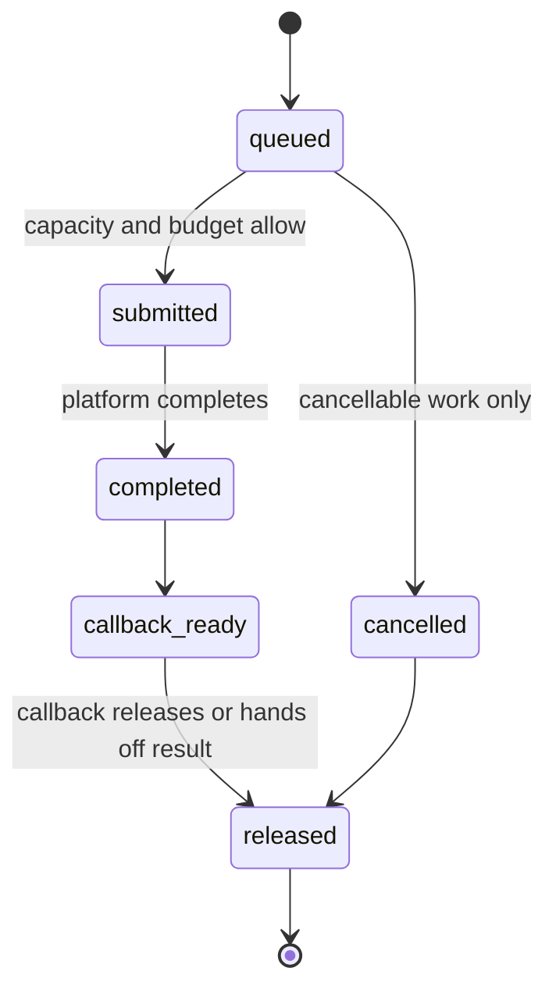

# I/O Scheduling Contract

## Status and Scope

This document refines the I/O scheduling rules in [Runtime, Connections, and Concurrency Control](runtime-and-concurrency.md). It is the RunaDB v1 target design; it does not claim that Phase 0 implements an asynchronous reactor, separate queues, or background compaction. Until that work lands, the current `accept -> handleConnection` sequential loop remains the only implementation fact.

This document makes no platform commitment to `io_uring`, `epoll`, kqueue, IOCP, or a thread pool. Any platform backend is acceptable if it observes the submission, completion, and callback boundaries defined here. It does not change ADR-0005's single-writer commit ordering or ADR-0006's WAL-first, default-durable commit.

## RunaDB Scheduling Boundary

RunaDB separates platform completion from callback execution so completion handling cannot re-enter SQL, storage, or protocol code while it holds scheduler state. It derives fixed capacity from admitted connections, commit batches, recovery, manifest publication, and shutdown rather than growing queues under load. This is a single-instance service contract: no platform backend, replication queue, or external runtime model is part of the RunaDB product surface.

The scheduler's job is to preserve the meaning of RunaDB's other boundaries while work is concurrent. A completed socket write is not permission to reorder a connection's responses. A completed file write is not a commit until the single writer publishes it. A cancelled statement cannot revoke WAL work that has crossed the irreversible point. Separating completion from callbacks makes these decisions occur at owned state transitions rather than incidentally inside a platform event loop.

Capacity is an admission decision, not a hint. Every operation reserves a slot, bytes, and an owner before it enters the platform. When the reservation is unavailable, the owner pauses or rejects new work at the earliest safe boundary. This protects the WAL and recovery paths from a slow result consumer, and it lets operators distinguish a saturated resource from logical **contention** on the write path.

## Goals and Invariants

The scheduler's goals, in order, are:

1. WAL durability and recovery I/O for confirmed commits can continue to make progress.
2. A slow connection, an exhausted background queue, or a completion-event storm cannot block other connections or commits.
3. Memory, kernel in-flight I/O, file handles, and callback work all have computable bounds.
4. Platform I/O completions do not run application logic while traversing the kernel queue, avoiding recursively driven call stacks.
5. Protocol response order within a connection, and commit sequence order in the single writer, do not change under concurrent scheduling.

The scheduler owns no SQL semantics, MVCC visibility, or WAL contents. It owns only I/O submission state, completion queues, budgets, capacity, and timing. Completing a file write is not a successful commit; only `commit` may report success after the WAL reaches its durability boundary and `published_commit_seq` advances.

## Work Classes and Capacity

Before submission, every I/O operation must be assigned a class. A class is a scheduling and observability property, not a new storage ownership boundary.

| Class | Work | Scheduling requirement | Action at saturation |
| --- | --- | --- | --- |
| `critical` | WAL append/sync, reads required for recovery, an already-started manifest publication, and file operations required for shutdown | May use all reserved capacity; network writes and compaction must not queue ahead of it | Stop accepting new write transactions; if critical I/O cannot complete, enter an explicit instance-level failure path |
| `foreground_read` | Socket reads for admitted connections and file reads required by read-only statements | Schedule fairly by connection after `critical` | Pause reads for the affected connection; do not discard validated frames |
| `foreground_write` | Socket writes for protocol errors, command completion, and query results | Small and bounded; a slow reader must not consume `critical` capacity | Stop reading the connection and producing more results; close it after the hard limit is exceeded |
| `maintenance` | Compaction I/O, prefetch, checkpoint preparation, and cancellable cleanup | May use only capacity not reserved for foreground and critical paths | Defer or reduce concurrency; never reclaim files still visible to an active snapshot |

WAL sync and recovery reads within `critical` are not cancellable. An already-started manifest publication must complete or stop the instance with an explicit failure; it must not report a partial state to connections. If a checkpoint's final persistence step blocks WAL reclamation or recovery correctness, temporarily promote that step to `critical`; its scan, merge, and file preparation remain `maintenance`. This avoids treating "checkpoint" as a whole as higher priority than commit.

Each class tracks queued count, kernel in-flight count, completed-but-not-callbacked count, bytes, and age from enqueue to completion. Capacity must be declared centrally and constrain operation slots, buffer bytes, and per-file/per-connection in-flight limits at the same time; limiting only one creates an implicit unbounded queue in the other two.

At startup, validate the capacity relationships. Reserve at least one read or close slot for every open connection, enough slots for every admitted commit batch to complete its WAL append and sync, and `critical` slots for recovery, manifest finalization, and shutdown. The implementation must not assume that every slot can be occupied by compaction. Derive configuration from the worst-case number of simultaneous in-flight operations and enforce it with assertions and tests rather than discovering deadlock through runtime allocation failure.

## Tick and Dispatch Rules

One tick performs only bounded work, in this order:

1. Submit to the platform operations produced by the previous round's callbacks, subject to capacity.
2. Extract platform completion events in batches, recording only operation results, completion times, and the completion queue; do not call SQL, storage, the network protocol, or user callbacks at this stage.
3. Process the completion queue within callback-count and CPU-time budgets. A callback may change only its own state, release resources, queue follow-up work, or hand the result to its owner; it must not recursively run the scheduler.
4. Select the next batch by class: replenish `critical` first, then round-robin `foreground_read` and `foreground_write` among admitted connections, and finally run `maintenance` only with the remaining budget.
5. Submit operations from step 4 and from callbacks, then yield. If ready work remains, the next tick must not wait indefinitely in the kernel; block until the next timer or I/O completion only when no ready work exists.

Round-robin operates at connection granularity, not request granularity: each runnable connection receives only the configured number of operations and bytes per round, preventing a large result set or one batch scan from monopolizing the foreground budget. `net/connection` still preserves message and response order within a connection. The scheduler must not reorder responses from one connection for fairness or send multiple commit requests through a path that bypasses `commit`.

When the callback budget is exhausted, unprocessed completion events remain for the next tick. If their age exceeds the alert threshold, the runtime must record their class, queue depth, and maximum age; it must not "catch up" by invoking callbacks directly during kernel completion traversal. This preserves bounded call stacks and makes queue delay observable.

## Backpressure and Admission

Backpressure must propagate backward from the exhausted resource to the earliest boundary where work production can stop:

| Exhausted resource | Upstream action | Recovery condition |
| --- | --- | --- |
| Per-connection `foreground_write` byte limit | Stop reading the connection; pause result streaming | Resume in original order after output falls below the low watermark |
| Global foreground-read slots or buffers | Reactor pauses accept or reads from unsaturated connections | An operation completes and the global level falls below the recovery threshold |
| Commit-request or `critical` WAL slots | Do not admit another write statement on the connection; preserve order for queued requests | The single writer and WAL release enough capacity |
| `maintenance` slots or byte budget | Do not start new compaction/prefetch; cancellable work stops at a safe checkpoint | Reschedule after foreground and critical levels fall |
| Operation objects or buffer pool | Do not allocate replacements; apply class-specific backpressure | The original object returns to the pool after its callback |

Use separate high and low watermarks to prevent repeated start/stop transitions from one completion event. The hard limit is a correctness boundary: when a connection exceeds its output hard limit, first cancel work that has not crossed an irreversible commit point, then discard output and close the connection. Do not take capacity reserved for other connections or the WAL. A commit already in the WAL durability path is still completed by the single writer; its result is simply no longer sent to the closed connection.

Under global pressure, pause `accept` before terminating healthy existing connections; at an explicit deployment connection hard limit, new connections may be rejected promptly. The scheduler must not arbitrarily reject confirmed commits under memory pressure or lower the default durability level to asynchronous mode to drain queues.

## Operation Lifecycle and Cancellation

Each operation may undergo the following state transitions only once:

Cancellation after `submitted` is cooperative: the cancellation mark prevents follow-up operations but does not assume that the platform can revoke a read, write, or sync already in the kernel. A callback must first determine whether the connection/statement generation is still valid, then either deliver the result or release resources. Objects must not be reused before `released`; buffers, file handles, and weak connection references held by a completion event must remain valid.

Connection closure cancels unsubmitted network I/O and cancellable read-only/maintenance work, but does not cancel WAL or manifest work after the irreversible commit point. Cancellation and closure must not recursively drive another round of I/O from a callback; they only change state and queue work for the next batch.

## Observability, Failure, and Acceptance

At minimum emit these metrics, separated by I/O class and durability level: submitted, completed, and callback counts; current and peak queue depth; in-flight slots; buffer bytes; queue age; submit-to-completion latency; completion-to-callback latency; callback CPU time; budget exhaustion count; backpressure transitions; rejected accepts; cancellations; and critical-I/O failures. Connection identifiers, cancellation credentials, SQL text, and row contents must not be metric labels.

Critical-I/O errors cannot be downgraded to connection errors: if WAL append/sync, recovery reads, or an already-started manifest publication fails, the instance must stop accepting work that would create new persistent state and enter a diagnosable recovery/stop path. Ordinary socket EOF, cancelled read-only work, and cancellable maintenance work follow their owners' local cleanup rules.

Minimum regression set:

1. Under synchronous completion and callback-reentry pressure, callback depth remains one, operation counts balance, and new I/O enters the platform only during the next submission phase.
2. Reduce each class's slots to the smallest test values and verify capacity assertions, backpressure recovery, critical-slot reservation, and absence of deadlock.
3. With slow readers, large result sets, and continuous compaction, other connections still complete small reads and writes, and WAL sync is not starved by network writes.
4. Inject errors or connection closure at WAL append, sync, manifest finalization, and callback handoff; recovery exposes only the confirmed commit prefix and leaves no stuck operations or leaked buffers.
5. Measure and assert that maintenance yields under foreground pressure and regains bounded progress when the foreground is idle; permanent compaction starvation is not acceptable.

## Implementation Boundary

Implement in a reversible sequence: first define `runtime` operation states, fixed capacity, and the completion queue, and validate ticks with a fake platform backend; then add socket I/O and per-connection backpressure; next let `commit` use reserved WAL slots and group commit; finally add compaction, checkpoint preparation, and file reclamation. Each step must expose its metrics and failure regressions before concurrency is increased.

Module dependencies, unique data-write ownership, and quality gates are constrained by the [architecture contract](../architecture-contract.yml). Changing commit ordering, the default durability guarantee, the single-writer model, or introducing cross-instance I/O coordination requires a new ADR superseding the relevant existing decision.
