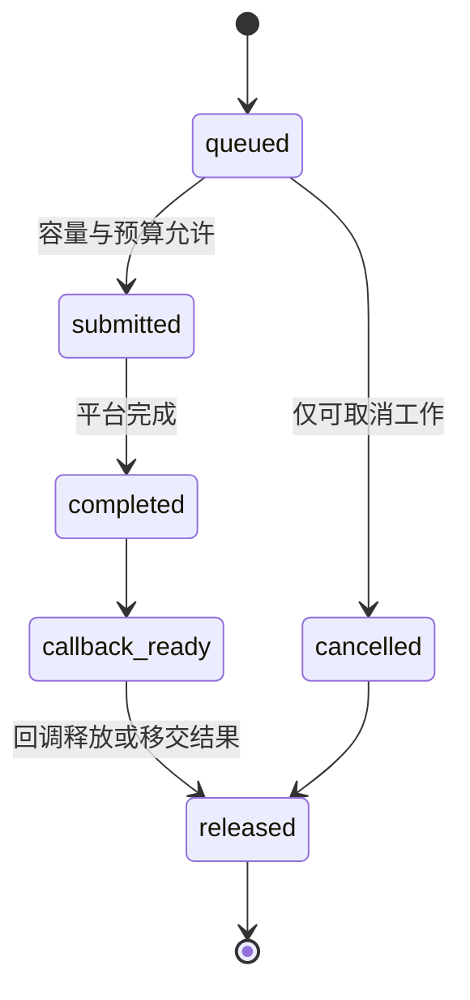

# I/O 调度契约

## 状态与范围

本文细化 [运行时、连接与并发控制](runtime-and-concurrency.md) 中的 I/O
调度规则。它是 Pico v1 的目标设计，不表示 Phase 0 已实现异步 reactor、独立
队列或后台压缩。实现落地前，当前 `accept -> handleConnection` 顺序循环仍是唯一
的实现事实。

本文不选择 `io_uring`、`epoll`、kqueue、IOCP 或线程池作为平台承诺。平台后端只要
遵守这里的提交、完成和回调边界即可。本文也不改变 ADR-0005 的单写者提交排序，
或 ADR-0006 的 WAL 先行及默认持久化提交。

## 证据与采用边界

本设计核对了同一工作区的 TigerBeetle 提交
[`97c7a8ef`](https://github.com/tigerbeetle/tigerbeetle/blob/97c7a8ef385270ebe0e1b75959d3d21d134629df/src/io/linux.zig)：其 Linux I/O 层将内核完成事件
复制到独立完成队列后才运行回调，回调产生的新提交在本轮末尾统一提交；提交队列
满时先推进提交，而不是递归执行回调。其消息池还以各队列的最大并发量推导固定
容量，保证资源饱和时仍有前进空间
([`message_pool.zig`](https://github.com/tigerbeetle/tigerbeetle/blob/97c7a8ef385270ebe0e1b75959d3d21d134629df/src/message_pool.zig))。

Pico 采用这些调度和容量推导原则，但不采用 TigerBeetle 的单线程运行时、固定大小
复制消息池、VSR 复制队列、数据修复或其 IOPS 常量。Pico 是单机单实例 OLTP
数据库；连接的 PostgreSQL 线协议、WAL 耐久边界和 LSM 后台工作决定了不同的
请求类别与饥饿边界。

## 目标与不变量

调度器的目标依次是：

1. 已确认提交的 WAL 持久化与恢复 I/O 可以继续推进。
2. 一个慢连接、耗尽的后台队列或完成事件风暴不能阻塞其他连接和提交。
3. 内存、内核在途 I/O、文件句柄和回调工作量都有可计算上限。
4. 平台 I/O 完成不在内核队列遍历期间执行业务逻辑，因而没有递归驱动的调用栈。
5. 同一连接的协议响应顺序，以及单写者的提交序号顺序，不因并发调度改变。

调度器不拥有 SQL 语义、MVCC 可见性或 WAL 内容。它只拥有 I/O 操作的提交状态、
完成队列、预算、容量和计时。完成某个文件写入不等于提交成功；只有 `commit`
在 WAL 达到耐久边界并发布 `published_commit_seq` 后才能报告成功。

## 工作类别与容量

每个 I/O 操作在提交前必须归入一个类别。类别是调度和观测属性，不是新的存储
所有权边界。

| 类别 | 工作 | 调度要求 | 饱和时的动作 |
| --- | --- | --- | --- |
| `critical` | WAL 追加/同步、恢复所需读取、已开始的 manifest 发布、关闭所需的文件操作 | 可使用全部保留容量；不得被网络写出或压缩排队在后 | 停止接收新的写事务；若无法完成关键 I/O，进入明确的实例级失败路径 |
| `foreground_read` | 已准入连接的 socket 读取、只读语句所需文件读取 | 在 `critical` 之后按连接公平调度 | 暂停对应连接读取；不丢弃已验证帧 |
| `foreground_write` | 协议错误、命令完成和查询结果的 socket 写出 | 小而有界；不得让慢读者占用 `critical` 容量 | 停止该连接读取及继续产出结果；超过硬上限关闭该连接 |
| `maintenance` | 压缩读写、预取、检查点准备与可取消清理 | 只能使用未被前台和关键路径预留的容量 | 延后或降并发；不得回收活跃快照仍可见的文件 |

`critical` 内部的 WAL 同步和恢复读取均不可取消；已开始的 manifest 发布也必须完成
或令实例以明确故障停止，不能把半完成状态报告给连接。检查点的最终持久化步骤若
阻塞 WAL 回收或恢复正确性，应临时提升为 `critical`；其扫描、合并和文件准备仍是
`maintenance`。这避免将“检查点”整体误当成比提交更高优先级的任务。

所有类别分别维护：待提交数、内核在途数、已完成待回调数、字节数和从入队到完成
的年龄。容量应由配置集中声明，并同时约束操作槽位、缓冲字节和单文件/单连接的
在途上限；只限制其中一个会让另两个形成隐性无界队列。

启动时必须验证容量关系。至少要为每个尚未关闭的连接保留一个读取或关闭槽位，
为每个已准入提交批次保留完成其 WAL 追加和同步所需的槽位，并为恢复、manifest
收尾及关闭保留 `critical` 槽位。实现不得以“所有槽位均可被压缩占用”为前提。
配置计算应像 TigerBeetle 的消息池一样由最坏同时在途操作推导，并以断言和测试
固定下来，而不是靠运行时分配失败来发现死锁。

## Tick 与派发规则

一次 tick 只做有限工作，按下列顺序推进：

1. 将前一轮回调产生的、在容量以内的操作提交给平台。
2. 批量提取平台完成事件，只写入操作结果、完成时间和完成队列；此阶段不得调用
   SQL、存储、网络协议或用户回调。
3. 在回调数量和 CPU 时间预算内处理完成队列。一个回调只能改变自身所属状态、
   释放资源、排队后续工作或把结果转交给其所有者；不得嵌套运行调度器。
4. 按类别选取下一批操作：先补足 `critical`，再在已准入连接间轮转
   `foreground_read` 和 `foreground_write`，最后只使用剩余预算运行
   `maintenance`。
5. 提交第 4 步及回调产生的新操作，然后让出。若仍有就绪工作，下一 tick 不得在
   内核中无限等待；若没有就绪工作，才可阻塞到下一个定时器或 I/O 完成。

“轮转”是连接粒度而非请求粒度：每条可运行连接每轮只获得受配置限制的操作数和
字节数，避免大结果集或单个批量扫描独占前台预算。连接内仍由 `net/connection`
保持报文和响应顺序。调度器不能为了公平重排同一连接的两个响应，也不能将多个
提交请求交给绕过 `commit` 的路径。

回调预算耗尽时，未处理完成事件保留到下一 tick。若其年龄超过告警阈值，运行时
必须记录类别、队列深度和最长年龄；它不能通过在内核完成遍历中直接执行回调来
“追赶”。这条规则直接对应 TigerBeetle 将 CQE 与回调队列分离所避免的递归和不可
解释调用栈问题。

## 背压与准入

背压必须从耗尽点反向传播到可以停止产生工作的最早边界：

| 耗尽资源 | 上游动作 | 恢复条件 |
| --- | --- | --- |
| `foreground_write` 的单连接字节上限 | 停止读取该连接；暂停结果流送 | 输出低于恢复水位后按原次序继续 |
| 全局前台读取槽位或缓冲 | reactor 暂停 accept 或未饱和连接的读取 | 有操作完成且全局水位低于恢复阈值 |
| 提交请求或 `critical` WAL 槽位 | 连接不再准入下一条写语句；已入队请求保持原顺序 | 单写者和 WAL 释放足够容量 |
| `maintenance` 槽位或字节预算 | 不启动新的压缩/预取；可取消工作在安全检查点停止 | 前台与关键水位回落后再调度 |
| 操作对象或缓冲池 | 不分配替代对象；沿所属类别的规则施加背压 | 原对象在回调后归还池中 |

水位必须有高、低两个阈值，防止单个完成事件造成反复启停。硬上限是正确性边界：
单连接输出超过硬上限时，先取消尚未跨越不可逆提交点的工作，再丢弃输出并关闭；
不能为它挤占其他连接或 WAL 的保留容量。一个已经进入 WAL 耐久路径的提交仍由
单写者完成，其结果只是不再送往已关闭连接。

全局压力下，accept 的暂停优先于杀死健康的既有连接；达到明确部署的连接硬上限
时可以快速拒绝新连接。调度器不得在内存压力下随意拒绝已确认提交，也不得把默认
耐久级别降为异步以清空队列。

## 操作生命周期与取消

每个操作只能经历一次下列状态转换：

`submitted` 之后的取消是协作性的：取消标记阻止后续操作，但不假定平台能撤销已在
内核中的读取、写入或同步。回调必须首先识别连接/语句代次是否仍有效，再决定交付
结果或仅释放资源。对象在 `released` 前不得重用；完成事件需要持有的缓冲、文件句柄
和连接弱引用必须一直有效。

连接关闭会撤销尚未提交的网络 I/O 和可取消的只读/维护工作，但不撤销进入不可逆
提交点后的 WAL 或 manifest 工作。取消和关闭都不得从回调直接递归驱动新一轮 I/O；
它们只改变状态并排入下一批操作。

## 观测、故障与验收

至少输出下列指标，均按 I/O 类别和耐久级别区分：提交数、完成数、回调数、当前与
峰值队列深度、在途槽位、缓冲字节、队列年龄、提交到完成延迟、完成到回调延迟、
回调 CPU 时间、预算耗尽次数、背压启停次数、拒绝 accept 数、取消数及关键 I/O
失败数。连接标识、取消凭据、SQL 文本和行内容不得成为指标标签。

关键 I/O 的错误不能被降级为一次连接错误：WAL 追加/同步、恢复读取或已开始的
manifest 发布失败时，实例必须停止接收会产生新持久状态的工作，并以可诊断错误
进入恢复/停止路径。普通 socket EOF、已取消只读操作和可取消维护工作则按其所有者
的局部清理规则完成。

最低回归集：

1. 同步完成和回调再入压力下，回调深度恒为一，操作计数守恒，且新 I/O 只在下一
   提交阶段进入平台。
2. 将每类槽位缩至测试最小值，验证容量断言、背压恢复、关键槽位预留及无死锁。
3. 慢读者、大结果集和持续压缩并存时，其他连接仍可完成小读写，WAL 同步不被
   网络写出饿死。
4. 在 WAL 追加、同步、manifest 收尾和回调移交处注入错误或连接关闭；恢复后只
   暴露已确认提交前缀，且无悬挂操作或泄漏缓冲。
5. 测量并断言维护工作在前台压力下退让，而前台空闲后能重新取得有限进展；不能
   以永久饿死压缩作为达标方式。

## 实施边界

建议按以下可回滚顺序实施：先定义 `runtime` 的操作状态、固定容量与完成队列，
并用假的平台后端验证 tick；再接入 socket I/O 与单连接背压；随后让 `commit` 使用
受保留的 WAL 槽位和 group commit；最后接入压缩、检查点准备和文件回收。每一步
都必须先暴露对应指标和故障回归，才扩大并发度。

模块依赖、唯一数据写权和质量门槛由
[架构契约](../architecture-contract.yml) 约束。若要改变提交顺序、默认耐久保证、
单写者模型或引入跨实例 I/O 协调，必须以新 ADR 取代相应既有决策。
