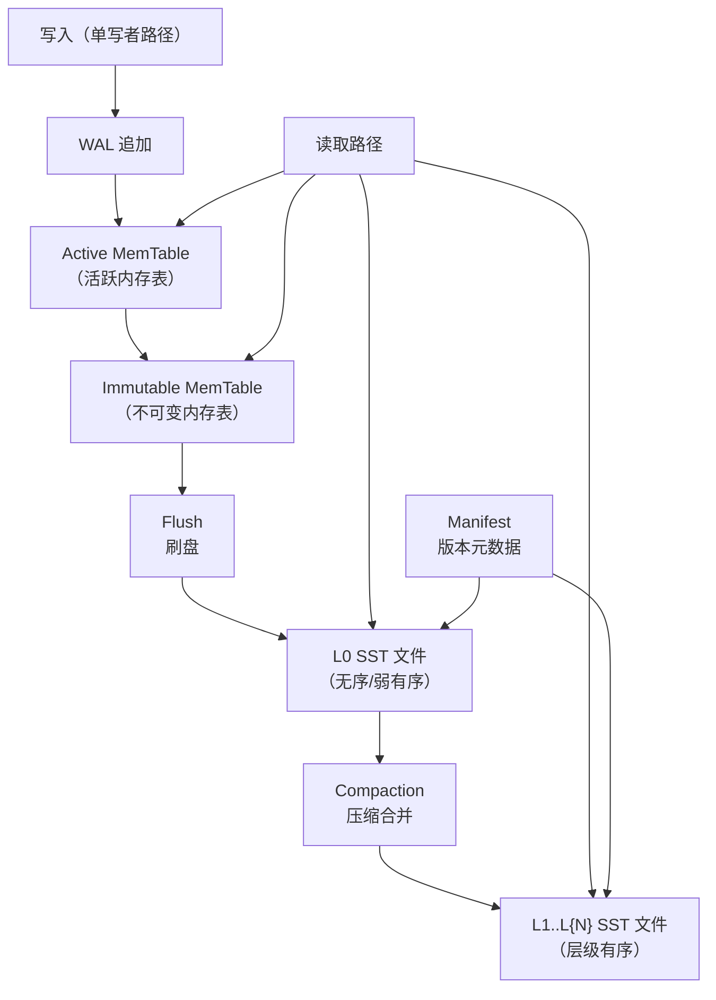
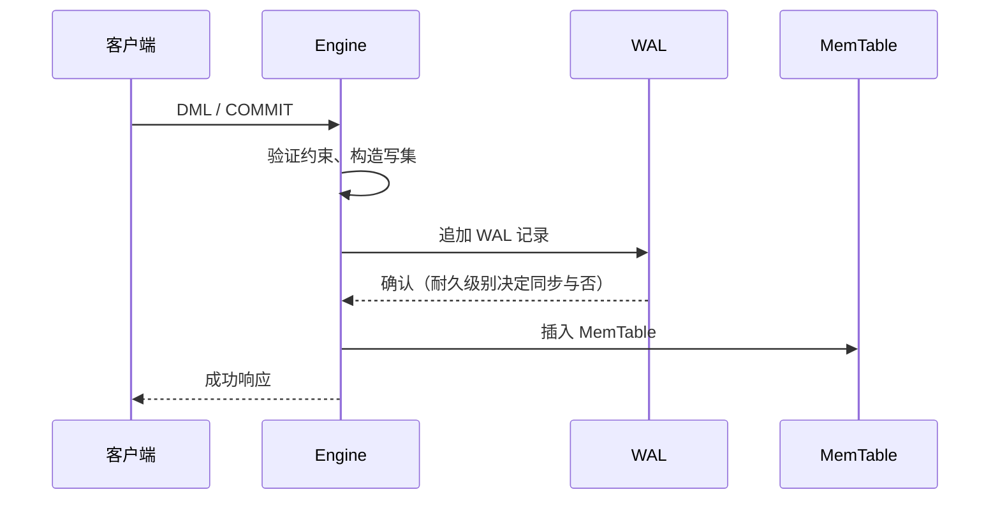

# LSM 存储引擎设计

## 概述

Pico 采用 **LSM 风格**（Log-Structured Merge-Tree）作为表与索引的主存储组织方式。LSM 以追加写为主，将随机写转化为顺序写，与 Pico 的"写性能好、高争用不崩"目标一致（见 ADR-0004）。关系模型（表、行、主键、二级索引）是用户视角；LSM 是物理组织方式。

本文件记录 LSM 存储引擎的目标设计与演进路径。当前实现状态见 [README](../README.md)。

---

## 设计原则

- **有序集合 + WAL + MVCC** 是逻辑边界：执行层不绑定文件格式细节。
- 所有写走 WAL → 内存表管道；SST 文件一旦写入即不可变（仅压缩可改写）。
- 二级索引与主表共享同一 LSM 结构；事务提交易失性产出跨表/索引的 WAL 记录。
- 压缩与读放大/空间放大的可观测性是第一天设计约束，不是事后补充。

---

## 架构总览



### 组件职责

| 组件 | 职责 |
|------|------|
| **Active MemTable** | 接收当前写入的可变内存有序集合。写满后冻结为 Immutable。 |
| **Immutable MemTable** | 只读内存有序集合，等待刷盘为 L0 SST。允许多个并存。 |
| **L0 SST** | 直接由 flush 产生的不可变有序文件。L0 内文件区间可重叠。 |
| **L1..L{N} SST** | 层级有序的不可变有序文件。层级内区间不重叠，覆盖全局键空间。 |
| **Manifest** | 记录所有 SST 文件的层级归属、键区间、文件号和版本号。WAL 的保护对象之一。 |
| **WAL** | 恢复的事实来源（见 [WAL 与崩溃恢复](wal-and-recovery.md)）。 |

---

## MemTable（内存表）

### 数据结构

Active MemTable 是一个支持并发读（写者串行插入）的有序数据结构：

- **默认实现**：跳表（skiplist），O(log n) 期望插入/查找。
- **可选实现**：有序向量 + 二分查找（适用于小数据量或批构造）。
- **布隆过滤器**：可选的前缀/整键布隆过滤，减少不存在的键对 SST 的读取。

### 内部键编码

每笔 MemTable 条目编码为连续字节序列：

| 字段 | 编码 | 描述 |
|------|------|------|
| key_size | varint | 用户键长度 |
| user_key | bytes | 用户键 |
| seq | fixed64 | `(commit_seq << 8) \| value_type` |
| value_size | varint | 值长度 |
| value | bytes | 值数据 |

相同 user_key 的条目按 commit_seq **降序**排列（最新在前），保证点查立即返回最新版本。

### 内存管理

- MemTable 使用 arena 分配器进行批量内存分配，降低碎片和记账开销。
- 刷盘后整个 MemTable 的 arena 一次性释放，不逐条回收。
- 全局 `WriteBufferManager` 协调所有内存表的总内存上限，超过阈值触发写入停滞（write stall）。

### 切换条件

当活跃 MemTable 满足以下任一条件时切换为 Immutable：

1. 内存使用量超过 `write_buffer_size`（编译期或启动时配置）。
2. 活跃 MemTable 关联的 WAL 文件达到大小上限。
3. 显式 `FLUSH` 命令触发。

切换过程：

1. 当前 MemTable 标记为 Immutable。
2. 创建新的 Active MemTable 与新的 WAL 文件。
3. 后台线程将 Immutable MemTable 刷盘为 L0 SST。

---

## SST 文件格式

SST 文件是 LSM 的持久化有序存储单元。每个 SST 文件包含数据块、索引块和元数据。

```
[Footer] ← 指向元数据索引块的指针
[元数据过滤器] ← 布隆过滤器、统计信息等
[元数据索引] ← 各元数据块的位置与大小
[数据索引] ← 每个数据块的最后一个键（用于二分查找）
[数据块 N] ← 压缩的有序键值对
...
[数据块 1] ← 压缩的有序键值对
[Header] ← 文件 Magic、格式版本、键比较器名
```

### 数据块

- 贪心打包：扫描键值对直到累计大小超过 `block_size`，或者当前键与前一个键共享的前缀长度超过 `block_restart_interval`（前缀压缩）。
- 前缀压缩（delta encoding）：每个重启点记录完整键，后续记录只记录与前一个键的差异。
- 可选压缩（Snappy/Zstd）：对整个数据块进行。

### 数据索引

- 每个数据块的最后一个键（或分隔键）作为索引条目。
- 读取时通过二分查找定位目标键所在的数据块。

### 元数据过滤器

- 整键或前缀布隆过滤器。
- 点查时先检查布隆过滤器，若提示不存在则跳过 SST 文件，避免不必要的 I/O。

---

## 写入路径



关键约束：

- **WAL 先于 MemTable**：WAL 写入成功后，才插入 MemTable。这是崩溃恢复正确性的核心不变式。
- **单写者序列化**：所有提交通过单写者路径串行化，MemTable 插入不需要加锁。
- **写集原子性**：显式事务的所有操作在一个 `txn_batch` WAL 帧中写入；memtable 插入在 WAL 确认后顺序应用。

见 [写入路径与 WriteBatch](write-path.md) 的详细设计。

---

## 读取路径

### 点查（Point Lookup）

按键精确查找的路径（谓词为主键等值）：

1. **Active MemTable**：查跳表（布隆过滤）。找到则返回最新版本。
2. **Immutable MemTables**：按从新到旧顺序依次查找。找到则返回。
3. **L0 SST**：按从新到旧顺序依次查找（L0 内区间可能重叠）。先检查布隆过滤器。
4. **L1..L{N} SST**：二分查找定位可能包含该键的 SST 文件（层级内区间不重叠），然后读对应数据块。

找到第一个可见版本后返回；若所有层级均返回墓碑（tombstone），则键不存在。

### 范围扫描（Range Scan）

按有序迭代器遍历键范围：

1. 合并所有层级（MemTable + Immutable + L0 + L1..L{N}）的有序迭代器。
2. 执行归并排序（merge sort），按 commit_seq 降序去重（最新版本优先）。
3. 对用户返回每个键的最新可见版本。

---

## Compaction（压缩）

### 目标

- **限制 L0 文件数**：将 L0 的多个重叠文件合并为 L1 的无重叠文件。
- **控制读放大**：减少点查和范围扫描需要检查的文件数。
- **回收空间**：清除已覆盖的旧版本和被删除的墓碑。
- **控制写放大**：避免过深的压缩层级导致过多写放大。

### 触发条件

| 条件 | 操作 |
|------|------|
| L0 文件数超过 `level0_file_num_compaction_trigger` | 选定一批 L0 文件合并到 L1 |
| 某层级的总大小超过目标阈值 | 选择该层级中与下一层级重叠区间最大的一个 SST 文件进行合并 |
| 手动 `COMPACT` 命令 | 按用户指定的键区间压缩 |

### 压缩策略

**Size-Tiered Compaction（按层级）**：

- L1 及以上层级内部键区间不重叠，每个层级有固定的大小目标（逐层放大 10 倍）。
- 选择层级中与下一层级重叠比例最高的文件进行压缩。
- 压缩输入：该文件及其与下一层级的所有重叠文件。
- 压缩输出：一组新的 L{N+1} SST 文件，键区间不重叠。

### 压缩过程

1. 选定的 SST 文件集合 → 归并排序读取所有条目。
2. 按 commit_seq 判断版本可见性，丢弃被覆盖的旧版本。
3. 按新层级的目标 SST 大小打包输出文件。
4. 所有输出文件写完后进行 fsync。
5. 原子更新 Manifest：移除输入文件，添加输出文件，递增版本号。
6. 旧文件在所有引用其可见区间的快照释放后回收。

---

## Manifest（版本清单）

Manifest 是 LSM 版本的持久化记录。每次版本变更（flush、compaction）写入一条 manifest 记录。

### 记录类型

| 类型 | 内容 |
|------|------|
| `version_edit` | 新增 SST 文件（文件号、层级、键区间、大小、时间戳） |
| `version_edit` | 删除 SST 文件（文件号、层级） |
| `snapshot` | 当前快照列表（GC 安全边界） |
| `wal_closed` | 已关闭的 WAL 文件及其大小 |

### 生命周期

1. Flush/Compaction 完成后，构建 `VersionEdit`。
2. 追加到 Manifest 文件（带 CRC 校验）。
3. fsync Manifest（默认耐久级别下）。
4. 更新内存中的 LSM 版本引用。
5. 清除不再引用的文件的读缓存。

启动恢复时：

1. 打开并验证 Manifest（magic + CRC）。
2. 按顺序重放所有 `VersionEdit` 重建 LSM 文件集合。
3. 从最后一个 Manifest 记录之后的位置开始重放 WAL。

---

## 快照与 GC

### 快照编号

- 每个提交获得单调递增的提交序号（`commit_seq`）。
- 快照记录创建时的 `commit_seq`。
- 可见性：只看到 `commit_seq ≤ snapshot_seq` 且未经删除的版本。

### 空间回收

- 压缩过程中，丢弃所有 `commit_seq < oldest_snapshot_seq` 的旧版本和被墓碑标记的已删除条目。
- 只有当某 SST 文件中的全部条目对所有存活快照都不可见时，该文件才在压缩中被完全排除。
- `oldest_snapshot_seq` 是最早活跃快照的序号，或当前分配的最新序号（无活跃快照时）。

---

## 当前实现状态 vs 目标

| 特性 | Phase 0（当前） | Phase 1 目标 | Phase 2+ 目标 |
|------|----------------|-------------|--------------|
| 内存表 | `ArrayList(Row)` + `HashMap` 主键索引 | 有序内存表（跳表或有序向量） | 带布隆过滤器的跳表 |
| 持久化 | 纯内存（WAL 重放恢复） | L0 SST 刷盘 | 全层级 SST |
| SST 格式 | 无 | 有格式的 SST 文件 | 前缀压缩 + 可选块压缩 |
| Compaction | 无 | L0 → L1 合并 | 全层级 |
| Manifest | 引擎内 `StringHashMap(Table)` | 持久化 Manifest 文件 | 带版本号与快照追踪的 Manifest |
| 布隆过滤器 | 无 | 可选整键布隆 | 前缀布隆 |
| 内存上限控制 | 无 | WriteBufferManager | 写停滞 |
| 二级索引 | `CREATE INDEX` → `NotImplemented` | 作为独立 LSM 结构实现 | 覆盖索引（Index-Only Scan） |

---

## 参考

- RocksDB [MemTable Insertion](https://github.com/facebook/rocksdb/blob/main/docs/components/write_flow/04_memtable_insert.md)：M-Table 内部键编码、arena 分配、并发插入。
- RocksDB [Tombstone Lifecycle](https://github.com/facebook/rocksdb/blob/main/docs/components/write_flow/08_tombstone_lifecycle.md)：墓碑在写路径、读路径和压缩中的生命周期。
- [ADR-0004 LSM 存储引擎决策](../adr/0004-lsm-storage-engine.md)：选择 LSM 而非 B-Tree 的取舍分析。
- [Pager 与静态页缓存](pager-and-static-cache.md)：SST 文件可选的页缓存层。
- [并发控制契约](concurrency-control.md)：MVCC 快照与版本可见性。
