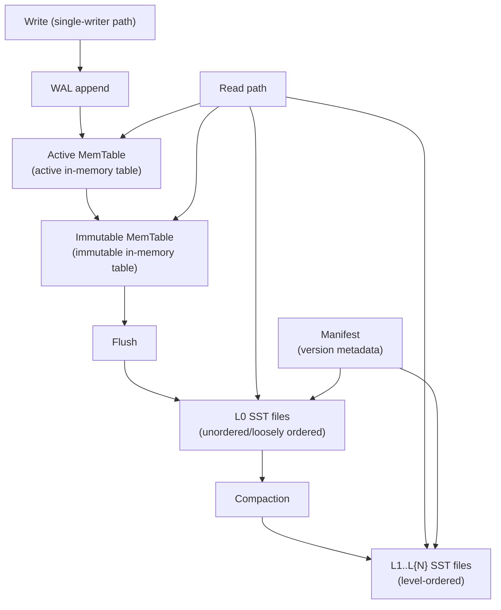
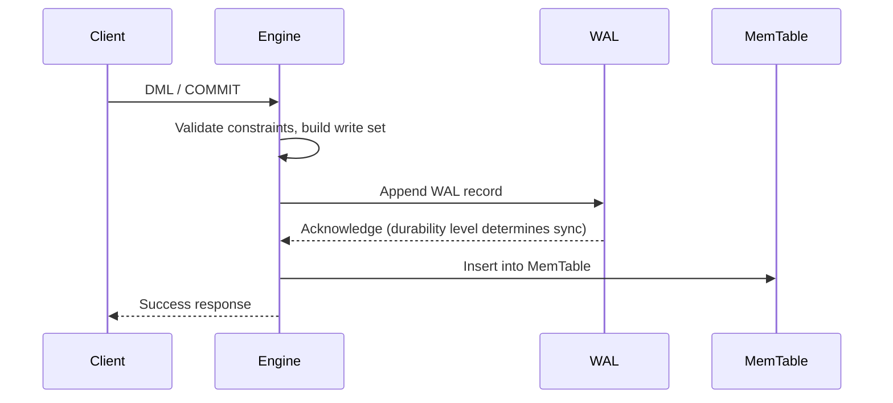

# LSM Storage Engine Design

## Overview

Pico uses an **LSM-style** (Log-Structured Merge-Tree) organization as the primary storage layout for tables and indexes. LSM favors append-only writes and turns random writes into sequential writes, matching Pico's goal of strong write performance without collapsing under contention (see ADR-0004). The relational model (tables, rows, primary keys, and secondary indexes) is the user-facing view; LSM is the physical organization.

This document records the target design and evolution path for the LSM storage engine. See [README](../../README.md) for the current implementation status.

---

## Design Principles

- **Ordered set + WAL + MVCC** is the logical boundary: the execution layer does not depend on file format details.
- All writes follow the WAL -> memtable pipeline; once written, SST files are immutable (only compaction may rewrite them).
- Secondary indexes and primary tables share the same LSM structure; transaction commit produces a volatile WAL record spanning the affected tables/indexes.
- Observability for compaction, read amplification, and space amplification is a day-one design constraint, not a later add-on.

---

## Architecture Overview



### Component Responsibilities

| Component | Responsibility |
|------|------|
| **Active MemTable** | Holds the current mutable in-memory ordered set. Freezes into an Immutable when full. |
| **Immutable MemTable** | Read-only in-memory ordered set waiting to be flushed to an L0 SST. Multiple Immutable MemTables may coexist. |
| **L0 SST** | Immutable ordered file produced directly by flush. File ranges may overlap within L0. |
| **L1..L{N} SST** | Immutable, level-ordered files. Ranges do not overlap within a level, and together cover the key space. |
| **Manifest** | Records the level, key range, file number, and version number for every SST file. One of the objects protected by the WAL. |
| **WAL** | Source of truth for recovery (see [WAL and Crash Recovery](wal-and-recovery.md)). |

---

## MemTable (In-Memory Table)

### Data Structure

An Active MemTable is an ordered data structure supporting concurrent reads while writes are serialized:

- **Default implementation**: skiplist, with expected O(log n) insertion and lookup.
- **Optional implementation**: sorted vector plus binary search, suitable for small data sets or batch construction.
- **Bloom filter**: optional prefix/full-key Bloom filter to reduce reads of SSTs that cannot contain a key.

### Internal Key Encoding

Each MemTable entry is encoded as a contiguous byte sequence:

| Field | Encoding | Description |
|------|------|------|
| key_size | varint | User-key length |
| user_key | bytes | User key |
| seq | fixed64 | `(commit_seq << 8) \| value_type` |
| value_size | varint | Value length |
| value | bytes | Value data |

Entries for the same user key are ordered by `commit_seq` in **descending** order (newest first), so a point lookup can immediately return the newest version.

### Memory Management

- MemTables use an arena allocator for bulk allocation, reducing fragmentation and accounting overhead.
- After flush, the entire MemTable arena is released at once rather than reclaimed entry by entry.
- A global `WriteBufferManager` coordinates the total memory limit across all memtables; exceeding the threshold triggers a write stall.

### Switching Conditions

The active MemTable switches to Immutable when any of the following is true:

1. Memory usage exceeds `write_buffer_size` (configured at compile time or startup).
2. The WAL file associated with the active MemTable reaches its size limit.
3. An explicit `FLUSH` command is issued.

Switching proceeds as follows:

1. Mark the current MemTable Immutable.
2. Create a new Active MemTable and a new WAL file.
3. A background thread flushes the Immutable MemTable to an L0 SST.

---

## SST File Format

An SST file is the persistent ordered-storage unit of the LSM. Each SST file contains data blocks, index blocks, and metadata.

```
[Footer] <- pointer to the metadata index block
[Metadata filter] <- Bloom filter, statistics, and so on
[Metadata index] <- location and size of each metadata block
[Data index] <- last key of each data block (for binary search)
[Data block N] <- compressed ordered key-value pairs
...
[Data block 1] <- compressed ordered key-value pairs
[Header] <- file magic, format version, key-comparator name
```

### Data Blocks

- Greedy packing: scan key-value pairs until the accumulated size exceeds `block_size`, or the shared prefix of the current and previous keys exceeds `block_restart_interval` (prefix compression).
- Prefix compression (delta encoding): each restart point records a complete key; subsequent records store only the difference from the previous key.
- Optional compression (Snappy/Zstd): applied to the entire data block.

### Data Index

- The last key (or separator key) of each data block is an index entry.
- Reads locate the data block containing a target key through binary search.

### Metadata Filters

- Full-key or prefix Bloom filters.
- Point lookups check the Bloom filter first; if it says the key is absent, the SST is skipped to avoid unnecessary I/O.

---

## Write Path



Key constraints:

- **WAL before MemTable**: insert into the MemTable only after the WAL write succeeds. This is the core crash-recovery invariant.
- **Single-writer serialization**: all commits are serialized through the single-writer path, so MemTable insertion needs no lock.
- **Write-set atomicity**: all operations in an explicit transaction are written in one `txn_batch` WAL frame; MemTable insertion is applied in order after WAL acknowledgment.

See [Write Path and WriteBatch](write-path.md) for the detailed design.

---

## Read Path

### Point Lookup

The exact-key lookup path (for a primary-key equality predicate) is:

1. **Active MemTable**: query the skiplist (and Bloom filter). If found, return the newest version.
2. **Immutable MemTables**: search from newest to oldest. Return on the first match.
3. **L0 SST**: search from newest to oldest (L0 ranges may overlap). Check the Bloom filter first.
4. **L1..L{N} SST**: use binary search to locate SST files that may contain the key (ranges do not overlap within a level), then read the relevant data block.

Return the first visible version found; if every level returns a tombstone, treat the key as nonexistent.

### Range Scan

Traverse the key range with ordered iterators:

1. Merge ordered iterators from every level (MemTable + Immutable + L0 + L1..L{N}).
2. Run a merge sort and deduplicate by descending `commit_seq` (newest version first).
3. Return the newest visible version of each key to the user.

---

## Compaction

### Goals

- **Limit L0 file count**: merge overlapping L0 files into non-overlapping L1 files.
- **Control read amplification**: reduce the number of files checked by point lookups and range scans.
- **Reclaim space**: remove superseded old versions and deletion tombstones.
- **Control write amplification**: avoid excessive write amplification from overly deep compaction levels.

### Triggers

| Condition | Action |
|------|------|
| L0 file count exceeds `level0_file_num_compaction_trigger` | Select a batch of L0 files and merge them into L1 |
| Total size of a level exceeds its target | Select the SST with the largest overlap into the next level and merge it |
| Manual `COMPACT` command | Compact the key range specified by the user |

### Compaction Strategy

**Size-Tiered Compaction (by level)**:

- Key ranges do not overlap within L1 and above; each level has a fixed size target, increasing by 10x per level.
- Select the file with the highest overlap ratio with the next level.
- Compaction input: that file and every overlapping file in the next level.
- Compaction output: a set of new L{N+1} SST files with non-overlapping key ranges.

### Compaction Process

1. Read all entries from the selected SST files with a merge sort.
2. Determine version visibility by `commit_seq` and discard superseded old versions.
3. Pack output files to the target SST size for the new level.
4. `fsync` after all output files are written.
5. Atomically update the Manifest: remove input files, add output files, and increment the version number.
6. Reclaim old files after all snapshots referring to their visibility intervals are released.

---

## Manifest (Version Set)

The Manifest is the persistent record of an LSM version. Each version change (flush or compaction) writes one Manifest record.

### Record Types

| Type | Contents |
|------|------|
| `version_edit` | Add an SST file (file number, level, key range, size, timestamp) |
| `version_edit` | Remove an SST file (file number, level) |
| `snapshot` | Current snapshot list (GC safety boundary) |
| `wal_closed` | Closed WAL file and its size |

### Lifecycle

1. Build a `VersionEdit` after flush or compaction completes.
2. Append it to the Manifest file (with CRC validation).
3. `fsync` the Manifest (at the default durability level).
4. Update in-memory references to the LSM version.
5. Clear the read cache for files that are no longer referenced.

During startup recovery:

1. Open and validate the Manifest (magic + CRC).
2. Replay all `VersionEdit` records in order to rebuild the LSM file set.
3. Replay the WAL starting after the last Manifest record.

---

## Snapshots and GC

### Snapshot Numbers

- Each commit receives a monotonically increasing commit sequence number (`commit_seq`).
- A snapshot records the `commit_seq` at its creation.
- Visibility: only versions with `commit_seq ≤ snapshot_seq` that have not been deleted are visible.

### Space Reclamation

- During compaction, discard old versions with `commit_seq < oldest_snapshot_seq` and deleted entries represented by tombstones.
- An SST file is completely excluded from compaction only when all of its entries are invisible to every live snapshot.
- `oldest_snapshot_seq` is the sequence number of the oldest active snapshot, or the latest allocated sequence number when no snapshot is active.

---

## Current Implementation vs. Target

| Feature | Phase 0 (current) | Phase 1 target | Phase 2+ target |
|------|----------------|-------------|--------------|
| MemTable | `ArrayList(Row)` + `HashMap` primary-key index | Ordered in-memory table (skiplist or sorted vector) | Skiplist with Bloom filter |
| Persistence | In-memory only (WAL replay recovery) | Flush to L0 SST | Full SST levels |
| SST format | None | Formatted SST files | Prefix compression + optional block compression |
| Compaction | None | L0 -> L1 merge | All levels |
| Manifest | In-engine `StringHashMap(Table)` | Persistent Manifest file | Manifest with version numbers and snapshot tracking |
| Bloom filter | None | Optional full-key Bloom filter | Prefix Bloom filter |
| Memory limit control | None | WriteBufferManager | Write stall |
| Secondary indexes | `CREATE INDEX` -> `NotImplemented` | Implemented as independent LSM structures | Covering indexes (Index-Only Scan) |

---

## Pico Decisions

- [ADR-0004 LSM Storage Engine Decision](../adr/0004-lsm-storage-engine.md): tradeoffs behind choosing LSM over B-Tree.
- [Pager and Static Page Cache](pager-and-static-cache.md): optional page-cache layer for SST files.
- [Concurrency Control Contract](concurrency-control.md): MVCC snapshots and version visibility.
