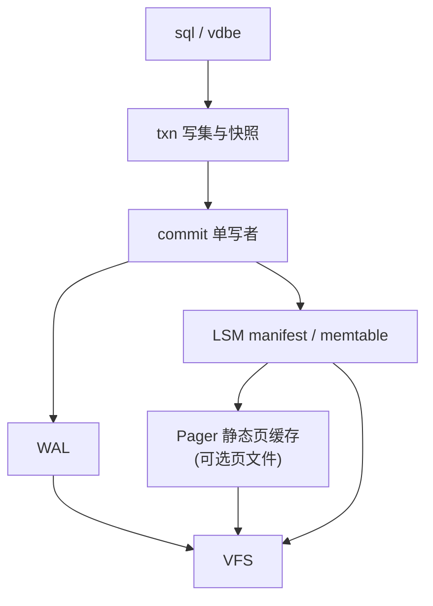
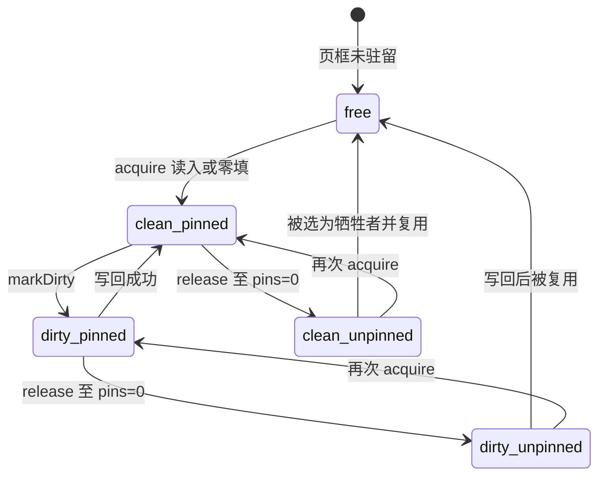

# Pager 与静态页缓存

## 状态与范围

本文描述 Pico 的**页管理器（Pager）**与**静态页缓存**契约，对照 SQLite 的
[`pager.c` / `pager.h`](https://github.com/sqlite/sqlite/blob/924626e603a36cc48ce87bc3a3eeddc61af1a72f/src/pager.h)、
[`pcache.c` / `pcache1.c`](https://github.com/sqlite/sqlite/blob/924626e603a36cc48ce87bc3a3eeddc61af1a72f/src/pcache1.c)、
[`pager-invariants.txt`](https://github.com/sqlite/sqlite/blob/924626e603a36cc48ce87bc3a3eeddc61af1a72f/doc/pager-invariants.txt) 与
`SQLITE_CONFIG_PAGECACHE`（见 [`sqlite.h.in`](https://github.com/sqlite/sqlite/blob/924626e603a36cc48ce87bc3a3eeddc61af1a72f/src/sqlite.h.in)）。

当前实现以 `src/storage/pager.zig` 为准：

- 编译期固定的 `page_size` 与 `cache_pages`；
- 页缓冲内嵌在 Pager 对象中，获取路径**不**为缓存行调用通用堆分配；
- `acquire` / `release` 引用（pin）、脏标记、LRU 驱逐前写回、`flush` / `sync`、
  按页截断；
- **不**实现事务、回滚日志、文件锁或 WAL 策略。

因此 Pico 的 Pager 更接近「固定容量的页框 + 文件后端」，而不是 SQLite 那个把
B-Tree、回滚日志、WAL 模式和锁揉在一起的巨型子系统。崩溃安全仍由 **WAL + 检查点
+ 不可变 LSM 文件** 承担（ADR-0004、ADR-0006）；Pager 只为需要定长页 I/O 的文件
（未来的块索引、空闲页、某些元数据页文件等）提供可预测的缓存边界。

## 外部参考及适用性

| 参考 | 已核对的机制 | Pico 的采用方式 | 明确不采用 |
| --- | --- | --- | --- |
| SQLite Pager API | `Get`/`Ref`/`Unref`、脏页、`Write`、事务 begin/commit、journal/WAL 模式 | pin/unpin、脏标记、写回与 `sync`；页对齐读写 | rollback journal、super-journal、SAVEPOINTS、多 journal 模式、Pager 级事务 |
| SQLite pager invariants | 页覆盖条件、对齐读写、sync 后再删 journal、锁后再改库文件 | 对齐读写；脏页写回可验证；上层在覆盖前保证可恢复 | 「先写 journal 再覆盖页」作为主路径；多进程 EXCLUSIVE/SHARED 锁不变量 |
| SQLite PCache / pcache1 | pin 页不可回收；脏列表；`xStress` 逼写；全局 PGroup 回收 | pin 阻止驱逐；缓存满且全 pin 时失败；驱逐前写脏页 | 可插拔 `sqlite3_pcache_methods2`、跨 Pager 的全局页池抢夺、运行时扩容 |
| `SQLITE_CONFIG_PAGECACHE` | 启动时提供 `pMem/sz/N` 静态池，优先吃池再 `malloc` | **更严**：池大小即硬上限，编译期嵌入，默认不回落到堆扩页框 | 池耗尽后静默 `malloc` 额外页框；负 N 表示按连接 bulk 分配 |
| ADR-0004 LSM | 主存储是有序集合而非原地 B-Tree 页更新 | Pager 不定义行/版本布局；LSM SST 默认走追加文件 + VFS，不强制经 Pager | 把用户表主路径做成 SQLite 式页修改 B-Tree |

## 分层关系

| 模块 | 唯一职责 | 拥有的状态 |
| --- | --- | --- |
| `storage/vfs` | 目录围栏与文件 I/O 原语 | 目录、实例锁、文件句柄 |
| `storage/pager` | 定长页的缓存、pin、脏写回 | 固定页框数组、时钟、所拥有的 `File` |
| `storage/wal` | 提交记录的追加与恢复扫描 | WAL 逻辑内容与耐久边界 |
| `storage/lsm` | 有序集合与 manifest | memtable、不可变表引用 |
| `commit` | 唯一提交顺序与发布 | 提交队列与 `published_commit_seq` |

`Pager.flush` / `sync` **不等于**事务提交。调用方若在没有 WAL 保护的情况下把
脏页 `sync` 到唯一主副本上，必须自证崩溃后仍逻辑等价；默认产品路径禁止把
「只靠 Pager 覆盖写」当作用户表的耐久手段。

## 静态缓存控制

### 为什么是静态的

SQLite 的 `SQLITE_CONFIG_PAGECACHE` 允许应用提供固定池，但实现仍可在池耗尽或
页更大时回退到 `sqlite3_malloc()`。Pico 选择更硬的边界，原因与
[I/O 调度](io-scheduling.md) 的容量推导一致：

1. **可计算上限**：页缓存字节 = `page_size * cache_pages`，在类型里可见，便于
   部署预算和测试缩容。
2. **故障模式明确**：缓存满且页均被 pin 时返回 `CacheFull`，而不是在提交或
   读路径上隐式分配并在 OOM 时留下半更新。
3. **与 Zig 编译期配置契合**：`Pager(page_size, cache_pages)` 把旋钮留在存储
   配置，而不是运行中的全局可变 `PRAGMA cache_size` 语义（后者若引入须单独
   ADR，且仍应受硬上限约束）。

### 控制面

| 旋钮 | 含义 | 约束 |
| --- | --- | --- |
| `page_size` | 每个页框字节数 | 非 0；读写按此对齐；文件逻辑长度必须是其整数倍 |
| `cache_pages` | 常驻页框个数 | 非 0；即同时可缓存的最大页数 |
| pin（`pins`） | 调用方持有计数 | `pins > 0` 的页不可驱逐、不可因截断丢弃 |
| dirty | 页内容相对文件已修改 | 驱逐或 `flush` 前必须写回；写回成功后清脏 |
| `last_used` / clock | 近似 LRU | 仅在未 pin 页中选择牺牲者 |
| 文件所有权 | Pager `init` 接管 `File` | `deinit` 关闭文件；不共享给其他 Pager |

**禁止**的控制行为：

- 在 `acquire` 热路径为新页框调用通用堆分配「顶一下」。
- 为躲避 `CacheFull` 自动把脏页写到未定义恢复策略的位置。
- 在未 pin 的情况下把页指针交给跨语句长期持有者。
- 把 `cache_pages` 解释为「建议值」而在压力下无限增长。

若未来需要多个 Pager 实例（多文件），每个实例仍有自己的静态数组；跨文件的
全局统一池只有在引入可证明的抢占与饥饿策略后，才能用新 ADR 加入，且仍须有
进程级硬顶。

## 页生命周期

### API 契约（与实现一致）

| 操作 | 前置 | 后置 / 错误 |
| --- | --- | --- |
| `acquire(page_id)` | — | 返回 pin+1 的页；未命中则占框、必要时写回旧脏页、读盘或对文件外页零填；全 pin 且无空框 → `CacheFull` |
| `release(page)` | 页属于本 Pager、已驻留、`pins > 0` | `pins -= 1`；否则 `InvalidPageHandle` |
| `markDirty(page)` | 同上且仍 pin | `dirty = true` |
| `flush` | — | 所有脏驻留页写回文件，清脏，仍可驻留 |
| `sync` | — | `flush` 后对文件 `sync` |
| `pageCount` | 文件大小为 `page_size` 整数倍 | 返回页数；否则 `CorruptPageFile` |
| `truncate(n)` | 所有 `id >= n` 的驻留页 `pins == 0` | 丢弃这些页框并截断文件；否则 `PagePinned` |

页编号从 0 起（与 SQLite 从 1 起的 `Pgno` 不同）。偏移为 `page_id * page_size`，
溢出为 `PageOffsetOverflow`。

### 与 SQLite 不变量的选择性继承

从 `pager-invariants.txt` 继承精神、改写到 LSM/单写者世界：

| SQLite 不变量 | Pico 对应 |
| --- | --- |
| (3)(4) 库文件读写页对齐 | Pager 只做整页读写；长度非整页视为损坏 |
| (1) 覆盖页前须可恢复 | **不是** Pager 的职责：用户表变更先 WAL；Pager 覆盖写仅用于调用方已证明可恢复的页文件，或可丢弃的重建中文件 |
| (5) 改库后 sync 再丢 journal | 产品主路径：WAL sync 后再推进检查点/回收；Pager `sync` 只服务其文件 |
| (12)(13) 写前 EXCLUSIVE、读前 SHARED | 由实例 VFS `LOCK` + 单写者取代；无页级进程锁 |
| 脏页 pin 时不可随意丢 | `pins > 0` 不可驱逐；`CacheFull` 显式失败 |

## 谁该用 Pager，谁不该

**适合**：

- 定长页组织的元数据或空闲结构文件；
- 需要有界缓存、可 pin 短生命周期页视图的只读/重建扫描；
- 测试中验证「页对齐 + 静态缓存 + 驱逐写回」的通用文件后端。

**不适合作为主路径**：

- 用户表行的 OLTP 读写（应走 memtable / LSM + MVCC 快照）；
- WAL 记录（追加日志，不是页覆盖）；
- 不可变 SSTable 的一次性顺序写（应 `AtomicFile` 写完 sync 再发布）；
- 把「缓存命中率」当成正确性来源——可见性只由快照与 manifest 定义。

## 并发与单写者

Pager 本身不提供内部锁。目标规则：

1. 同一 Pager 实例的可变操作（`acquire` 导致的驱逐、`markDirty`、`flush`、
   `truncate`）由单一所有者序列化，或由上层证明无数据竞争。
2. 只读 `acquire` 若未来允许多读者，只可共享已 pin 的干净页视图，且不得与
   截断/写回并发而无协调。
3. 提交路径不得因 Pager 缓存驱逐执行无界工作；驱逐 I/O 应计入调度类别与预算。

这与 ADR-0005 一致：提交排序仍在 `commit`，Pager 不是第二个写者。

## 观测、故障与验收

指标建议：cache 命中/未命中、驱逐次数、因脏页引发的写回、`CacheFull` 次数、
pin 峰值、`flush`/`sync` 延迟、`CorruptPageFile` 次数。按文件角色标签，不按
SQL 文本。

最低回归（`pager.zig` 已覆盖其中若干）：

1. 文件外 `page_id` 零填；写脏、`sync` 后 `pageCount` 覆盖到该页。
2. 容量为 2 时，第三次 `acquire` 驱逐最久未使用且未 pin 的页；若其脏则先写回。
3. 唯一页框被 pin 时，另一 `page_id` 的 `acquire` 为 `CacheFull`；`truncate`
   穿过 pin 页失败。
4. 文件大小不是 `page_size` 整数倍时，`pageCount` / 读中段失败为
   `CorruptPageFile`。
5. 故障注入：写回或 `sync` 失败时，脏页不得被谎报为干净；调用方不得发布依赖
   该写回的提交。

## 实施边界

1. **已完成**：泛型静态 Pager、pin/LRU/脏写回、与 VFS 文件集成、基础单测。
2. **下一步**：明确哪些 on-disk 结构绑定 Pager；WAL/LSM 打开路径禁止误用。
3. **再下一步**：把 Pager 触发的读写作 I/O 类别接入调度；可选只读旁路校验。
4. **需要新 ADR**：运行时动态扩容页框、全局可抢占页池、把用户表主存储改回
   原地页修改 B-Tree、引入 SQLite 式 rollback journal 作为默认耐久手段。
