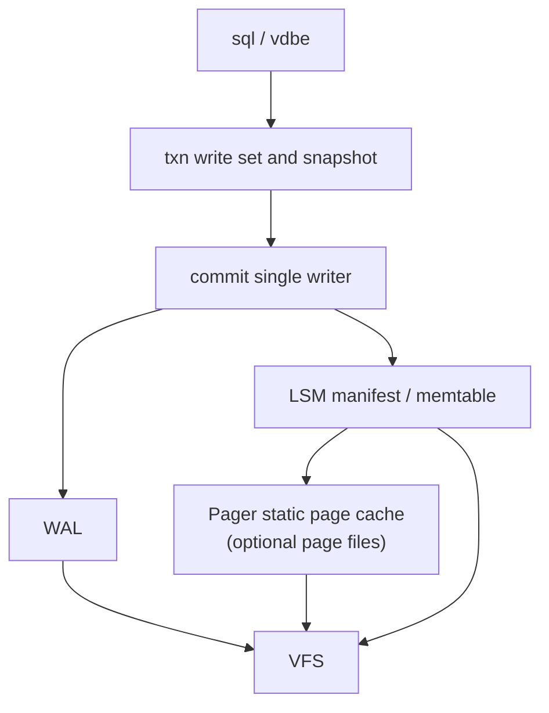
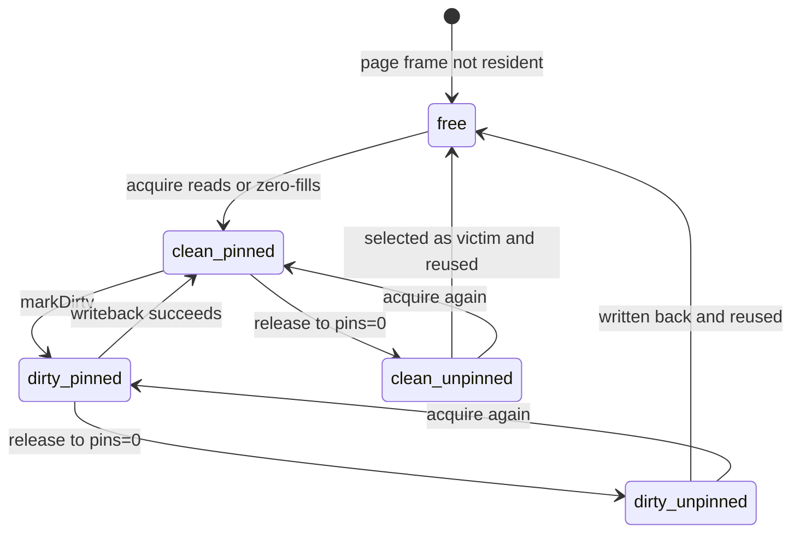

# Pager and Static Page Cache

## Status and Scope

This document describes Pico's **Pager** and **static page cache** contract, with reference to SQLite's [`pager.c` / `pager.h`](https://github.com/sqlite/sqlite/blob/924626e603a36cc48ce87bc3a3eeddc61af1a72f/src/pager.h), [`pcache.c` / `pcache1.c`](https://github.com/sqlite/sqlite/blob/924626e603a36cc48ce87bc3a3eeddc61af1a72f/src/pcache1.c), [`pager-invariants.txt`](https://github.com/sqlite/sqlite/blob/924626e603a36cc48ce87bc3a3eeddc61af1a72f/doc/pager-invariants.txt), and `SQLITE_CONFIG_PAGECACHE` (see [`sqlite.h.in`](https://github.com/sqlite/sqlite/blob/924626e603a36cc48ce87bc3a3eeddc61af1a72f/src/sqlite.h.in)).

The current implementation is defined by `src/storage/pager.zig`:

- compile-time-fixed `page_size` and `cache_pages`;
- page buffers embedded in the Pager object; the acquisition path does **not** use general heap allocation for cache lines;
- `acquire` / `release` references (pinning), dirty marking, writeback before LRU eviction, `flush` / `sync`, and page-granular truncation;
- **no** transactions, rollback journal, file locking, or WAL policy.

Pico's Pager is therefore closer to "fixed-capacity page frames + a file backend" than to SQLite's larger subsystem, which combines B-Tree storage, rollback journals, WAL modes, and locking. Crash safety remains the responsibility of **WAL + checkpoints + immutable LSM files** (ADR-0004, ADR-0006). The Pager provides predictable cache bounds only for files that need fixed-size page I/O (future block indexes, free-page structures, some metadata page files, and so on).

## External References and Applicability

| Reference | Mechanisms checked | Pico's adoption | Explicitly not adopted |
| --- | --- | --- | --- |
| SQLite Pager API | `Get`/`Ref`/`Unref`, dirty pages, `Write`, transaction begin/commit, journal/WAL modes | pin/unpin, dirty marking, writeback and `sync`; page-aligned I/O | rollback journal, super-journal, SAVEPOINTS, multiple journal modes, Pager-level transactions |
| SQLite pager invariants | Page-overwrite conditions, aligned I/O, deleting the journal after sync, changing the database file after locking | Aligned I/O; verifiable dirty-page writeback; upper layers guarantee recoverability before overwriting | "Write the journal before overwriting pages" as the main path; multi-process EXCLUSIVE/SHARED lock invariants |
| SQLite PCache / pcache1 | Pinned pages cannot be reclaimed; dirty list; `xStress` write pressure; global PGroup reclamation | pin prevents eviction; full cache with all pages pinned fails; dirty pages are written before eviction | Pluggable `sqlite3_pcache_methods2`, global page-pool stealing across Pagers, runtime expansion |
| `SQLITE_CONFIG_PAGECACHE` | Static `pMem/sz/N` pool supplied at startup, using the pool before `malloc` | **Stricter**: pool size is a hard limit, embedded at compile time, with no default heap fallback for extra page frames | Silent `malloc` of extra page frames after pool exhaustion; negative N for per-connection bulk allocation |
| ADR-0004 LSM | Primary storage is an ordered set rather than in-place B-Tree page updates | Pager does not define row/version layout; LSM SSTs normally use append files + VFS and are not required to pass through Pager | Making SQLite-style page-modified B-Tree the primary user-table path |

## Layering

| Module | Sole responsibility | Owned state |
| --- | --- | --- |
| `storage/vfs` | Directory fencing and file I/O primitives | Directory, instance lock, file handles |
| `storage/pager` | Fixed-size page caching, pinning, dirty writeback | Fixed page-frame array, clock, owned `File` |
| `storage/wal` | Append commit records and scan recovery | WAL logical contents and durability boundary |
| `storage/lsm` | Ordered set and manifest | Memtable, immutable-table references |
| `commit` | Unique commit ordering and publication | Commit queue and `published_commit_seq` |

`Pager.flush` / `sync` **does not equal** transaction commit. A caller that syncs dirty pages to the sole primary copy without WAL protection must prove that the result remains logically equivalent after a crash; the default product path prohibits using "Pager-only overwrite" as the durability mechanism for user tables.

## Static Cache Control

### Why It Is Static

SQLite's `SQLITE_CONFIG_PAGECACHE` lets an application provide a fixed pool, but the implementation may fall back to `sqlite3_malloc()` when the pool is exhausted or a page is too large. Pico chooses a stricter boundary, for the same capacity-derivation reasons described in [I/O Scheduling](io-scheduling.md):

1. **Computable limit**: cache bytes = `page_size * cache_pages`, exposed in the type for deployment budgeting and downsizing tests.
2. **Explicit failure mode**: when the cache is full and every page is pinned, return `CacheFull` instead of allocating implicitly on the commit or read path and leaving a partial update after OOM.
3. **Fits Zig compile-time configuration**: `Pager(page_size, cache_pages)` keeps the knobs in storage configuration rather than introducing runtime-global mutable `PRAGMA cache_size` semantics (if the latter is introduced, it requires a separate ADR and must still respect a hard limit).

### Control Surface

| Knob | Meaning | Constraint |
| --- | --- | --- |
| `page_size` | Bytes per page frame | Non-zero; reads/writes are aligned to it; logical file length must be an integer multiple |
| `cache_pages` | Number of resident page frames | Non-zero; maximum number of pages cached simultaneously |
| pin (`pins`) | Count held by callers | Pages with `pins > 0` cannot be evicted or discarded by truncation |
| dirty | Page content differs from the file | Must be written back before eviction or `flush`; clear dirty after successful writeback |
| `last_used` / clock | Approximate LRU | Choose victims only among unpinned pages |
| File ownership | Pager `init` takes ownership of `File` | `deinit` closes the file; it is not shared with another Pager |

**Forbidden** control behavior:

- Call general heap allocation for a new page frame in the `acquire` hot path as a fallback.
- Automatically write dirty pages to a location with an undefined recovery policy merely to avoid `CacheFull`.
- Give a page pointer to a cross-statement long-lived holder without pinning it.
- Interpret `cache_pages` as a recommendation and grow without bound under pressure.

If multiple Pager instances (multiple files) are needed in the future, each instance still has its own static array. A global pool shared across files may be added only through a new ADR after proving its preemption and starvation policy, and it must retain a process-level hard limit.

## Page Lifecycle

### API Contract (Matches the Implementation)

| Operation | Preconditions | Postconditions / Errors |
| --- | --- | --- |
| `acquire(page_id)` | — | Returns a page with pin+1; on a miss, claims a frame, writes back an old dirty page if needed, reads from disk or zero-fills beyond the file; all pinned and no free frame -> `CacheFull` |
| `release(page)` | Page belongs to this Pager, is resident, and `pins > 0` | `pins -= 1`; otherwise `InvalidPageHandle` |
| `markDirty(page)` | Same, and still pinned | `dirty = true` |
| `flush` | — | Writes all dirty resident pages to the file, clears dirty, and keeps them resident |
| `sync` | — | `flush`, then `sync` the file |
| `pageCount` | File size is an integer multiple of `page_size` | Returns page count; otherwise `CorruptPageFile` |
| `truncate(n)` | Every resident page with `id >= n` has `pins == 0` | Discards those frames and truncates the file; otherwise `PagePinned` |

Page numbers start at 0 (unlike SQLite's `Pgno`, which starts at 1). The offset is `page_id * page_size`; arithmetic overflow returns `PageOffsetOverflow`.

### Selective Inheritance from SQLite Invariants

The principles in `pager-invariants.txt`, rewritten for the LSM/single-writer model:

| SQLite invariant | Pico equivalent |
| --- | --- |
| (3)(4) Aligned page I/O for the database file | Pager performs whole-page I/O only; a non-page-aligned length is corruption |
| (1) Recoverability before overwriting a page | **Not** the Pager's responsibility: user-table changes go to the WAL first; Pager overwrite is only for page files whose recoverability the caller has established, or disposable files being rebuilt |
| (5) Sync after changing the database before discarding the journal | Product main path: WAL sync before advancing checkpoint/reclamation; Pager `sync` serves only its file |
| (12)(13) EXCLUSIVE before writing, SHARED before reading | Replaced by instance VFS `LOCK` + single writer; no process lock at page level |
| Do not arbitrarily discard a dirty pinned page | `pins > 0` prevents eviction; `CacheFull` is an explicit failure |

## Who Should and Should Not Use the Pager

**Appropriate**:

- Metadata or free-space structure files organized as fixed-size pages;
- Read-only/rebuild scans needing bounded caching and short-lived pinnable page views;
- A generic file backend for testing page alignment, static caching, and eviction writeback.

**Not appropriate as the main path**:

- OLTP reads/writes of user-table rows (use memtable / LSM + MVCC snapshots);
- WAL records (an append log, not page overwrite);
- One-pass sequential writes of immutable SSTables (write with `AtomicFile`, sync, then publish);
- Treating cache hit rate as a correctness source; visibility is defined only by snapshots and the manifest.

## Concurrency and Single Writer

The Pager provides no internal locks. The target rules are:

1. Mutable operations on one Pager instance (eviction caused by `acquire`, `markDirty`, `flush`, and `truncate`) are serialized by one owner, or the upper layer proves that there is no data race.
2. If read-only `acquire` is eventually allowed for multiple readers, they may share only pinned clean-page views and must not race truncation/writeback without coordination.
3. The commit path must not perform unbounded work because of Pager cache eviction; eviction I/O must count toward a scheduling class and budget.

This is consistent with ADR-0005: commit ordering remains in `commit`; the Pager is not a second writer.

## Observability, Failure, and Acceptance

Recommended metrics: cache hits/misses, eviction count, dirty-page writebacks, `CacheFull` count, peak pins, `flush`/`sync` latency, and `CorruptPageFile` count. Label them by file role, not SQL text.

Minimum regressions (some are already covered by `pager.zig`):

1. Zero-fill a `page_id` beyond the file; after dirtying and `sync`, `pageCount` includes that page.
2. With capacity 2, a third `acquire` evicts the least recently used unpinned page; if it is dirty, write it back first.
3. When the only frame is pinned, `acquire` for another `page_id` returns `CacheFull`; `truncate` across the pinned page fails.
4. If the file size is not an integer multiple of `page_size`, `pageCount` and a mid-file read fail with `CorruptPageFile`.
5. With fault injection, a writeback or `sync` failure must not report a dirty page as clean; callers must not publish a commit depending on that writeback.

## Implementation Boundary

1. **Complete**: generic static Pager, pin/LRU/dirty-page writeback, VFS file integration, and basic unit tests.
2. **Next**: identify which on-disk structures bind to Pager; prohibit accidental use in WAL/LSM open paths.
3. **After that**: connect Pager-triggered reads and writes to I/O classes; optionally add a read-only verification bypass.
4. **Requires a new ADR**: runtime page-frame expansion, a globally preemptible page pool, changing primary user-table storage back to in-place page-modified B-Tree, or introducing SQLite-style rollback journal as the default durability mechanism.
