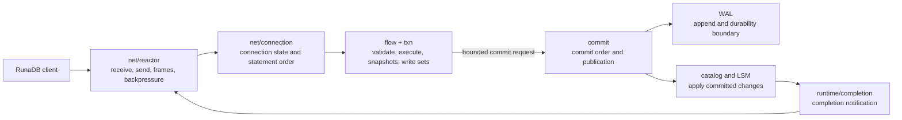

# Runtime, Connections, and Concurrency Control

## Status and Scope

This is the target RunaDB v1 runtime design, not a claim that Phase 0 implements it. The
current `src/net/server.zig` handles connections in `accept -> handleConnection` order and
exists only to validate the migration adapter's minimal working loop. The cancellation slice
is implemented at the ownership boundaries that Phase 6 builds on: `src/commit/coordinator.zig`
withdraws queued commit requests before a commit sequence is assigned and terminates marked
requests before the WAL durability boundary; `src/net/connection.zig` owns the per-Connection
identity, statement generation, and cancellation mark; `src/net/registry.zig` is the bounded
credential → Connection table used for constant-time cancellation routing; and
`CANCEL_REQUEST` is a wire-protocol contract with official-client and malformed-input coverage.
Because the listener is sequential, a `CANCEL_REQUEST` from another Connection is delivered
only between statements today (a no-op by design); the registry counts those as no-ops, and
a `hit` requires a statement actually executing. A malformed `CANCEL_REQUEST` is a protocol
error: the Server replies `CN1001` and closes the Connection. Concurrent mid-statement
delivery, admission, commit queues, and I/O scheduling become implementation guarantees only
after the Phase 6 runtime and its regressions land.

This design refines ADR-0005, ADR-0006, and ADR-0009 and cannot change these constraints:

1. RunaDB is a single-machine, single-instance service entered through the versioned RunaDB wire protocol.
2. Runa Flow and Runa Query IR are explicit subsets; a parseable protocol message does not imply supported semantics.
3. Only the single writer performs commit ordering and publication of committed state; reads may run in parallel.
4. At the default durability level, a commit response waits for the corresponding WAL persistence boundary.

Version visibility, isolation levels, pre-commit conflict validation, and version reclamation
are defined by the [concurrency control contract](concurrency-control.md). This document
defines their ownership and scheduling boundaries in the connection, queue, and I/O runtime.

## RunaDB Runtime Boundary

Each RunaDB **connection** owns protocol, cancellation, session, and input/output quota state. The runtime owns connection registration, admission, bounded queues, and controlled callback execution. A cancellation mark applies only to the current statement and is observed at defined cancellation points. The single writer serializes commit publication and watermark advancement; snapshot and reclamation boundaries remain independently verifiable. RunaDB does not expose an embedded API threading model, a multi-process lock manager, or a platform-specific I/O runtime as product contracts.

The ownership split gives connection loss a deterministic meaning. Before the irreversible commit point, closing a connection abandons its statement and private write set. After that point, the single writer finishes the WAL and publication work even if there is no connection left to receive the result. This avoids both false success (a response without durable publication) and false rollback (claiming that a confirmed change was undone because the client disconnected).

Connection quotas are likewise not transaction semantics. They decide how much input, output, and queued work a connection may hold; they never change its statement order, another connection's snapshot, or the global commit order. The runtime can therefore stop reading a slow connection without allowing it to monopolize memory or making an unrelated transaction observe a different database history.

## Responsibility Boundaries

| Owner | Responsible for | Not responsible for |
| --- | --- | --- |
| `net/reactor` | Listening, nonblocking reads/writes, admission, frame limits, backpressure, and I/O completion events | Flow/IR validation, transaction state, WAL, or storage files |
| `net/connection` | Per-connection protocol state, statement order, output-frame order, and cancellation routing | Global commit order or other connections' execution state |
| `flow` / `txn` | Request validation, snapshots, write sets, and conflict candidates | Writing WAL or publishing visible data directly |
| `commit` | Accepting bounded requests, assigning commit sequences, WAL persistence, atomic publication, and completion results | Socket I/O and slow-client output buffers |
| `runtime/completion` | Delivering completion results to the connection's execution context | Recursively running business callbacks inside the kernel completion queue |

`net` must not import `storage`. A slow reader must not hold `commit`, and `commit` must not
wait synchronously for network output; it returns a bufferable completion or discards it when
the connection has closed.

## Connection Identity, Registration, and Shutdown

After startup, the runtime assigns each connection a monotonically increasing internal ID and
registers it in a bounded instance connection table. This table is the source of truth for
admission, observability, and cancellation routing, not the owner of transactions, snapshots,
or results. An entry contains at least the internal ID, protocol state, current statement
generation, cancellation flag, and a weak reference to the connection execution context. It
must not own socket write buffers or result sets, so slow or closed readers cannot be kept alive
by the registry.

Cancellation credentials are defined by the RunaDB wire protocol and must not use a fixed value.
After startup, RunaDB generates an unpredictable credential unique within the connection
lifetime and maps it to the internal connection ID. A cancellation request performs only a
constant-time lookup and marks cancellation: it does not create an execution context, write
the original connection, or wait for the statement. Missing, mismatched, closed, or expired
requests finish with the protocol-defined no-op behavior. Credentials must not be reused until
the old registration is fully revoked.

Shutdown stops new frames, marks the current cancellable statement, lets execution release
snapshots/write sets/results, revokes the credential and registration, discards unsent output,
and closes the transport. Disconnecting an explicit transaction rolls back its uncommitted
write set. A transaction past the irreversible commit point still completes in the single
writer; its result is discarded because the connection is gone. Shutdown must not synchronously
drain the socket or wait for `commit` before reclaiming the registration.

### Cancellation and Statement Generations

Cancellation is a cooperative request to stop the current statement, not a rollback of a
committed transaction, a change to commit order, or instance shutdown. Increment the statement
generation on each `ready -> executing` transition and clear its flag. Parsing, scanning,
result streaming, commit-queue waits, and pre-WAL-sync execution must inspect the flag between
bounded work units.

1. Before `commit`, discard local results; an autocommit statement produces no commit.
2. A cancellable Request in an explicit transaction reports an error, while transaction-failure semantics come from the published Flow/IR rules, not reactor guesses.
3. Withdraw requests queued without a commit sequence. Requests with a sequence but no WAL write terminate deterministically without a visibility hole.
4. Once a complete commit record is in WAL, cancellation cannot make it uncommitted. The single writer publishes it and discards or reports the result depending on connection liveness.

The irreversible point is the complete commit record reaching the selected durability level.
Cancellation cannot preempt WAL sync, manifest publication, or recovery; those operations
finish or terminate with an explicit instance-level failure.

## Connection and I/O Scheduling

Connections progress through `accepting -> startup -> authenticating -> ready -> executing ->
ready -> closing -> closed`. Phase 0 maps `authenticating` directly to `ready`, but keeps the
state to avoid an implicit authentication branch in protocol callbacks. `executing` means a
statement is running or waiting for commit; responses on one connection remain in protocol
order. Only `txn` supplies wire-protocol transaction state; `net` must not infer it from the
last message.

Length, format, message-order, and startup violations are protocol errors: send a feasible
error frame and close. Unsupported Flow/IR, binding, and execution errors end only the current
statement and return to the protocol's next-statement state. Transport EOF performs shutdown
cleanup without attempting an error. Protocol extensions such as batching or prepared queries
must define recovery states and frames explicitly rather than scattering state through socket
callbacks.

Each runtime tick:

1. Submits queued reads, writes, accepts, and file I/O to the operating system.
2. Extracts completed events and records only their results; it does not submit new I/O while traversing the kernel completion queue.
3. Runs completion callbacks within a fixed budget. Callbacks may enqueue work but cannot recursively drive I/O.
4. Submits callback-produced I/O, then yields to the next connections and commit tasks.

The runtime keeps separate network, disk, and commit queues. Disk completion storms must not
starve network reads, and network output must not preempt WAL persistence. Operation categories,
capacity reservations, connection fairness, tick budgets, backpressure, completion lifetimes,
and critical-I/O failures are defined by the [I/O scheduling contract](io-scheduling.md).

Queues and buffers are bounded deployment resources:

| Resource | Saturation action | Forbidden behavior |
| --- | --- | --- |
| Connections | Stop `accept` or quickly reject new connections | Pretend availability by using an unbounded registry |
| Per-connection input frame | Stop reading that connection; oversized messages return a protocol error and close | Allocate based on an unvalidated length |
| Per-connection output | Pause reads that produce more streamable results; over the hard limit cancel the unfinished statement and close | Put slow-client results in a global unbounded queue |
| Commit requests | Pause the connection's next write statement and measure wait time | Modify storage around the single writer |
| Background I/O/compaction | Reduce compaction concurrency or defer work while reserving recovery/WAL capacity | Free capacity by dropping confirmed commits |

Do not allocate a protocol frame before validating its length against the maximum. The current
temporary limits are 1 MiB for startup frames and 16 MiB for ordinary frames; once configurable,
the document, implementation, and protocol regressions must use one configuration name and
cover overflow, truncated frames, half-close, and slow readers.

## Commit, Snapshots, and Contention

The sequence for a write transaction is: construct write set -> enter commit queue -> assign
consecutive commit sequence in the single writer -> append WAL -> reach the selected durability
level -> apply catalog/table/index changes -> atomically advance the published watermark ->
wake waiting connections. A client receives success only after the final step.

A read obtains the published watermark at start and uses it with local transaction state to
decide visibility. The single writer must not split one commit's table, catalog, or secondary
index effects around that watermark. Transaction end, snapshot creation, and file reclamation
share the same commit-sequence domain:

1. Snapshots reference only complete commits at or before the published watermark.
2. The single writer revalidates write-write contention against published state; conflicts fail explicitly or wait under a published policy, never overwrite silently.
3. Active snapshots register their minimum required sequence; compaction/reclamation deletes only versions/files strictly below that lower bound.
4. Uncommitted write sets and connection state are discarded after a crash; recovery replays only complete, verified, committed WAL records.

No snapshot may fall between dependent commit publications. RunaDB achieves that with one published watermark, not a multi-process active-transaction array or a heavy-lock wait graph for ordinary DML. DDL, cancellation, isolation levels, and extended queries still need their own conflict and state-transition rules.

For a future strict-OCC transaction, the runtime admits the connection's work and checks its
input and operation budgets before issuing `read_seq`. `txn` enforces conflict-range budgets as
it collects dependencies and before it queues the immutable commit request. This keeps rejected
or queue-delayed work from retaining an unnecessarily old snapshot and expanding the conflict
history horizon. Once admitted, `txn` registers the snapshot and builds an immutable commit
request; `commit` validates that request in queue order. The runtime reports queue delay,
serialization conflict, stale-snapshot rejection, and overload separately, because only the
first three may be addressed by changing transaction timing or data shape.

## Observability and Acceptance

At minimum emit connection and rejection counts, state transitions, current/peak queue depth,
per-connection input/output watermarks, frame rejection reasons, cancellation hit/mismatch/
expired counts and mark-to-observe latency, I/O submit/complete latency, callback duration,
commit queue/batch/WAL-sync latency, snapshot lifetime, conflict results, compaction wait, and
the oldest snapshot watermark. Every metric carries the durability level; connection IDs and
cancellation credentials must not be metric or log labels.

Required regressions include slow readers, half-closes, oversized frames, and cancellation
across multiple connections; reentrant completion callbacks without recursive scheduling,
counter imbalance, or starvation; snapshot-correct parallel reads; deterministic same-key
conflicts; crash injection at WAL append, sync, publication, and reclamation; official-client
cancellation with invalid credentials; and cleanup of uncommitted writes and registrations
after disconnect.

## Evolution Order

1. Define RunaDB wire-protocol startup, state, error, and cancellation semantics, including frame limits and official-client regressions.
2. Extract the `net/connection` state machine and add connection/buffer limits; execution may remain single-task.
3. Add the runtime reactor and bounded task queues; parallelize network I/O and read-only statements without changing commit.
4. Extract the `commit` single-writer queue and commit sequence; connect WAL group commit and MVCC snapshot registration.
5. Enable background compaction only after regressions cover snapshot lower bounds, manifest publication, and file reclamation.

Any change that introduces multiple writers, row-lock wait graphs, cross-instance coordination,
or default asynchronous durability requires a new ADR because it changes product constraints,
not merely scheduling.
