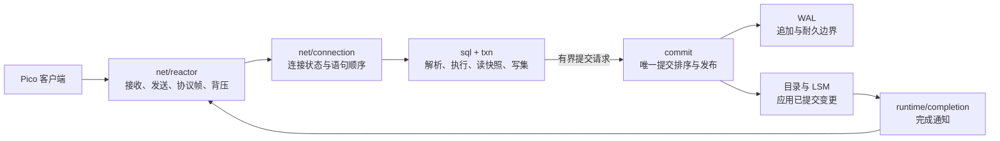

# 运行时、连接与并发控制

## 状态与范围

本文是 Pico v1 的目标运行时设计，不表示当前 Phase 0 已实现。当前
`src/net/server.zig` 按 `accept -> handleConnection` 顺序处理连接；它只用于
验证当前迁移适配层的最小闭环。本文所述的并发接入、提交队列和 I/O
调度在相应模块落地并有回归后才成为实现保证。

本设计细化 ADR-0005、ADR-0006 与 ADR-0009，不能改变其中的以下约束：

1. Pico 是单机单实例服务，连接通过版本化 Pico 线协议进入。
2. SQL 是明确的 SQL 子集；协议可解析不代表语义受支持。
3. 提交排序和已提交状态发布只有单写者可以执行；读可并行。
4. 默认耐久级别下，提交响应要等待对应 WAL 的持久化边界。

版本可见性、隔离级别、提交前冲突验证与版本回收的语义由
[并发控制契约](concurrency-control.md) 定义；本文只定义它们在连接、队列与
I/O 运行时中的所有权和调度边界。

## 外部参考及适用性

| 参考 | 已核对的机制 | Pico 的采用方式 | 明确不采用 |
| --- | --- | --- | --- |
| [DuckDB `ClientContext`](https://github.com/duckdb/duckdb/blob/8689b7b0561ac21e4cf8b8cadcb396a6c5c37e4/src/include/duckdb/main/client_context.hpp)、[`ConnectionManager`](https://github.com/duckdb/duckdb/blob/8689b7b0561ac21e4cf8b8cadcb396a6c5c37e4/src/include/duckdb/main/connection_manager.hpp) 与 [`connection_manager.cpp`](https://github.com/duckdb/duckdb/blob/8689b7b0561ac21e4cf8b8cadcb396a6c5c37e4/src/main/connection_manager.cpp) | 每个客户端上下文独立持有短生命周期执行状态；实例集中登记连接；中断状态独立于执行锁；销毁时先结束事务和查询，再清理上下文 | 每个 Pico **连接**拥有协议状态、取消状态、会话状态、输入/输出配额；实例运行时拥有连接登记和准入；取消仅标记当前语句，执行路径在可取消点观察它 | DuckDB 在此检出版本没有可复用的数据库网络服务层；不把嵌入式 API 的线程模型、嵌入式 `Connection` API 或其事务策略当成 Pico 的线协议模型 |
| [TigerBeetle Linux I/O](https://github.com/tigerbeetle/tigerbeetle/blob/97c7a8ef385270ebe0e1b75959d3d21d134629df/src/io/linux.zig) | 提交请求与提取完成事件分离；完成回调脱离内核队列运行；队列满时先推进完成事件；记录内核和回调耗时 | I/O 驱动只收集完成事件，运行时在受控调度点执行回调；有界队列满时暂停读取或拒绝准入，绝不无界堆积 | io_uring、单线程运行时及 TigerBeetle 的复制/共识不是 Pico 的产品约束；平台后端可以不同 |
| [PostgreSQL 事务 README](https://github.com/postgres/postgres/blob/0fd30e2119ede879080cef426abf4f9b304e3f51/src/backend/access/transam/README) | 快照建立与事务退出必须有一致的提交顺序，否则可能看见不一致版本组合 | 快照水位与提交发布由单写者的提交序号建立全序；读路径只在稳定水位后解释 MVCC 可见性 | 行/表重量锁、死锁检测、`ProcArrayLock`、SSI 和多进程共享内存锁管理不进入 Pico v1 |

PostgreSQL 的并发控制是问题定义而不是代码模板：它需要在多后端并发提交
下以锁保护活动事务数组。Pico 的单写者使“发布提交”和“推进可见水位”天然
串行，但不免除快照与回收边界的证明责任。

## 责任边界

| 所有者 | 负责 | 不负责 |
| --- | --- | --- |
| `net/reactor` | 监听、非阻塞读取/发送、连接准入、帧大小限制、读写背压、I/O 完成事件 | SQL 解析、事务状态、WAL 或存储文件 |
| `net/connection` | 单连接协议状态机、同一连接内语句顺序、输出帧次序、取消请求路由 | 全局提交顺序、其他连接的执行状态 |
| `sql` / `txn` | SQL 子集判定、语句级快照、写集和冲突候选 | 直接写 WAL、直接发布可见数据 |
| `commit` | 接受有界提交请求、分配提交序号、WAL 持久化、原子发布、完成结果 | socket I/O、慢客户端的输出缓存 |
| `runtime/completion` | 把完成结果转交到连接所属执行上下文 | 在内核完成队列内递归执行业务回调 |

`net` 不得导入 `storage`。连接的慢读者不得占住 `commit`，且 `commit` 不得
同步等待网络写出；它只返回可缓冲的完成结果或在连接已关闭时丢弃结果。

## 连接身份、登记与关闭

运行时为每条已完成启动的连接分配单调递增的内部连接标识，并将其登记在实例的
有界连接表中。该表是准入、观测和取消路由的唯一事实来源，不是事务、快照或
执行结果的所有者。注册表条目至少含内部标识、协议状态、当前语句代次、取消标记
和对连接执行上下文的弱引用；不能持有 socket 写缓冲或结果集的所有权。这样，慢
读者或已关闭连接不会因注册表意外延长其资源寿命，这一点直接借鉴 DuckDB 对已失效
弱引用的清理方式。

Pico 线协议的取消凭据由协议规范定义，不能使用固定值。启动成功后，Pico 为连接生成
不可预测、在连接生命周期内唯一的取消凭据，并将其映射到内部连接标识。收到取消请求
时，reactor 只做常数时间查找和取消标记，不创建 SQL 执行上下文、不写入原连接、也不
等待语句结束；找不到、凭据不匹配、连接已关闭或语句代次已结束时以 Pico 协议规定的
无副作用方式结束请求。凭据绝不能在旧登记项完全撤销前复用，否则延迟到达的取消请求
可能取消无关连接。

关闭按以下顺序发生：停止读取新帧；标记当前可取消语句；让执行路径释放读快照、
写集和结果资源；撤销取消凭据和连接登记；丢弃尚未送出的输出并关闭传输。对显式
事务，断连等价于回滚未提交写集；已经跨过不可逆提交点的事务继续由单写者完成，
其完成结果因没有连接而丢弃。关闭不能同步等待 socket 排空，也不能让连接登记在
`commit` 完成后才有机会回收。

### 取消与语句代次

取消是“请求停止当前语句”的协作信号，不是回滚已提交事务、更改提交顺序或关闭
实例。每次从 `ready` 进入 `executing` 时递增语句代次，并清除该代次的取消标记；
解析、扫描、结果流送、提交队列等待和 WAL 同步前的执行路径必须在有界工作单元间
检查该标记。检查命中后：

1. 尚未进入 `commit` 的语句丢弃其局部结果；自动提交语句不产生提交。
2. 显式事务中的可取消语句报错，但事务是否进入失败状态必须由已发布 SQL 子集的
   事务规则定义，不能由 reactor 猜测。
3. 已入提交队列但尚未分配提交序号的请求撤销；已分配序号但未写入 WAL 的请求由
   单写者以确定方式终止，不能留下序号可见性空洞。
4. 完整提交记录进入 WAL 后，取消不再能把提交改为未提交。单写者完成发布，再将
   对该连接的成功结果丢弃或以协议错误报告，取决于连接是否仍存活。

最后一条与 DuckDB 在不可逆操作后抑制中断的边界相同，但 Pico 的不可逆点由
“完整提交记录达到所选耐久级别”定义。取消不会抢占 WAL 同步、manifest 发布或恢复；
这些位置只允许完成或以明确的实例级故障终止，不能以半完成状态返回连接错误。

## 连接和 I/O 调度

每条连接按下列状态推进：`accepting -> startup -> authenticating -> ready ->
executing -> ready -> closing -> closed`。Phase 0 的无认证实现将
`authenticating` 直接转为 `ready`，但状态仍须保留，避免将认证加进协议回调的
隐式分支。`executing` 表示已有语句正在执行或等待提交；同一连接中的响应仍按协议
次序发送。Pico 线协议中的事务状态只能由 `txn` 给出；`net` 不得根据最后一条报文
自行推断。

错误有明确作用域：长度、格式、消息顺序或启动阶段违规是协议错误，发送可行的
错误帧后关闭连接；不支持的 Pico SQL、绑定或执行错误只终结当前语句，并按协议回到
可接收下一语句的状态；传输 EOF 直接走关闭清理，不尝试发送错误。批处理或预编译等
协议扩展必须定义明确的错误恢复状态和恢复帧；该状态机不能散落在 socket 回调里。

每个运行时 tick 必须按以下顺序工作：

1. 向操作系统提交已排队的读、写、accept 和文件 I/O。
2. 取走已完成事件并只记录其结果，避免在内核完成队列遍历中提交新 I/O。
3. 在固定预算内运行完成回调；回调可以排队新工作，但不能递归驱动 I/O。
4. 再提交回调产生的新 I/O，随后让出给下一批连接和提交任务。

这保留 TigerBeetle 避免递归、无界调用栈与不清晰提交时机的优点，同时不把
某一种内核 API 固化为架构要求。运行时必须维护独立的网络、磁盘和提交队列；
不得让磁盘完成风暴饿死网络读取，也不得让网络写出抢占 WAL 持久化。

操作类别、关键容量保留、连接级公平、tick 预算、背压传播、完成对象生命周期和
关键 I/O 故障处理，由 [I/O 调度契约](io-scheduling.md) 定义。该契约是本文这段
“独立队列”要求的唯一细化来源；连接状态机不自行决定 I/O 优先级或重试策略。

队列和缓冲均为有界资源，初始阈值是部署配置而非协议常量：

| 资源 | 饱和动作 | 禁止行为 |
| --- | --- | --- |
| 连接数 | 停止 accept 或快速拒绝新连接 | 以无界连接表换取可用性假象 |
| 单连接输入帧 | 停止该连接读取；超出最大报文大小返回协议错误并关闭 | 将未验证长度分配给解析器 |
| 单连接输出 | 暂停产生更多可流式结果的读取；超过硬上限取消该连接的未完成语句并关闭 | 把慢客户端的结果放入全局无界队列 |
| 提交请求 | 暂停对应连接的下一条写语句，并计量等待时间 | 绕开单写者直接修改存储 |
| 后台 I/O / 压缩 | 降低压缩并发度或延后任务；保留恢复和 WAL 的容量 | 以丢弃已确认提交为代价释放队列 |

协议帧在长度字段通过最大值校验前不得分配。当前实现已有启动帧 1 MiB、普通
帧 16 MiB 的临时上限；在引入配置后，文档、实现和协议回归必须使用同一命名
配置，并验证长度溢出、截断帧、半关闭和慢读者。

## 提交、快照与争用

一次写事务的事实顺序是：构造写集 -> 进入提交队列 -> 单写者分配连续提交序号
-> 追加 WAL -> 达到所选耐久级别 -> 应用目录、表和索引变更 -> 原子推进已发布
提交水位 -> 唤醒等待连接。客户端只能在最后一步后收到成功响应。

读语句在开始时取得已发布提交水位，并用它和事务本地状态判定版本可见性。单写
者必须保证不会在该水位前后拆开一次提交的表、目录或二级索引效果。事务结束、
快照建立和文件回收必须以同一个提交序号域协调：

1. 快照只引用已发布水位及其之前的完整提交。
2. 写写争用在单写者处按已发布状态重新验证；冲突事务明确失败或按已发布策略等待，不能静默覆盖。
3. 活跃快照登记其最小所需提交序号；压缩和回收只能删除严格早于该下界的版本或文件。
4. 未提交写集和连接状态在崩溃后丢弃；恢复只重放完整、校验通过且已提交的 WAL 记录。

这与 PostgreSQL “快照不能夹在相互依赖的事务退出之间”的要求等价，但实现更小：
Pico 不维护多进程活动事务数组，也不需要把普通 DML 放入重量锁等待图。DDL、
取消、事务隔离级别和扩展查询在落地前仍需要各自的冲突与状态转换规则。

## 可观测性与验收

运行时至少输出：连接数和拒绝数、连接状态迁移、每个队列的当前/峰值深度、每连接
输入输出水位、帧拒绝原因、取消请求的命中/失配/已结束计数及从标记到观察的延迟、
I/O 提交/完成延迟、回调耗时、提交排队/批次/WAL 同步延迟、快照存活时间、冲突
结果、压缩等待及最老快照水位。所有指标都应带耐久级别，避免把不同保证下的延迟
混为一个数字；连接标识和取消凭据不得作为日志或指标标签输出。

实施每一阶段前至少新增对应回归：

1. 多连接下慢读者、半关闭、超长帧和连接取消不阻塞其他连接或提交。
2. I/O 回调可重入压力下不存在递归调度、队列计数失衡或饥饿；满队列行为可观察。
3. 并行读与连续提交下，每个结果只含其快照水位允许的版本。
4. 同一主键的并发写在提交排序点产生确定的成功/冲突结果。
5. 在 WAL 追加、同步、发布水位和回收边界注入崩溃后，恢复只暴露已确认提交前缀。
6. 使用官方 Pico 客户端发出取消请求：错误凭据和已关闭连接不会影响其他连接；队列
   等待中的语句可取消；WAL 耐久边界后的取消不能撤销已提交效果。
7. 断开有显式事务的连接后未提交写集不可见；断开等待网络写出的连接不阻塞其他
   连接，且连接登记和取消凭据均被回收。

## 演进顺序

1. 定义 Pico 线协议的启动、状态、错误和取消语义，补齐帧限制与官方客户端协议回归。
2. 抽取 `net/connection` 状态机并引入连接登记、连接/缓冲上限；执行仍可单任务。
3. 引入运行时 reactor 与有界任务队列，先并行网络 I/O 和只读语句，不改变提交路径。
4. 抽取 `commit` 单写者队列和提交序号，接入 WAL group commit 与 MVCC 快照登记。
5. 在快照下界、manifest 发布和文件回收均有故障回归后，再允许后台压缩并发。

任何试图把多写者、行锁等待图、跨实例协调或默认异步耐久引入上述路径的改动，
均需要新 ADR；它们会改变既有产品约束，而不是普通调度优化。
