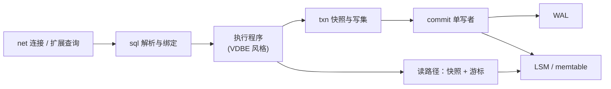
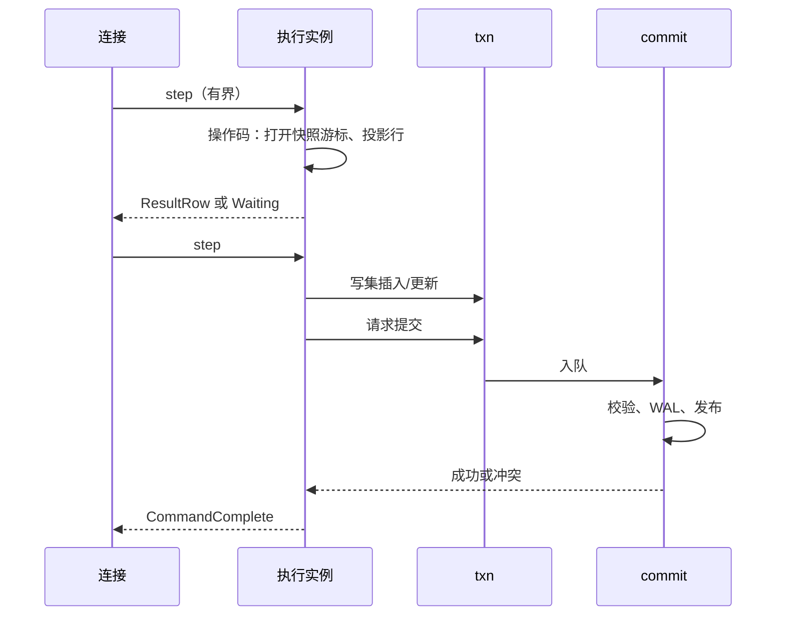

# 执行引擎（VDBE 风格）

## 状态与范围

本文定义 Pico **语句执行层**的目标形态，对照 SQLite 的 Virtual Database Engine
（[`vdbe.h`](https://github.com/sqlite/sqlite/blob/924626e603a36cc48ce87bc3a3eeddc61af1a72f/src/vdbe.h)、
[`vdbe.c`](https://github.com/sqlite/sqlite/blob/924626e603a36cc48ce87bc3a3eeddc61af1a72f/src/vdbe.c)、
[`vdbeaux.c`](https://github.com/sqlite/sqlite/blob/924626e603a36cc48ce87bc3a3eeddc61af1a72f/src/vdbeaux.c)）。

当前 Phase 0/1 实现是 `src/sql/exec.zig` 上的**直接解释**：解析 AST 后立即调用
`storage/engine` 的表操作，没有独立字节码、寄存器文件或可暂停的程序计数器。
`BEGIN` / `COMMIT` / `ROLLBACK` 仍是兼容标签，尚无跨语句写集（见
[并发控制契约](concurrency-control.md)）。

本文不要求字节码格式与 SQLite 操作码编号兼容，也不把 VDBE 当作对外 API。它要
固定的是：**SQL 子集 → 可检查的执行程序 → 通过事务/存储边界产生效果**，以便
计划、执行、取消、解释与测试能够分层，而不是继续把语义堆进单个 `execStmt`。

## 外部参考及适用性

| 参考 | 已核对的机制 | Pico 的采用方式 | 明确不采用 |
| --- | --- | --- | --- |
| SQLite `Vdbe` / `VdbeOp` | 语句编译为操作码序列；P1–P5 操作数；寄存器 `Mem`；游标表 | 目标：每条已绑定语句对应一份**执行程序**（操作序列 + 有界工作区） | 与 SQLite 操作码稳定 ABI 兼容；触发器子程序全盘复制 |
| `OP_Transaction` / `OP_Halt` / `OP_Goto` | 显式事务边界与控制流 | 事务进入/退出是程序中的显式步骤，最终效果仍经 `txn`/`commit` | 在操作码里直接抢 B-Tree 写锁或开始 rollback journal |
| `OP_OpenRead` / `OP_Column` / `OP_Next` / `OP_ResultRow` | 游标扫描与投影、逐行产出 | 游标抽象在 **LSM/memtable 有序迭代 + 快照可见性** 上 | `OP_Open*` 绑定 sqlite B-Tree 页游标 |
| `OP_Insert` / `OP_Delete` 等 | 在 VM 内直接改存储 | 写操作只构造/合并**写集**或发出提交请求，不绕过单写者 | 执行线程直接 `fsync` 库文件或发布 manifest |
| VDBE 可中断步进 | 进度回调、`isInterrupted`、按操作码边界响应 | 与连接**取消**和语句代次对齐：在操作码/有界批次边界采样取消 | 取消已进入 WAL 耐久边界的提交 |
| `EXPLAIN` / 扫描状态 | 操作码与计划可观测 | 目标支持解释执行程序与基本计数器 | 承诺 PG `EXPLAIN ANALYZE` 全语义 |

SQLite 的力量在于：解析器很大，但运行时主循环相对规则——所有语句都化成对
存储游标与寄存器的操作。Pico 需要同样的**深度接口**，但存储游标的背后是
MVCC + LSM + 单写者，而不是 pager 保护下的 B-Tree 页改。

## 在整体中的位置

| 阶段 | 所有者 | 产出 | 禁止 |
| --- | --- | --- | --- |
| 词法/解析 | `sql` | AST 或等价结构化语句 | 执行副作用 |
| 绑定 | `sql` | 类型检查后的常量/参数 | 写存储 |
| 编译（目标） | `sql` | 执行程序 + 所需寄存器/游标数 | 打开网络或 WAL |
| 执行 | `sql` 驱动，经 `txn`/`read` | 行流、写集、命令标签 | 直接改 `published_commit_seq` |
| 提交 | `commit` | WAL + 发布 | 解析 SQL |

`net` 只看到：准备好的语句、执行请求、行/标签、错误与 `ReadyForQuery` 所需的
事务状态位。它不得解释操作码。

## 执行程序模型

### 程序与工作区

目标对象（名称可在实现时调整，语义固定）：

- **Program**：只读操作序列；可对同连接上的重复执行复用（扩展查询的 plan 缓存
  前提）。
- **Instance**（一次执行）：程序计数器、寄存器文件、游标槽、结果暂存、错误码、
  与连接语句代次的关联。
- **Opcode**：操作码 + 固定小数目的整数/引用操作数（类比 P1–P5），禁止在操作码
  里藏无界侧信道状态。

寄存器保存标量、短生命周期引用和空值；大对象与行缓冲的所有权规则必须写清：
要么由 Instance 竞技场分配并在执行结束释放，要么引用 pin 住的存储页/块并在
`release` 前不可驱逐（若读路径经过 Pager）。

### 操作码分组（目标最小集）

不追求 SQLite 数百操作码的全集。按 SQL 子集分期引入：

| 组 | 例子（概念名） | 作用 |
| --- | --- | --- |
| 控制 | `Goto`、`Halt`、`HaltIf`、`Gosub`/`Return`（若需要） | 分支与结束；错误码进入 `Halt` |
| 事务 | `TxBegin`、`TxCommit`、`TxRollback`、`SnapshotOpen` | 只调用 `txn` API；Commit 只入队 |
| 常量/表达式 | `Integer`、`Text`、`Null`、`Copy`、`Function` | 寄存器计算；函数集由 SQL 子集规定 |
| 游标 | `OpenScan`、`OpenSeek`、`Next`、`Rewind`、`Close` | 基于快照的有序扫描/点查 |
| 行 | `Column`、`ResultRow`、`MakeRecord` | 投影与协议行产出 |
| 写集 | `WriteInsert`、`WriteUpdate`、`WriteDelete` | 变更进入私有写集，含约束候选 |
| 元数据 | `OpenCatalog`、`CreateTable`… | 目录变更同样进写集/提交，不直写文件 |

每个操作码的文档必须声明：是否 I/O、是否可取消点、是否可能入提交队列、失败时
事务状态如何变化。这对应 SQLite 在 `vdbe.c` 里用注释描述 Opcode/Synopsis 的
做法，但 Pico 的权威说明落在本架构与代码旁注释，而不是生成一套对外操作码手册。

### 主循环不变量

1. **一次只推进有界工作**：单次 `step` 执行有限操作码或有限行，然后把控制交回
   连接调度，以便公平与取消（见 [运行时](runtime-and-concurrency.md)）。
2. **取消采样点**：至少在 `Next`、表达式批、等待提交、以及任何可能阻塞的 I/O
   申请之前检查语句代次取消标记。
3. **读不阻塞写**：游标只解释快照水位 + 本事务写集；不取全局表锁。
4. **写不发布**：写操作码不得调用 VFS 写 WAL/LSM 最终状态；只有 `commit` 单写者
   在验证后发布。
5. **错误范围**：表达式/约束/子集拒绝 → 语句失败；存储损坏/WAL 关键失败 → 不得
   被包装成普通 SQL 错误而继续服务写请求（上交实例故障路径）。
6. **可解释**：同一 Program 在 `EXPLAIN` 模式下可打印操作序列，不执行副作用
  （或只执行无副作用的分析路径）。

## 与当前 `exec.zig` 的迁移关系

| 现在 | 目标 |
| --- | --- |
| `execStmt` 大 switch 直接调 engine | 编译器生成 Program；`step` 解释 |
| `Engine.insert/update/delete` 立即改内存表并写 WAL | 写集缓冲；单写者批量发布 |
| SELECT 一次物化所有行 | 游标 + `ResultRow` 流式产出，受连接输出背压 |
| 取消几乎无 | 操作码边界采样取消 |
| 计划不可见 | `EXPLAIN` 打印 Program |

迁移应保持 SQL 子集语义黄金测试不变：先引入 Program 表示与同等语义的解释器，
再切开写集与提交，最后再扩展操作码覆盖 JOIN 等（须先更新支持矩阵与 ADR 若
触及产品边界）。

## 游标与存储的接缝

执行层可见的游标接口应是深的、小的：

- 在快照 `s` 下打开某表或二级索引的点查/范围扫；
- `next` / `seek` / `column`；
- 关闭并释放 pin/缓冲。

其下可以是 memtable 跳跃、SST 块迭代、或（若元数据在页文件上）Pager 页 pin。
执行层**不得**依赖 SSTable 文件名、页号或 WAL 偏移来解释 SQL 可见性。

写路径接缝同样小：

- `write_set.insert/update/delete`；
- `commit_request`；
- 冲突与约束错误码。

这落实 ADR-0004 的逻辑边界：「有序集合 + WAL + MVCC」，执行层只依赖该边界。

## 资源与静态上限

与静态页缓存、I/O 容量同一哲学：

| 资源 | 上限来源 | 饱和行为 |
| --- | --- | --- |
| 寄存器数 / 游标数 | 编译期由语句形状决定，受配置硬顶 | 编译失败，而不是执行中扩表 |
| 单次 step 操作码或行数 | 运行时配置 | 返回 `Pending`，连接改调度其他工作 |
| 结果输出 | 连接 `foreground_write` 预算 | 暂停 `ResultRow`，不丢已产生行序 |
| 写集大小 | 配置 | 语句失败或提前不入队；不静默落盘 |

禁止在操作码实现里为「临时表」无限 `malloc` 而不计入写集/临时预算。若引入
排序/哈希聚合溢出，必须有显式临时文件路径（经 VFS）与限制。

## 观测、故障与验收

指标：每语句操作码步数、行产出数、游标打开数、写集条目、提交等待、取消命中、
程序缓存命中（若有）、各操作码组耗时。调试可提供「当前 pc + 操作码」但不对
用户连接默认倾倒寄存器内容。

最低验收（执行程序落地后）：

1. 现有 `exec.zig` / sub2api 风格用例在 Program 解释下黄金结果一致。
2. 大 `SELECT` 在输出背压下可分步；慢读者不阻塞其他连接提交。
3. 执行中取消：未入队写丢弃；已分配提交序号未写 WAL 的请求确定终止；WAL 耐久
   后取消不撤销提交。
4. 编译不支持的 SQL 在生成 Program 前失败，不产生半程序副作用。
5. 故障注入：游标 I/O 失败、提交冲突、约束失败的错误码稳定且事务状态机符合
   并发控制契约。

## 实施边界

1. **现在**：AST 直接执行；文档与测试定义语义基线。
2. **下一步**：引入只读 Program（控制 + 游标 + `ResultRow`），SELECT 先迁移。
3. **再下一步**：写集操作码 + 与单写者对接；`Tx*` 操作码替换标签式 BEGIN/COMMIT。
4. **随后**：扩展查询下的 Program 缓存、`EXPLAIN`、基本计数器。
5. **需要新 ADR**：用户可见的字节码 ABI、存储过程/触发器语言、与 PostgreSQL
   执行器节点一对一兼容、在 VM 内实现完整查询优化器规则集的产品承诺。

## 命名说明

文档与内部模块可称 **VDBE**、**执行程序** 或 **bytecode VM**。对外产品叙述用
「SQL 子集的执行」，避免让用户以为可加载 SQLite 字节码或兼容 `EXPLAIN` 的
SQLite 格式。代码标识符保持英语；领域讨论在中文里优先用**执行程序**／**操作码**，
在与 SQLite 对照时再写 VDBE。
