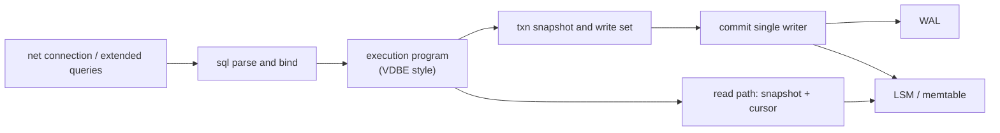
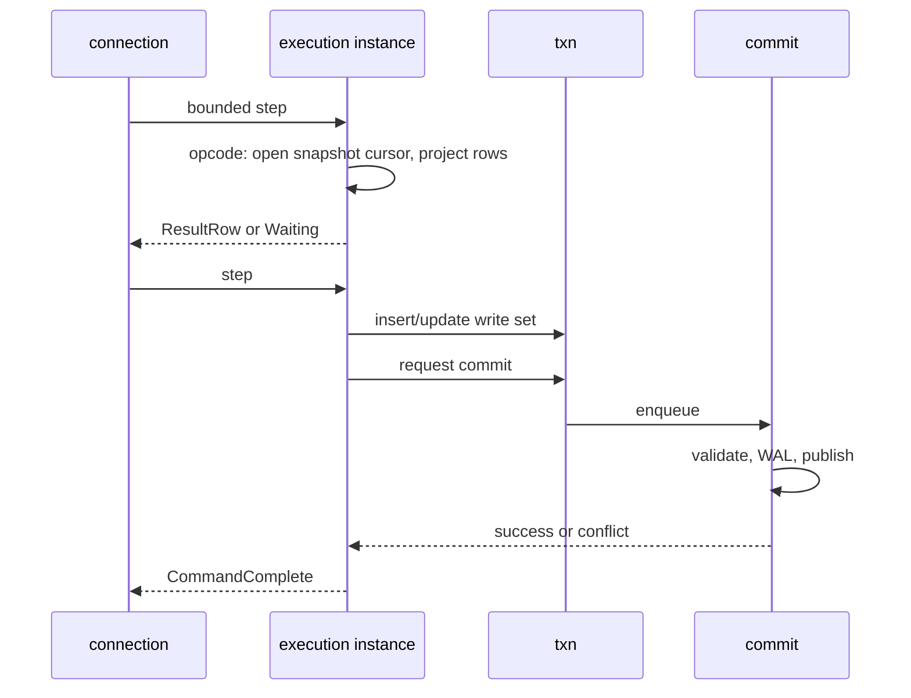

# Execution Engine (VDBE Style)

## Status and Scope

This document defines the target shape of Pico's **statement execution layer**, using
SQLite's Virtual Database Engine as a reference ([`vdbe.h`](https://github.com/sqlite/sqlite/blob/924626e603a36cc48ce87bc3a3eeddc61af1a72f/src/vdbe.h), [`vdbe.c`](https://github.com/sqlite/sqlite/blob/924626e603a36cc48ce87bc3a3eeddc61af1a72f/src/vdbe.c), [`vdbeaux.c`](https://github.com/sqlite/sqlite/blob/924626e603a36cc48ce87bc3a3eeddc61af1a72f/src/vdbeaux.c)).

The current Phase 0/1 implementation is **direct interpretation** in `src/sql/exec.zig`:
it calls `storage/engine` table operations immediately after parsing the AST, with no
bytecode, register file, or pausable program counter. `BEGIN` / `COMMIT` / `ROLLBACK` are
still compatibility tags and there is no cross-statement write set yet (see the
[concurrency control contract](concurrency-control.md)).

This does not require a bytecode format or opcode numbering compatible with SQLite, and VDBE
is not a public API. The fixed boundary is **SQL subset -> inspectable execution program ->
effects through transaction/storage boundaries**, so planning, execution, cancellation,
explanation, and testing remain layered instead of accumulating in one `execStmt`.

## External References and Applicability

| Reference | Mechanisms reviewed | Pico's approach | Explicitly not adopted |
| --- | --- | --- | --- |
| SQLite `Vdbe` / `VdbeOp` | Statements compile to opcode sequences; P1-P5 operands; `Mem` registers; cursors | Target: each bound statement has an **execution program** (operation sequence plus bounded workspace) | Stable SQLite opcode ABI compatibility; wholesale trigger-subprogram copying |
| `OP_Transaction` / `OP_Halt` / `OP_Goto` | Explicit transaction boundaries and control flow | Transaction entry/exit are explicit program steps; effects still pass through `txn`/`commit` | Taking B-Tree write locks or starting a rollback journal directly in opcodes |
| `OP_OpenRead` / `OP_Column` / `OP_Next` / `OP_ResultRow` | Cursor scans, projection, and row-at-a-time output | Cursor abstraction over **ordered LSM/memtable iteration plus snapshot visibility** | Binding `OP_Open*` to SQLite B-Tree page cursors |
| `OP_Insert` / `OP_Delete`, etc. | Direct storage changes inside the VM | Writes construct/merge a **write set** or issue a commit request without bypassing the single writer | Execution threads directly `fsync`ing database files or publishing manifests |
| Interruptible VDBE stepping | Progress callbacks, `isInterrupted`, and opcode-boundary response | Aligned with connection **cancellation** and statement generations; sample cancellation at opcode/bounded-batch boundaries | Cancelling a commit that has entered the WAL durability boundary |
| `EXPLAIN` / scan status | Observable opcodes and plans | Target supports explaining the execution program and basic counters | Promising the full semantics of PostgreSQL `EXPLAIN ANALYZE` |

SQLite's strength is that its parser is large but its runtime loop is regular: every
statement becomes a sequence of operations on storage cursors and registers. Pico needs the
same **strong abstraction**, but its cursors sit over MVCC + LSM + a single writer rather than pager-protected
B-Tree pages.

## Position in the System

| Stage | Owner | Output | Forbidden |
| --- | --- | --- | --- |
| Lexing/parsing | `sql` | AST or equivalent structured statement | Execution side effects |
| Binding | `sql` | Type-checked constants/parameters | Storage writes |
| Compilation (target) | `sql` | Execution program plus required register/cursor counts | Opening the network or WAL |
| Execution | `sql`, through `txn`/`read` | Row stream, write set, command tag | Directly changing `published_commit_seq` |
| Commit | `commit` | WAL plus publication | Parsing SQL |

`net` sees only prepared statements, execution requests, rows/tags, errors, and the
transaction status bits required by `ReadyForQuery`. It must not interpret opcodes.

## Execution Program Model

### Program and Workspace

Target objects (names may change during implementation; semantics are fixed):

- **Program**: a read-only operation sequence reusable for repeated execution on one connection (the basis for extended-query plan caching).
- **Instance**: one execution containing a program counter, register file, cursor slots, result staging, an error code, and the connection's statement-generation association.
- **Opcode**: an opcode plus a fixed small number of integer/reference operands (similar to P1-P5); opcodes must not hide unbounded side-channel state.

Registers hold scalars, short-lived references, and nulls. Ownership rules for large objects
and row buffers must be explicit: either an Instance arena owns them until execution ends, or
references pin storage pages/blocks until `release` (when the read path uses Pager).

### Opcode Groups (Target Minimum)

Pico does not seek SQLite's hundreds of opcodes. Groups are introduced in stages according to
the SQL subset:

| Group | Examples (conceptual names) | Purpose |
| --- | --- | --- |
| Control | `Goto`, `Halt`, `HaltIf`, `Gosub`/`Return` (if needed) | Branching and termination; errors enter `Halt` |
| Transactions | `TxBegin`, `TxCommit`, `TxRollback`, `SnapshotOpen` | Call only `txn` APIs; `Commit` only enqueues |
| Constants/expressions | `Integer`, `Text`, `Null`, `Copy`, `Function` | Register computation; functions are defined by the SQL subset |
| Cursors | `OpenScan`, `OpenSeek`, `Next`, `Rewind`, `Close` | Snapshot-based ordered scans and point lookups |
| Rows | `Column`, `ResultRow`, `MakeRecord` | Projection and protocol row output |
| Write set | `WriteInsert`, `WriteUpdate`, `WriteDelete` | Put changes in the private write set, including constraint candidates |
| Metadata | `OpenCatalog`, `CreateTable`, ... | Catalog changes also enter the write set/commit and do not write files directly |

Each opcode document must state whether it performs I/O, is a cancellation point, may enter
the commit queue, and how transaction state changes on failure. This mirrors SQLite's
Opcode/Synopsis comments in `vdbe.c`, but Pico's authoritative description is this
architecture and adjacent code comments, not a public opcode manual.

### Main-Loop Invariants

1. **Advance only bounded work**: each `step` executes a bounded number of opcodes or rows, then returns control to connection scheduling for fairness and cancellation (see [runtime](runtime-and-concurrency.md)).
2. **Cancellation sampling**: check the statement-generation cancellation flag before `Next`, expression batches, commit waits, and any potentially blocking I/O request.
3. **Reads do not block writes**: cursors interpret only the snapshot watermark and the transaction's write set; they do not take a global table lock.
4. **Writes do not publish**: write opcodes must not use VFS to write final WAL/LSM state; only the `commit` single writer publishes after validation.
5. **Error scope**: expression/constraint/subset rejection fails the statement; storage corruption or a critical WAL failure must not be wrapped as an ordinary SQL error while writes continue (enter the instance-failure path).
6. **Explainability**: the same Program can print its operation sequence in `EXPLAIN` mode without side effects (or through a side-effect-free analysis path).

## Migration from `exec.zig`

| Current | Target |
| --- | --- |
| Large `execStmt` switch calls engine directly | Compiler generates a Program; `step` interprets it |
| `Engine.insert/update/delete` immediately change the in-memory table and write WAL | Buffer a write set; publish in single-writer batches |
| SELECT materializes all rows at once | Cursor plus streamed `ResultRow`, subject to connection output backpressure |
| Almost no cancellation | Cancellation sampled at opcode boundaries |
| Plans are invisible | `EXPLAIN` prints the Program |

Migration must keep SQL-subset golden tests unchanged: introduce the Program representation
and an equivalent interpreter first, then separate write sets from commit, and only later add
opcode coverage such as JOIN (after updating the support matrix and an ADR if the product
boundary changes).

## Cursor/Storage Seam

The cursor interface exposed to execution should be narrow and expressive:

- Open a point lookup or range scan over a table or secondary index at snapshot `s`.
- `next` / `seek` / `column`.
- Close and release pins/buffers.

The implementation underneath may use memtable skipping, SST block iteration, or Pager page
pins when metadata is stored in page files. The execution layer **must not** depend on
SSTable file names, page numbers, or WAL offsets to interpret SQL visibility.

The write-path seam is equally small:

- `write_set.insert/update/delete`;
- `commit_request`;
- conflict and constraint error codes.

This implements ADR-0004's logical boundary: “ordered set + WAL + MVCC.” Execution depends
only on that boundary.

## Resource and Static Limits

The philosophy is the same as for static page caches and I/O capacity:

| Resource | Limit source | Saturation behavior |
| --- | --- | --- |
| Register/cursor count | Statement shape at compile time, capped by configuration | Compilation fails rather than growing during execution |
| Opcodes or rows per step | Runtime configuration | Return `Pending`; let the connection schedule other work |
| Result output | Connection `foreground_write` budget | Pause `ResultRow` without losing row order |
| Write-set size | Configuration | Fail the statement or refuse enqueueing early; never spill silently |

Opcode implementations must not `malloc` an unlimited “temporary table” outside the
write-set/temporary budget. Sort or hash-aggregate spill requires an explicit temporary-file
path through VFS and explicit limits.

## Observability, Faults, and Acceptance

Metrics include opcode steps per statement, rows produced, cursors opened, write-set entries,
commit wait, cancellation hits, Program-cache hits (if any), and time by opcode group. Debug
interfaces may expose the current pc and opcode, but connections must not receive register
contents by default.

Minimum acceptance after the execution program lands:

1. Existing `exec.zig` SQL-subset cases produce identical golden results under Program interpretation.
2. Large `SELECT` statements yield incrementally under output backpressure; slow readers do not block other connection commits.
3. Cancellation during execution discards unqueued writes; requests with an assigned sequence but no WAL write terminate deterministically; cancellation after WAL durability does not undo a commit.
4. Unsupported SQL fails before Program generation and produces no partial side effects.
5. Fault injection keeps cursor-I/O, commit-conflict, and constraint-failure error codes stable and keeps the transaction state machine within the concurrency control contract.

## Implementation Boundaries

1. **Now**: execute the AST directly; documents and tests define the semantic baseline.
2. **Next**: introduce a read-only Program (control, cursors, and `ResultRow`) and migrate SELECT first.
3. **After that**: add write-set opcodes and connect them to the single writer; replace tag-style BEGIN/COMMIT with `Tx*` opcodes.
4. **Then**: add Program caching under extended queries, `EXPLAIN`, and basic counters.
5. **Requires a new ADR**: user-visible bytecode ABI, stored-procedure/trigger language, one-to-one compatibility with PostgreSQL executor nodes, or a product promise for a complete VM query-optimizer rule set.

## Naming

Documents and internal modules may call this **VDBE**, **execution program**, or **bytecode
VM**. External product language should say “SQL subset execution” so users do not assume
that SQLite bytecode can be loaded or that SQLite's `EXPLAIN` format is compatible. Code
identifiers remain English.
