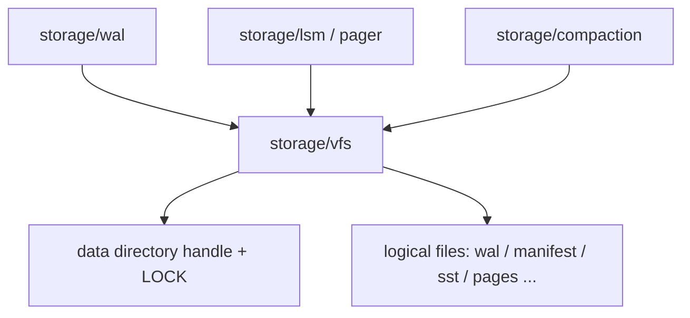
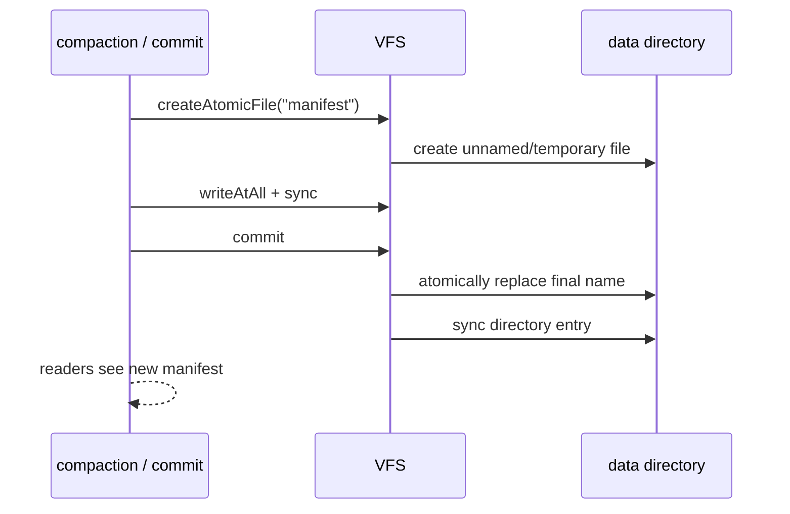

# VFS: Storage File Abstraction Within the Data Directory

## Status and Scope

This document details the `storage/vfs` boundary in the [architecture overview](../ARCHITECTURE.md), using
the SQLite VFS design as a reference ([`sqlite3_vfs` / `sqlite3_io_methods` in `sqlite.h.in`](https://github.com/sqlite/sqlite/blob/924626e603a36cc48ce87bc3a3eeddc61af1a72f/src/sqlite.h.in),
the [`os.h` wrapper layer](https://github.com/sqlite/sqlite/blob/924626e603a36cc48ce87bc3a3eeddc61af1a72f/src/os.h), and the
[`test_demovfs.c` minimal implementation](https://github.com/sqlite/sqlite/blob/924626e603a36cc48ce87bc3a3eeddc61af1a72f/src/test_demovfs.c)).

The current implementation is defined by `src/storage/vfs.zig`: one **instance** opens one
**data directory**, takes an exclusive instance lock on it, and permits open, positioned
read/write, sync, truncate, existence checks, deletion, and atomic publication only for
**logical file names** relative to that directory. The deeper rules in this document
(I/O-scheduler integration, fault injection, and WAL/LSM-specific open flags) are target
contracts until the corresponding modules land; they are not implemented guarantees yet.

VFS does **not** own the WAL format, page cache, transactions, SQL, wire protocol,
compression policy, or checkpoint semantics. It owns only how names within the data
directory are resolved, how handles are managed, and which I/O primitives callers may use.

## External References and Applicability

| Reference | Mechanisms reviewed | Pico's approach | Explicitly not adopted |
| --- | --- | --- | --- |
| SQLite `sqlite3_vfs` | Separates open/delete/access/path normalization from the platform; upper layers use logical paths | The storage layer uses only logical file names; platform details are confined to VFS and the `std.Io` adapter | Pluggable multi-VFS registries, per-connection VFS selection, and dynamic extension loading (`xDl*`) |
| SQLite `sqlite3_io_methods` | Positioned `xRead`/`xWrite`, `xSync`, `xTruncate`, `xFileSize`, and `xClose` | Provides positioned I/O, `sync`, `size`, `truncate`, and `close`; WAL and page files share these primitives | Multi-process `xLock`/`xUnlock` levels, `xShmMap`/`xShmLock`, and mmap fetch |
| SQLite Demo VFS | Omits locks and shared cache, assumes one connection, and may coalesce write buffers before sync | Uses an exclusive single-instance lock; callers and the I/O scheduler own write buffering, with no implicit VFS coalescing | Rollback-journal sector-aligned write coalescing by default and embedded journal buffering |
| [SQLite `vfs-shm.txt`](https://github.com/sqlite/sqlite/blob/924626e603a36cc48ce87bc3a3eeddc61af1a72f/doc/vfs-shm.txt) | Seven-state WAL-index locking | None | The complete SHM lock state machine and shared-memory index for multiple connections |
| [I/O scheduling contract](io-scheduling.md) | Separates completion events from callbacks, with capacities and categories | VFS calls should eventually enter the scheduler as categorized I/O operations | Business callbacks or unbounded queues embedded in VFS |

SQLite's VFS is an extension point that lets one core run across operating systems and
deployment environments. Pico's VFS is a **security and ownership boundary** that prevents the
storage layer from escaping the data directory, while also isolating platform I/O. Both
separate file I/O from storage semantics, but Pico does not make replaceable filesystems a
product feature.

## Responsibilities and Invariants

| Owner | Responsible for | Not responsible for |
| --- | --- | --- |
| `storage/vfs` | Opening and closing the data directory, the exclusive instance lock, logical-name validation, file/atomic-file lifetimes, positioned I/O, and `sync` | WAL frame layout, page-alignment policy, commit order, and compression choice |
| `storage/wal`, `storage/lsm`, `storage/pager` | Encoding content in logical files and deciding when to `sync` and atomically publish | Parsing `../`, absolute paths, or escapes into subdirectories |
| `runtime` I/O scheduler | When disk operations are submitted/completed, their capacity, and their category | File-name validity |
| `commit` | When a write has reached the **durability level** | Calling OS path APIs directly and bypassing VFS |

Required invariants:

1. **Directory fence**: Every storage file name must be validated and resolved relative to the data directory. Reject empty names, absolute paths, names containing separators, and `.` / `..`. The storage layer must not accept arbitrary paths from callers.
2. **Single-instance lock**: Take an exclusive lock on `LOCK` when opening the data directory. Failure returns `InstanceInUse`; two processes must not write the same directory.
3. **Stable logical names**: Upper layers use only short logical names such as `wal`, `manifest`, and `sst-…`. Physical path construction occurs only inside VFS.
4. **Handle ownership**: Callers close handles returned by `openFile` / `createAtomicFile`. VFS releases the directory and instance lock on `close` and does not implicitly close borrowed files.
5. **Atomic publication primitive**: Publish immutable files such as manifests and SSTables as “write temporary -> `sync` -> atomic replace -> directory `sync`”. A partially written file must never become the reader-visible final name.
6. **Durable deletion**: Sync directory entries after deleting a storage file so that a crash cannot leave ghost entries or cause recovery to use a deleted file.
7. **Non-transactional existence**: `exists` is advisory; callers must still handle concurrent open/delete failures.

## Mapping to SQLite Methods

| SQLite | Pico VFS | Description |
| --- | --- | --- |
| `xOpen` | `Vfs.openFile` / `createAtomicFile` | Logical names only; open flags map to `OpenOptions` |
| `xDelete` | `Vfs.deleteFile` | Sync the directory afterward |
| `xAccess` | `Vfs.exists` | Advisory; no permission model beyond F_OK is promised |
| `xFullPathname` | Resolved internally and not exposed | Prevents upper layers from joining paths |
| `xRead` / `xWrite` | `File.readAt` / `writeAtAll` | Positioned I/O; complete writes use `writeAtAll` |
| `xSync` | `File.sync` / `AtomicFile.sync` | Callers choose the durability boundary according to the **durability level** |
| `xTruncate` / `xFileSize` | `truncate` / `size` | Truncation and measurement for page files and WAL |
| `xClose` | `File.close` / `AtomicFile.deinit` | |
| `xLock` family | Instance-level `LOCK` only | No SHARED/RESERVED/PENDING/EXCLUSIVE page locks |
| `xShm*` | None | A single instance has no shared-memory WAL index |
| `xRandomness` / `xSleep` / `xCurrentTime` | Outside VFS | Supplied by `util`/runtime when needed, keeping clocks/entropy out of the file layer |
| `xDl*` | None | Dynamic extensions are not loaded into the storage path |

## Opening, Atomic Publication, and Sync

### Open Options

`OpenOptions` expresses storage intent rather than copying the complete POSIX flag set:

- `read` / `write`: access mode.
- `create` / `truncate` / `exclusive`: creation and exclusive creation.
- `lock` / `lock_nonblocking`: advisory file lock when supported by the platform; it **cannot** replace the instance `LOCK` or implement SQLite-style multi-process page locking.

WAL, page files, and manifest staging files should all enter through the same `openFile`
so tests can use the same fault-injection point.

### Atomic Publication

Rules:

1. Until the write completes and is synced, any old content under the final name remains valid to readers.
2. A failed `commit` must not leave the final name pointing to unsynced content; `deinit` cleans up the temporary file.
3. The upper layer validates content before a new file becomes recovery or read-path input when the format requires it. VFS guarantees only ordered bytes and directory-entry publication; it does not interpret content.

### Sync and Durability

VFS `sync` is a **platform persistence primitive**, not a user-visible **commit**. At the default **durability level**:

- The WAL append path must `sync` the WAL file before confirming a commit (see ADR-0006).
- The atomic publication path syncs the data file before replacement and the directory after replacement.
- `Pager.sync` writes and syncs dirty pages in that page file; it does not constitute a transaction commit.

Looser durability levels may defer or coalesce `sync`, but must be explicit and observable and must not be the default.

## I/O Scheduler Integration

In the target implementation, VFS reads, writes, and syncs should be registered as operations in the [I/O scheduler](io-scheduling.md):

| VFS use | I/O category |
| --- | --- |
| WAL append and sync, recovery reads, and completion of an in-progress manifest publication | `critical` |
| File reads required by foreground read-only statements | `foreground_read` |
| Compaction writes, prefetch, and checkpoint preparation | `maintenance` |

The VFS API may retain a synchronous shape or expose explicit asynchronous handles, but
platform completion callbacks must not run SQL or commit logic directly. The current phase
may use blocking `std.Io` calls. When asynchronous scheduling is introduced, caller and VFS
error models and cancellation semantics must remain intact: connection cancellation cannot
undo an operation that has entered an irreversible WAL/manifest step.

## Faults, Observability, and Acceptance

Minimum regressions (partly covered by `vfs.zig` tests):

1. Path escape: `../outside`, absolute paths, names containing `/` or `\`, and `.` / `..` all return `InvalidStoragePath`.
2. Instance lock: a second `Vfs.open` for the same data directory returns `InstanceInUse` under the process model allowed by the test.
3. Atomic publication: reads after replacement return new content; with crash injection at write, file sync, replace, and directory sync, readers see only the old complete file or the new complete file, never a torn final name.
4. Deletion: `exists` is false after `deleteFile`, and a directory-sync failure is not silently reported as success.
5. Upper-layer integration: WAL and Pager open files only through VFS, which tests can replace with a fault-injecting VFS.

Recommended metrics: open/close counts, sync count and latency, atomic publication
successes/failures, rejected paths, and instance-lock conflicts. Do not use full paths or
SQL text as labels.

## Implementation Boundaries

1. **Complete**: data-directory fencing, instance lock, positioned I/O, atomic publication, deletion and directory sync, and unit tests.
2. **Next**: route WAL/engine open paths through VFS and provide a fault-injectable VFS adapter for tests.
3. **After that**: integrate categories and capacities with `runtime` I/O scheduling; prevent storage modules from escaping through direct `std.fs` use.
4. **Requires a new ADR**: sharing one data directory across processes, pluggable user VFSes, network block-device semantics, and treating checkpoints as backup media.
