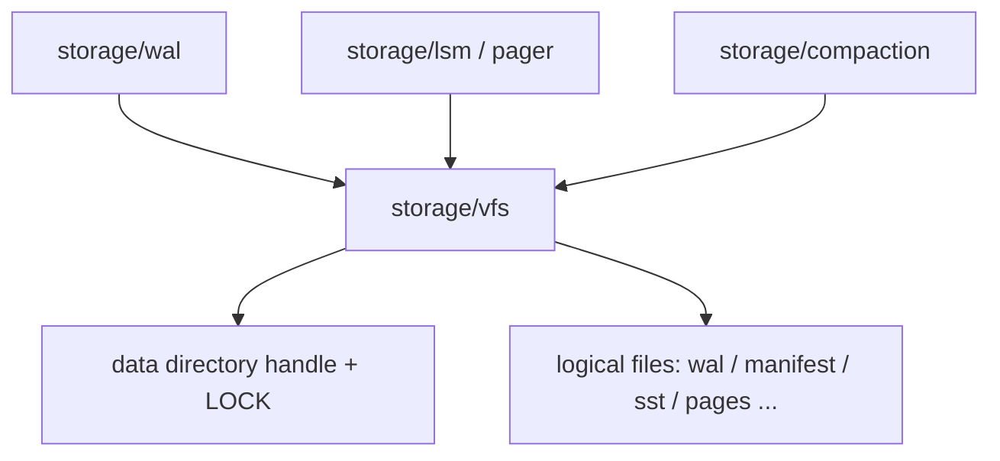
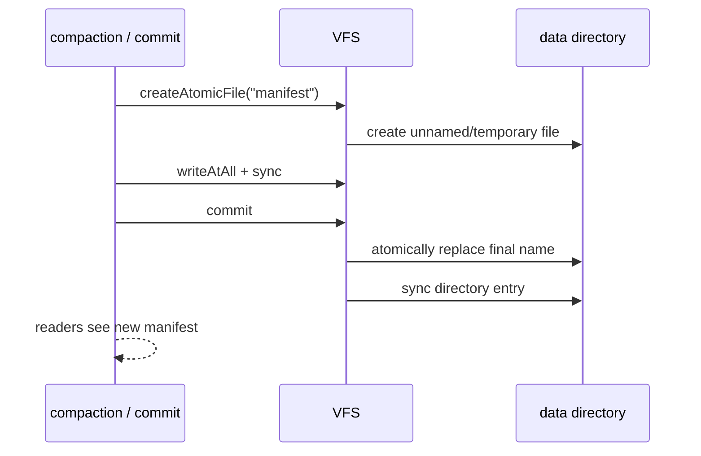

# VFS: Storage File Abstraction Within the Data Directory

## Status and Scope

This document details the `storage/vfs` boundary in the [architecture overview](../ARCHITECTURE.md).

The current implementation is defined by `src/storage/vfs.zig`: one **instance** opens one
**data directory**, takes an exclusive instance lock on it, and permits open, positioned
read/write, sync, truncate, existence checks, deletion, and atomic publication only for
**logical file names** relative to that directory. The deeper rules in this document
(I/O-scheduler integration, fault injection, and WAL/LSM-specific open flags) are target
contracts until the corresponding modules land; they are not implemented guarantees yet.

VFS does **not** own the WAL format, page cache, transactions, SQL, wire protocol,
compression policy, or checkpoint semantics. It owns only how names within the data
directory are resolved, how handles are managed, and which I/O primitives callers may use.

## Pico Boundary

Pico's VFS is a **safety and ownership boundary**. It prevents storage modules from escaping an instance's data directory and isolates platform I/O without making replaceable filesystems a product feature. It provides positioned reads and writes, sync, size, truncation, close, deletion, and atomic publication. It does not provide page-level multi-process locks, shared-memory indexes, dynamic extensions, or implicit write buffering. The [I/O scheduling contract](io-scheduling.md) assigns future VFS work a category and capacity; VFS itself never owns unbounded queues or business callbacks.

The boundary gives recovery a small, auditable file vocabulary. WAL, manifest, immutable-table, and page-file code can decide *what* bytes mean, but none of them can turn a malformed table name, a compaction bug, or a future SQL value into an arbitrary host path. They also cannot claim that a renamed file is durable without the required file and directory syncs. This keeps the fault question precise: a caller either receives a completed I/O operation under the data directory, or an error it must surface or recover from.

Atomic publication separates preparation from visibility. Compaction may write and validate a replacement SST or manifest while readers continue using the old name. Only the final replace makes the candidate visible, and recovery accepts only a complete final name. This is why VFS does not interpret records or make commit decisions: byte publication and logical publication are distinct steps owned by different modules.

## Responsibilities and Invariants

| Owner | Responsible for | Not responsible for |
| --- | --- | --- |
| `storage/vfs` | Opening and closing the data directory, the exclusive instance lock, logical-name validation, file/atomic-file lifetimes, positioned I/O, and `sync` | WAL frame layout, page-alignment policy, commit order, and compression choice |
| `storage/wal`, `storage/lsm`, `storage/pager` | Encoding content in logical files and deciding when to `sync` and atomically publish | Parsing `../`, absolute paths, or escapes into subdirectories |
| `runtime` I/O scheduler | When disk operations are submitted/completed, their capacity, and their category | File-name validity |
| `commit` | When a write has reached the **durability level** | Calling OS path APIs directly and bypassing VFS |

Required invariants:

1. **Directory fence**: Every storage file name must be validated and resolved relative to the data directory. Reject empty names, absolute paths, names containing separators, and `.` / `..`. The storage layer must not accept arbitrary paths from callers.
2. **Single-instance lock**: Take an exclusive lock on `LOCK` when opening the data directory. Failure returns `InstanceInUse`; two processes must not write the same directory.
3. **Stable logical names**: Upper layers use only short logical names such as `wal`, `manifest`, and `sst-…`. Physical path construction occurs only inside VFS.
4. **Handle ownership**: Callers close handles returned by `openFile` / `createAtomicFile`. VFS releases the directory and instance lock on `close` and does not implicitly close borrowed files.
5. **Atomic publication primitive**: Publish immutable files such as manifests and SSTables as “write temporary -> `sync` -> atomic replace -> directory `sync`”. A partially written file must never become the reader-visible final name.
6. **Durable deletion**: Sync directory entries after deleting a storage file so that a crash cannot leave ghost entries or cause recovery to use a deleted file.
7. **Non-transactional existence**: `exists` is advisory; callers must still handle concurrent open/delete failures.

## Interface Contract

| Pico VFS operation | Contract |
| --- | --- |
| `openFile` / `createAtomicFile` | Accept logical names only; map storage intent to `OpenOptions`. |
| `deleteFile` / `exists` | Deletion syncs the directory afterward; existence is advisory. |
| `readAt` / `writeAtAll` | Positioned I/O; complete writes use `writeAtAll`. |
| `sync` | Callers choose the durability boundary according to the **durability level**. |
| `truncate` / `size` | Used by page files and WAL for bounded file layout. |
| `close` / `deinit` | Release the caller-owned file or atomic-file object. |
| instance `LOCK` | Excludes a second writer for one data directory; no page-level locking model exists. |

## Opening, Atomic Publication, and Sync

### Open Options

`OpenOptions` expresses storage intent rather than copying the complete POSIX flag set:

- `read` / `write`: access mode.
- `create` / `truncate` / `exclusive`: creation and exclusive creation.
- `lock` / `lock_nonblocking`: advisory file lock when supported by the platform; it **cannot** replace the instance `LOCK` or introduce a page-level multi-process locking model.

WAL, page files, and manifest staging files should all enter through the same `openFile`
so tests can use the same fault-injection point.

### Atomic Publication

Rules:

1. Until the write completes and is synced, any old content under the final name remains valid to readers.
2. A failed `commit` must not leave the final name pointing to unsynced content; `deinit` cleans up the temporary file.
3. The upper layer validates content before a new file becomes recovery or read-path input when the format requires it. VFS guarantees only ordered bytes and directory-entry publication; it does not interpret content.

### Sync and Durability

VFS `sync` is a **platform persistence primitive**, not a user-visible **commit**. At the default **durability level**:

- The WAL append path must `sync` the WAL file before confirming a commit (see ADR-0006).
- The atomic publication path syncs the data file before replacement and the directory after replacement.
- `Pager.sync` writes and syncs dirty pages in that page file; it does not constitute a transaction commit.

Looser durability levels may defer or coalesce `sync`, but must be explicit and observable and must not be the default.

## I/O Scheduler Integration

In the target implementation, VFS reads, writes, and syncs should be registered as operations in the [I/O scheduler](io-scheduling.md):

| VFS use | I/O category |
| --- | --- |
| WAL append and sync, recovery reads, and completion of an in-progress manifest publication | `critical` |
| File reads required by foreground read-only statements | `foreground_read` |
| Compaction writes, prefetch, and checkpoint preparation | `maintenance` |

The VFS API may retain a synchronous shape or expose explicit asynchronous handles, but
platform completion callbacks must not run SQL or commit logic directly. The current phase
may use blocking `std.Io` calls. When asynchronous scheduling is introduced, caller and VFS
error models and cancellation semantics must remain intact: connection cancellation cannot
undo an operation that has entered an irreversible WAL/manifest step.

## Faults, Observability, and Acceptance

Minimum regressions (partly covered by `vfs.zig` tests):

1. Path escape: `../outside`, absolute paths, names containing `/` or `\`, and `.` / `..` all return `InvalidStoragePath`.
2. Instance lock: a second `Vfs.open` for the same data directory returns `InstanceInUse` under the process model allowed by the test.
3. Atomic publication: reads after replacement return new content; with crash injection at write, file sync, replace, and directory sync, readers see only the old complete file or the new complete file, never a torn final name.
4. Deletion: `exists` is false after `deleteFile`, and a directory-sync failure is not silently reported as success.
5. Upper-layer integration: WAL and Pager open files only through VFS, which tests can replace with a fault-injecting VFS.

Recommended metrics: open/close counts, sync count and latency, atomic publication
successes/failures, rejected paths, and instance-lock conflicts. Do not use full paths or
SQL text as labels.

## Implementation Boundaries

1. **Complete**: data-directory fencing, instance lock, positioned I/O, atomic publication, deletion and directory sync, and unit tests.
2. **Next**: route WAL/engine open paths through VFS and provide a fault-injectable VFS adapter for tests.
3. **After that**: integrate categories and capacities with `runtime` I/O scheduling; prevent storage modules from escaping through direct `std.fs` use.
4. **Requires a new ADR**: sharing one data directory across processes, pluggable user VFSes, network block-device semantics, and treating checkpoints as backup media.
