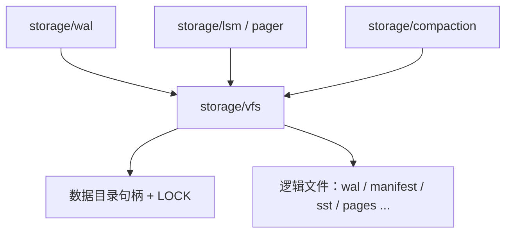
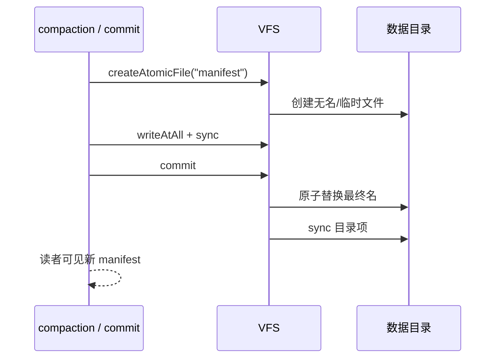

# VFS：数据目录内的存储文件抽象

## 状态与范围

本文细化 [架构总览](../ARCHITECTURE.md) 中的 `storage/vfs` 边界，并对照
SQLite VFS 设计（[`sqlite.h.in` 中 `sqlite3_vfs` / `sqlite3_io_methods`](https://github.com/sqlite/sqlite/blob/924626e603a36cc48ce87bc3a3eeddc61af1a72f/src/sqlite.h.in)、
[`os.h` 包装层](https://github.com/sqlite/sqlite/blob/924626e603a36cc48ce87bc3a3eeddc61af1a72f/src/os.h)、
[`test_demovfs.c` 最小实现](https://github.com/sqlite/sqlite/blob/924626e603a36cc48ce87bc3a3eeddc61af1a72f/src/test_demovfs.c)）。

当前实现以 `src/storage/vfs.zig` 为准：一个 **实例** 打开一个 **数据目录**，在目录上
取得排他实例锁，只允许相对该目录的**逻辑文件名**做打开、定位读写、同步、截断、
存在性检查、删除和原子发布。本文中的更深规则（与 I/O 调度对接、故障注入、WAL/LSM
专用打开标志）在对应模块落地前是目标契约，不是已实现保证。

VFS **不**拥有：WAL 格式、页缓存、事务、SQL、线协议、压缩策略或检查点语义。它只
拥有「数据目录内文件名如何解析、句柄如何生命周期管理、以及哪些 I/O 原语可被上层
调用」。

## 外部参考及适用性

| 参考 | 已核对的机制 | Pico 的采用方式 | 明确不采用 |
| --- | --- | --- | --- |
| SQLite `sqlite3_vfs` | 把「打开/删除/访问/路径规范化」与平台分离；上层只谈逻辑路径 | 存储层只使用逻辑文件名；平台细节集中在 VFS 与 `std.Io` 适配 | 可插拔多 VFS 注册表、按连接选择 VFS、动态扩展加载（`xDl*`） |
| SQLite `sqlite3_io_methods` | 定位读写 `xRead`/`xWrite`、`xSync`、`xTruncate`、`xFileSize`、`xClose` | 提供位置 I/O、`sync`、`size`、`truncate`、`close`；WAL 与页文件共用同一原语 | 多进程 `xLock`/`xUnlock` 层次、`xShmMap`/`xShmLock`、mmap fetch |
| SQLite Demo VFS | 省略锁与共享缓存，假定单连接；同步前可合并写缓冲 | 单实例排他锁；写缓冲策略留给调用方与 I/O 调度，不在 VFS 隐式合并 | 回滚日志扇区对齐写合并作为默认行为；嵌入式 journal 缓冲 |
| [SQLite `vfs-shm.txt`](https://github.com/sqlite/sqlite/blob/924626e603a36cc48ce87bc3a3eeddc61af1a72f/doc/vfs-shm.txt) | WAL-index 七态锁 | 无 | 整份 SHM 锁状态机与多连接共享内存索引 |
| [I/O 调度契约](io-scheduling.md) | 完成事件与回调分离、容量与类别 | VFS 调用最终应作为可分类 I/O 操作进入调度器 | 在 VFS 内嵌业务回调或无界队列 |

SQLite 的 VFS 是「让同一核心跑在多 OS / 多部署形态」的扩展点。Pico 的 VFS 是
「让存储层永远不能逃出数据目录」的**安全与所有权边界**，顺带隔离平台 I/O。两者
都把文件 I/O 从存储语义中抽出，但 Pico 不以可替换文件系统为产品特性。

## 责任与不变量

| 所有者 | 负责 | 不负责 |
| --- | --- | --- |
| `storage/vfs` | 数据目录打开与关闭、实例排他锁、逻辑名校验、文件/原子文件生命周期、位置 I/O 与 `sync` | WAL 帧布局、页对齐策略、提交顺序、压缩选择 |
| `storage/wal`、`storage/lsm`、`storage/pager` | 在逻辑文件上编码内容、决定何时 `sync`、何时原子发布 | 解析 `../`、绝对路径或子目录逃逸 |
| `runtime` I/O 调度 | 何时提交/完成磁盘操作、容量与类别 | 文件名合法性 |
| `commit` | 何时认为一次写入达到**耐久级别** | 直接调用 OS 路径 API 绕过 VFS |

必须保持的不变量：

1. **目录围栏**：所有存储文件名必须通过校验，且相对数据目录解析。拒绝空名、绝对路径、
   含路径分隔符的名、`.` / `..`。存储层不得接受调用方任意路径。
2. **单实例锁**：打开数据目录时在 `LOCK` 上取得排他锁；锁失败则返回
   `InstanceInUse`，不得两个进程同时写同一目录。
3. **逻辑名稳定**：上层只使用短逻辑名（如 `wal`、`manifest`、`sst-…`）。物理路径
   拼接只发生在 VFS 内部。
4. **句柄所有权**：`openFile` / `createAtomicFile` 返回的句柄由调用方关闭；VFS
   在 `close` 时释放目录与实例锁，不隐式关闭已借出的文件。
5. **原子发布原语**：不可变文件（manifest、SSTable 等）通过「写临时 → `sync` →
   原子替换 → 目录 `sync`」发布；半写入文件不得成为读者可见的最终名。
6. **删除耐久**：删除存储文件后同步目录项，避免崩溃后幽灵目录项或已删文件仍被
   恢复路径误用。
7. **存在性非事务**：`exists` 只是顾问信息；调用方必须仍处理并发打开/删除失败。

## 与 SQLite 方法的映射

| SQLite | Pico VFS | 说明 |
| --- | --- | --- |
| `xOpen` | `Vfs.openFile` / `createAtomicFile` | 仅逻辑名；打开标志映射为 `OpenOptions` |
| `xDelete` | `Vfs.deleteFile` | 删除后目录 sync |
| `xAccess` | `Vfs.exists` | 顾问性；无 F_OK 以外的权限模型承诺 |
| `xFullPathname` | 内部解析，不对外暴露 | 防止上层拼路径 |
| `xRead` / `xWrite` | `File.readAt` / `writeAtAll` | 位置 I/O；完整写用 `writeAtAll` |
| `xSync` | `File.sync` / `AtomicFile.sync` | 耐久边界由调用方按**耐久级别**决定何时调用 |
| `xTruncate` / `xFileSize` | `truncate` / `size` | 页文件与 WAL 截断/测量 |
| `xClose` | `File.close` / `AtomicFile.deinit` | |
| `xLock` 族 | 仅实例级 `LOCK` | 无 SHARED/RESERVED/PENDING/EXCLUSIVE 页锁 |
| `xShm*` | 无 | 单实例无 WAL-index 共享内存 |
| `xRandomness` / `xSleep` / `xCurrentTime` | 不在 VFS | 需要时由 `util`/运行时提供，避免把时钟/熵绑在文件层 |
| `xDl*` | 无 | 不加载动态扩展进存储路径 |

## 打开、原子发布与同步

### 打开选项

`OpenOptions` 表达存储意图，而不是照搬 POSIX 标志全集：

- `read` / `write`：访问模式。
- `create` / `truncate` / `exclusive`：创建与互斥创建。
- `lock` / `lock_nonblocking`：文件级顾问锁（若平台提供）；**不能**替代实例
  `LOCK`，也不能实现 SQLite 式多进程页锁协议。

WAL、页文件、manifest 准备文件应通过同一 `openFile` 进入，以便测试可用同一故障
注入点。

### 原子发布

规则：

1. 写入完成并 `sync` 之前，最终名上的旧内容（若有）对读者仍有效。
2. `commit` 失败不得留下「最终名指向未 sync 内容」的状态；临时文件由 `deinit` 清理。
3. 新文件成为恢复或读路径输入之前，内容校验（若格式要求）由上层完成；VFS 只保证
   字节按序落盘与目录项发布，不解释内容。

### 同步与耐久

VFS 的 `sync` 是**平台持久化原语**，不是用户可见的**提交**。默认**耐久级别**下：

- WAL 追加路径在确认提交前必须对 WAL 文件 `sync`（见 ADR-0006）。
- 原子发布路径在替换前对数据文件 `sync`，替换后对目录 `sync`。
- 页管理器的 `Pager.sync` 只使该页文件上的脏页写回并同步；它不构成事务提交。

较松耐久级别可以推迟或合并 `sync`，但必须显式配置、可观察，且不得成为默认。

## 与 I/O 调度的衔接

目标实现中，VFS 底层读写/sync 应登记为 [I/O 调度](io-scheduling.md) 中的操作：

| VFS 用途 | I/O 类别 |
| --- | --- |
| WAL 追加与同步、恢复读取、已开始的 manifest 发布收尾 | `critical` |
| 前台只读语句所需的文件读 | `foreground_read` |
| 压缩写、预取、检查点准备 | `maintenance` |

VFS API 本身保持同步外观或显式异步句柄均可，但不得在平台完成回调里直接跑 SQL
或提交逻辑。当前 Phase 实现可以是阻塞 `std.Io` 调用；引入异步调度时，调用方与
VFS 的错误模型和取消语义必须保持：已进入不可逆 WAL/manifest 步骤的操作不可被
连接取消撤销。

## 故障、观测与验收

最低回归（已有部分覆盖于 `vfs.zig` 测试）：

1. 路径逃逸：`../outside`、绝对路径、含 `/` 或 `\` 的名、`.` / `..` 一律
   `InvalidStoragePath`。
2. 实例锁：同一数据目录第二次 `Vfs.open` 失败为 `InstanceInUse`（在测试允许的
   进程模型下）。
3. 原子发布：替换后读取为新内容；崩溃注入点在 write、file sync、replace、dir
   sync 四处时，读者只见旧完整文件或新完整文件，不见撕裂最终名。
4. 删除：`deleteFile` 后 `exists` 为假，且目录 sync 失败时不得静默宣称成功。
5. 与上层联调：WAL 与 Pager 只通过 VFS 打开文件，测试中可替换为故障注入 VFS。

建议指标：打开/关闭次数、sync 次数与延迟、原子发布成功/失败、路径拒绝次数、
实例锁冲突次数。不把完整路径或 SQL 文本作为标签。

## 实施边界

1. **已完成**：数据目录围栏、实例锁、位置 I/O、原子发布、删除与目录 sync、单测。
2. **下一步**：把 WAL/引擎打开路径统一到 VFS；为测试提供可注入失败的 VFS 适配。
3. **再下一步**：与 `runtime` I/O 调度对接类别与容量；禁止存储模块直接使用
   `std.fs` 逃逸。
4. **需要新 ADR 才能做的**：多进程共享同一数据目录、可插拔用户 VFS、网络块设备
   语义、把检查点当作备份介质。
