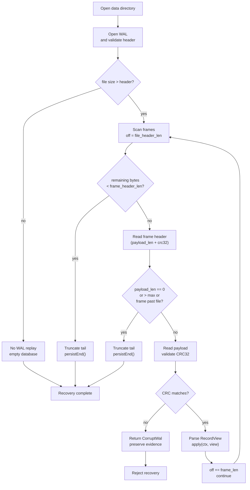

# WAL and Crash Recovery

> **Key files:** `src/storage/wal.zig` (WAL format and I/O), `src/storage/engine.zig` (recovery scheduling and application)

## Overview

The WAL (Write-Ahead Log) is RunaDB's source of truth for crash recovery. **WAL before
MemTable** is an invariant: every write must be fully persisted to WAL before it is applied
to memory state. Recovery replays confirmed writes from WAL to rebuild the in-memory tables.

At the default durability level, the complete commit record is synced to WAL before a
successful `COMMIT` response. Lower durability levels are available for development or
explicitly accepted risk (see ADR-0006).

## Design Goals

- **Crash consistency**: confirmed commits are not lost; only incomplete tail writes are discarded.
- **Versioned format**: the file identifies itself with `magic + version`, so frames from different formats are not misinterpreted.
- **CRC validation**: each frame covers its payload and length field with CRC32 to detect silent corruption.
- **Atomic batch commit**: all operations in an explicit transaction form one WAL frame and are either all applied or all discarded during recovery.
- **Sequential single-file append**: the current implementation uses one WAL file and append-only writes; it does not perform random writes.

## WAL File Format

### File Header

```
Offset  Size  Field
──────────────────────────────
0       7     Magic: "RUNADB_WAL"
7       4     Format version: u32 LE
──────────────────────────────
        11    Total header size = file_header_len
```

- `RUNADB_WAL` identifies a RunaDB WAL file quickly.
- `format_version` is currently **5**. Version 5 records carry a `commit_seq` on `txn_batch` frames and add the `set_commit_seq` record. Version 1–4 files (no `set_serial` for v1, no `commit_seq` for pre-v5 `txn_batch`) are still replayed by this build; a build older than this one rejects newer files with `UnsupportedWalFormat`. The checkpoint path upgrades older files in place when it rewrites the WAL.
- Open validates magic + version; mismatch returns `error.UnsupportedWalFormat` and preserves the file as evidence.

### Frame Layout

WAL consists of variable-length frames immediately after the file header:

```
Offset  Size  Field      Description
──────────────────────────────────────
0       4     len        Payload bytes (u32 LE)
4       4     crc32      CRC32(len_bytes ‖ payload)
8       len   payload    Record type + record data
──────────────────────────────────────
        8+len            Total frame size = frame_header_len + payload_len
```

- **CRC coverage**: `crc32c` computes the four-byte LE representation of `payload_len` concatenated with `payload`. Covering the length prevents a flipped length from being accepted as a different complete frame.
- **One positioned write**: header and payload are written in one `writeAtAll` call. A crash therefore produces either a complete frame or an incomplete tail, not a header-only intermediate state.
- **Maximum payload**: `8 MiB` (`frame_payload_len_max`) prevents a single frame from causing excessive recovery memory use.

### Record Types

| Type | Value | Description |
|------|-----:|-------------|
| `create_table` | 1 | Create a table (table name + column-definition list) |
| `insert` | 2 | Insert one row (table name + value list) |
| `update` | 3 | Update one row (table name + primary-key value + new value list) |
| `delete` | 4 | Delete one row (table name + primary-key value) |
| `add_column` | 5 | Add a column (table name + column definition) |
| `drop_column` | 6 | Drop a column (table name + column name) |
| `set_default` | 7 | Set a DEFAULT expression (table name + column name + expression) |
| `set_not_null` | 8 | Set NOT NULL (table name + column name + enable/disable) |
| `txn_batch` | 9 | Transaction batch commit: an atomic frame containing a `commit_seq` (format v5+) and nested operations |
| `set_serial` | 10 | Checkpoint-only: restore SERIAL counter (table name + i64). Format version 2+. |
| `set_commit_seq` | 12 | Checkpoint-only: restore the published commit watermark (i64). Format version 5+. |

### Record Encoding Details

**Primitive encoding:**

| Type | Encoding |
|------|----------|
| `u16` | 2-byte LE |
| `u32` | 4-byte LE |
| `i64` | 8-byte LE |
| String | `u16(len) + len bytes` (maximum length 65535) |
| Value (null) | `0x00` |
| Value (int) | `0x01 + i64(8 bytes LE)` |
| Value (text) | `0x02 + u16(len) + len bytes` |
| Value (bool) | `0x03 + 0x00/0x01` |
| DefaultExpr | `0x00` (none) / `0x01` (now) / `0x02 + Value` (literal) |
| Column | `str(name) + u8(type_tag) + u8(flags) + DefaultExpr` |
| Column flags | `bit0: pk, bit1: not_null, bit2: unique, bit3: serial` |

**`create_table` payload encoding:**

```
type_byte: u8 = 1
str(table_name)
u16(n_columns)
repeated(n_columns):
  Column
```

**`insert` payload encoding:**

```
type_byte: u8 = 2
str(table_name)
u16(n_values)
repeated(n_values):
  Value
```

**`update` payload encoding:**

```
type_byte: u8 = 3
str(table_name)
Value(pk)  — primary-key value used to locate the row
u16(n_values)
repeated(n_values):
  Value
```

**`delete` payload encoding:**

```
type_byte: u8 = 4
str(table_name)
Value(pk)
```

**`txn_batch` payload encoding (format v5):**

```
type_byte: u8 = 9
u64(commit_seq)
u16(n_ops)
repeated(n_ops):
  u32(op_payload_len)
  op_payload: [type_byte + encoded_op_data]
```

`commit_seq` is the MVCC commit sequence assigned by the single-writer coordinator;
recovery rebuilds the published watermark from it. Nested operations in a `txn_batch` frame may
use the `insert`, `update`, and `delete` encodings without the outer frame header. The entire
batch shares one CRC: a frame is either complete and valid or the entire batch is discarded. A
group of independent transactions may share one durability round via `appendTxnBatchGroup`
without merging their identity or commit order.

## WAL Lifecycle

### Creation

1. `Engine.open()` -> `Wal.open()` opens the `wal` file in `CREATE` mode.
2. If the file is empty, write and sync the header (`magic + version`).
3. Otherwise validate the header.

### Writing

1. `Engine` calls `wal.appendInsert()`, `wal.appendUpdate()`, `wal.appendTxnBatch()`, and so on.
2. `appendPayload()` constructs header + payload and writes them at the current offset with one `writeAtAll`.
3. If `sync_on_append == true` (the default durability level), `syncThrough()` joins or leads a
   group-commit durability round: concurrent appenders that land while a data-sync is in flight
   share that sync. On Linux the durability call is `fdatasync` (file data + size, not unrelated
   inode metadata).

### Recovery

See the next section.

### Reclamation (Target)

- After a checkpoint advances, covered WAL portions may be reclaimed.
- In Phase 0, WAL is one unbounded file. WAL replacement/reclamation will be added with checkpoints.

## Crash Recovery

### Recovery Flow



### Recovery Invariants

1. **Confirmed commits are not lost**: every complete, validated frame represents a confirmed operation and must be replayed exactly.
2. **Unknown or corrupt frames reject recovery**: CRC failure, an unknown record type, or an unparseable format returns `error.CorruptWal`; recovery does not guess at a repair.
3. **Incomplete tails are tolerated**: an incomplete final frame (missing header or payload) is silently truncated while the confirmed prefix remains intact.
4. **Truncation is persisted**: `persistEnd()` data-syncs the new EOF so later appends do not encounter the garbage tail.

### Why CRC Matters

RunaDB's WAL CRC covers both `payload_len` and `payload`. A payload-only CRC would allow damage,
or an attacker, to change the length and reinterpret a valid payload as a different record size
or type. Covering the length detects this corruption immediately.

### Recovery Modes

| Mode (planned) | Behavior | Use case |
|-----------------|----------|----------|
| Strict (default) | Stop at the first corrupt frame and reject recovery | Production, integrity first |
| Tolerate truncation | Truncate an incomplete final frame (current behavior) | Standard crash recovery |
| Skip corruption | Skip corrupt frames and continue | Emergency data salvage |

The current implementation tolerates truncation; strict mode will be added as an option.

### `txn_batch` Recovery

An explicit transaction's write set is stored in a `txn_batch` frame:

- `replayWal` reads the frame; `applyRecord()` identifies `txn_batch`; `forEachTxnBatchOp()` iterates its nested operations.
- The entire batch is applied only when the frame is complete and its CRC is valid; a corrupt or truncated frame is discarded in full.
- This preserves transaction atomicity: recovery cannot expose a partially committed transaction.
- The frame's `commit_seq` advances the published watermark; a checkpoint persists the watermark with `set_commit_seq` so recovery restores it after history is collapsed.

### Failure Model

| Failure | Recovery behavior | Guarantee |
|---------|-------------------|-----------|
| Process crashes during WAL write | Truncate the tail and discard the incomplete frame | Complete confirmed frames are not lost |
| Crash during WAL `fsync` | Same | Same |
| WAL header corruption | `UnsupportedWalFormat`, reject recovery | No guessed repair |
| CRC corruption in the middle of WAL | `CorruptWal`, preserve evidence | Recovery rejected |
| Silent filesystem corruption (bit flip) | CRC detects it -> `CorruptWal` | Recovery rejected |
| Complete frame length flips | CRC detects it -> `CorruptWal` | Recovery rejected |

## Current Implementation vs Target

| Feature | Current (Phase 0) | Target |
|------|----------------|------|
| File layout | Single WAL file; checkpoint rewrites it atomically via `AtomicFile` and publishes a versioned `manifest` boundary record (`src/storage/manifest.zig`) | WAL rotation + manifest + LSM flush |
| WAL reclamation | **Implemented**: checkpoint (`src/storage/checkpoint.zig`) collapses history into the minimal record set that restores committed state; the manifest records the commit watermark and covered catalog objects, and recovery rejects an incompatible or inconsistent manifest | LSM flush + manifest publication |
| Group Commit | WAL-layer shared `fdatasync` rounds among concurrent appenders | Engine commit queue + batched writes + shared durability |
| Recovery modes | Tolerate truncation (implicit) | Strict + tolerant + skip-corruption (configurable) |
| CRC algorithm | CRC32 | Upgradeable to CRC32C |
| WAL compression | None | Optional compression (zstd) |
| WAL tracking | Manifest records the commit watermark and covered catalog objects | Manifest records size and position of closed WALs |
| WAL checksum chain | None | Each new WAL record includes the previous WAL checksum |

## RunaDB Decisions

- [ADR-0006 WAL durability defaults](../adr/0006-wal-durability-defaults.md): sync policy and durability-level selection.
- [Write path and WriteBatch](write-path.md): `txn_batch` and write-set commit path.
- [VFS design](vfs.md): data-directory fencing and positioned I/O, the lower-level abstraction used by WAL.
