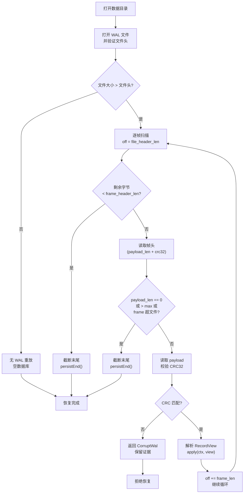

# WAL 与崩溃恢复

> **关键文件：** `src/storage/wal.zig`（WAL 格式与 I/O）、`src/storage/engine.zig`（恢复调度与应用）

## 概述

WAL（Write-Ahead Log）是 Pico 崩溃恢复的事实来源。**WAL 先于 MemTable** 是不变式：每笔写入在应用到内存状态前必须完整持久化到 WAL。崩溃恢复时，从 WAL 重放已确认的写入，重建内存表状态。

默认耐久级别下，`COMMIT` 成功响应前完整提交记录已同步到 WAL。支持降档级别用于开发或明确接受风险的场景（见 ADR-0006）。

---

## 设计目标

- **崩溃一致性**：不丢失已确认提交；仅抛出"末尾截断"的不完整写入。
- **格式版本化**：文件自标识 `magic + version`，不同格式的帧不会互相误解释。
- **CRC 校验**：每个帧的 payload 与长度字段均覆盖 CRC32，检测静默损坏。
- **原子批提交**：显式事务的所有操作为一个 WAL 帧，恢复时要么全应用要么全丢弃。
- **单文件顺序追加**：当前实现为单个 WAL 文件，追加为主，无随机写。

---

## WAL 文件格式

### 文件头

```
Offset  Size  Field
──────────────────────────────
0       7     Magic: "PICO_WAL"
7       4     Format version: u32 LE
──────────────────────────────
        11    Total header size = file_header_len
```

- Magic 值 `PICO_WAL` 用以快速识别 Pico WAL 文件。
- `format_version` 当前为 **1**。格式破坏性变更（帧布局、记录类型编码、校验算法）须递增此版本。
- 打开时验证 magic + version；不匹配时返回 `error.UnsupportedWalFormat` 并保留文件证据。

### 帧布局

WAL 由一系列变长帧组成，紧跟在文件头之后：

```
Offset  Size  Field      Description
──────────────────────────────────────
0       4     len        Payload 字节数（u32 LE）
4       4     crc32      CRC32(len_bytes ‖ payload)
8       len   payload    记录类型 + 记录数据
──────────────────────────────────────
        8+len            Total frame size = frame_header_len + payload_len
```

- **CRC 覆盖**：`crc32c` 计算 `payload_len` 的 4 字节 LE 表示拼接 `payload`。覆盖长度字段防止翻转长度后被接受为不同的完整帧。
- **单次位置写**：帧头部与 payload 在同一 `writeAtAll` 调用中写入，确保崩溃时要么写入完整帧，要么写入"截断末尾"——不会出现头部写入而 body 未写入的中间态。
- **最大 payload 大小**：`8 MiB`（`frame_payload_len_max`），防止单帧过大导致恢复内存问题。

### 记录类型

| 类型 | 值 | 描述 |
|------|-----|------|
| `create_table` | 1 | 创建表（表名 + 列定义列表） |
| `insert` | 2 | 插入一行（表名 + 值列表） |
| `update` | 3 | 更新一行（表名 + 主键值 + 新值列表） |
| `delete` | 4 | 删除一行（表名 + 主键值） |
| `add_column` | 5 | 增加列（表名 + 列定义） |
| `drop_column` | 6 | 删除列（表名 + 列名） |
| `set_default` | 7 | 设置 DEFAULT 表达式（表名 + 列名 + 表达式） |
| `set_not_null` | 8 | 设置 NOT NULL（表名 + 列名 + 启用/禁用） |
| `txn_batch` | 9 | 事务批提交——嵌套多个操作的原子帧 |

### 记录编码细节

**基础类型编码：**

| 类型 | 编码 |
|------|------|
| `u16` | 2 字节 LE |
| `u32` | 4 字节 LE |
| `i64` | 8 字节 LE |
| 字符串 | `u16(len) + len bytes`（最大长度 65535） |
| Value (null) | `0x00` |
| Value (int) | `0x01 + i64(8 bytes LE)` |
| Value (text) | `0x02 + u16(len) + len bytes` |
| Value (bool) | `0x03 + 0x00/0x01` |
| DefaultExpr | `0x00`（none）/ `0x01`（now）/ `0x02 + Value`（literal） |
| Column | `str(name) + u8(type_tag) + u8(flags) + DefaultExpr` |
| 列 flags | `bit0: pk, bit1: not_null, bit2: unique, bit3: serial` |

**`create_table` payload 编码：**

```
type_byte: u8 = 1
str(table_name)
u16(n_columns)
repeated(n_columns):
  Column
```

**`insert` payload 编码：**

```
type_byte: u8 = 2
str(table_name)
u16(n_values)
repeated(n_values):
  Value
```

**`update` payload 编码：**

```
type_byte: u8 = 3
str(table_name)
Value(pk)  — 主键值，用于定位行
u16(n_values)
repeated(n_values):
  Value
```

**`delete` payload 编码：**

```
type_byte: u8 = 4
str(table_name)
Value(pk)
```

**`txn_batch` payload 编码：**

```
type_byte: u8 = 9
u16(n_ops)
repeated(n_ops):
  u32(op_payload_len)
  op_payload: [type_byte + encoded_op_data]
```

`txn_batch` 帧内部嵌套的操作可以是 `insert`、`update`、`delete` 的编码（不含外层帧头）。整个 batch 共享一个 CRC：一个帧要么完整且校验正确，要么整批丢弃。

---

## WAL 生命周期

### 创建

1. `Engine.open()` → `Wal.open()` 打开 `wal` 文件（`CREATE` 模式）。
2. 若文件长度为零，写入文件头（magic + version）并同步。
3. 若文件非空，验证文件头有效。

### 写入

1. `Engine` 调用 `wal.appendInsert()` / `wal.appendUpdate()` / `wal.appendTxnBatch()` 等。
2. `appendPayload()` 构造帧头部 + payload → 一次 `writeAtAll` 写入当前偏移。
3. 若 `sync_on_append == true`（默认耐久级别），立即 `fsync` 确认持久化。

### 恢复（详见下文）

### 回收（目标状态）

- 检查点推进后，已覆盖的 WAL 部分可回收。
- 当前（Phase 0）WAL 为单文件，无限增长。检查点实现后引入 WAL 替换/回收机制。

---

## 崩溃恢复

### 恢复流程



### 恢复不变量

1. **已确认提交不丢失**：WAL 中每个校验通过的完整帧都代表一个已确认的操作。恢复时必须精确重放。
2. **未知/损坏帧导致拒绝**：CRC 校验失败、未知记录类型、无法解析的格式 → `error.CorruptWal`。不猜测修复。
3. **末尾截断可容忍**：文件末尾不完整的帧（头部缺失或 payload 不完整）被静默截断，已确认的前缀帧完整保留。
4. **截断后持久化**：截断操作通过 `persistEnd()`（`fsync`）持久化新 EOF，确保后续追加不会再见到垃圾尾部。

### CRC 校验的重要性

Pico 的 WAL 帧 CRC 覆盖 `payload_len` 与 `payload` 两者：

- 单独 CRC payload 不足：攻击者或损坏可以翻转长度字段，使校验通过的 payload 被解释为不同类型/大小的记录。
- 同时覆盖长度：任何长度字段损坏都会导致 CRC 不匹配，立即被检测。

### 恢复模式

| 模式（计划实现） | 行为 | 适用场景 |
|-----------------|------|----------|
| 严格模式（默认） | 首个损坏帧处停止并拒绝恢复 | 生产环境，数据完整性优先 |
| 容忍截断 | 允许末尾不完整帧被截断（当前行为） | 标准崩溃恢复，宕机后常见 |
| 跳过损坏 | 跳过损坏帧并继续 | 紧急恢复，数据抢救 |

当前实现为容忍截断模式，未来将引入严格模式作为可选项。

---

### `txn_batch` 恢复

显式事务的写集保存在 `txn_batch` 帧中：

- 恢复时，`replayWal` 读取 `txn_batch` 帧 → `applyRecord()` 识别为 `txn_batch` → `forEachTxnBatchOp()` 遍历所有内嵌操作。
- 整个 batch 要么全部应用（帧完整、CRC 正确），要么全部丢弃（帧损坏或末尾截断）。
- 这保证了事务的原子性：恢复后不会出现"部分已提交"的事务。

---

### 故障模型

| 故障场景 | 恢复行为 | 保证 |
|---------|---------|------|
| WAL 写入时进程崩溃 | 末尾截断，丢弃不完整帧 | 已确认的完整帧不丢失 |
| WAL fsync 时崩溃 | 同上 | 同上 |
| WAL 文件头部损坏 | `UnsupportedWalFormat`，拒绝恢复 | 不猜测修复 |
| WAL 中部帧 CRC 损坏 | `CorruptWal`，保留证据 | 拒绝恢复 |
| 文件系统静默损坏（bit flip） | CRC 检测 → `CorruptWal` | 拒绝恢复 |
| 完整帧长度字段翻转 | CRC 检测 → `CorruptWal` | 拒绝恢复 |

---

## 当前实现 vs 目标

| 特性 | 当前（Phase 0） | 目标 |
|------|----------------|------|
| 文件布局 | 单文件 WAL | WAL 替换/轮换 + 检查点 |
| Group Commit | 每次`appendPayload`写入一帧 + 可选同步 | 有界队列 + 批次写入 + 共享 fsync |
| 恢复模式 | 容忍截断（隐式） | 严格 + 容忍截断 + 跳过损坏（可配置） |
| CRC 算法 | CRC32 | 可升级为 CRC32C |
| WAL 压缩 | 无 | 可选压缩（zstd） |
| WAL 追踪 | 无 | Manifest 中记录已关闭 WAL 的大小与位置 |
| WAL 校验链 | 无 | 每个新 WAL 记录前驱 WAL 的校验和（链式验证） |

---

## 参考

- RocksDB [Write-Ahead Log](https://github.com/facebook/rocksdb/blob/main/docs/components/write_flow/03_wal.md)：32 KB 块结构、碎片化、CRC 优化、WAL 回收。
- RocksDB [Crash Recovery](https://github.com/facebook/rocksdb/blob/main/docs/components/write_flow/09_crash_recovery.md)：恢复流程、WAL 恢复模式、截断策略。
- [ADR-0006 WAL 耐久性决策](../adr/0006-wal-durability-defaults.md)：同步策略与耐久级别选择。
- [写入路径与 WriteBatch](write-path.md)：txn_batch 与写集的提交路径。
- [VFS 设计](vfs.md)：数据目录围栏与位置 I/O（WAL 依赖的底层抽象）。
