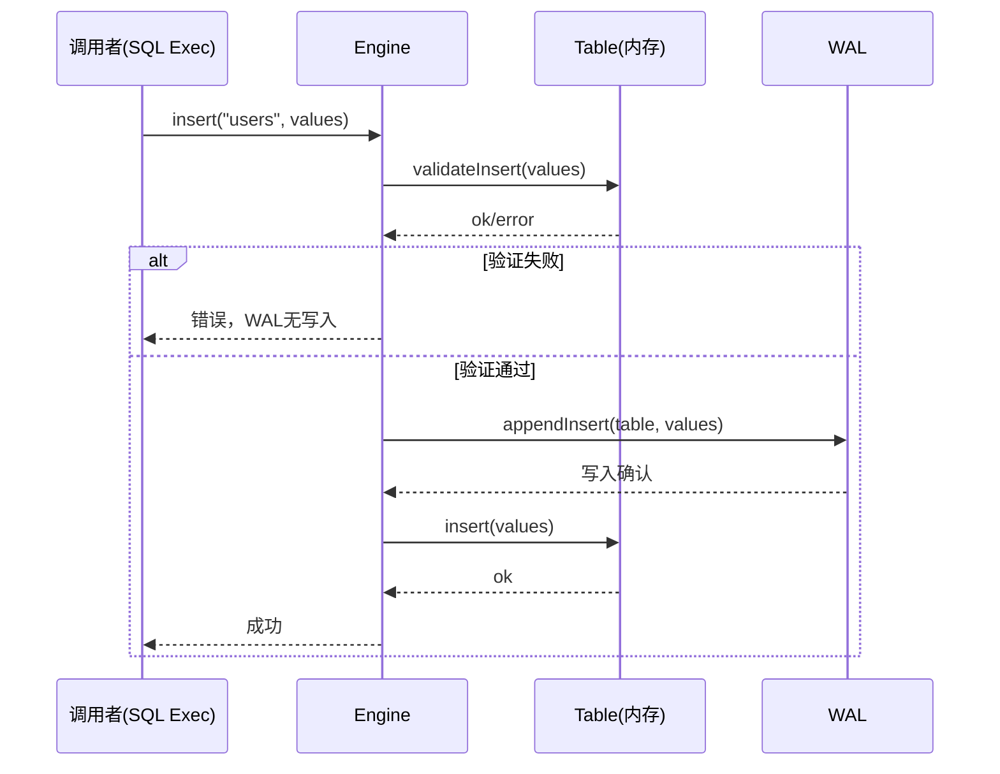
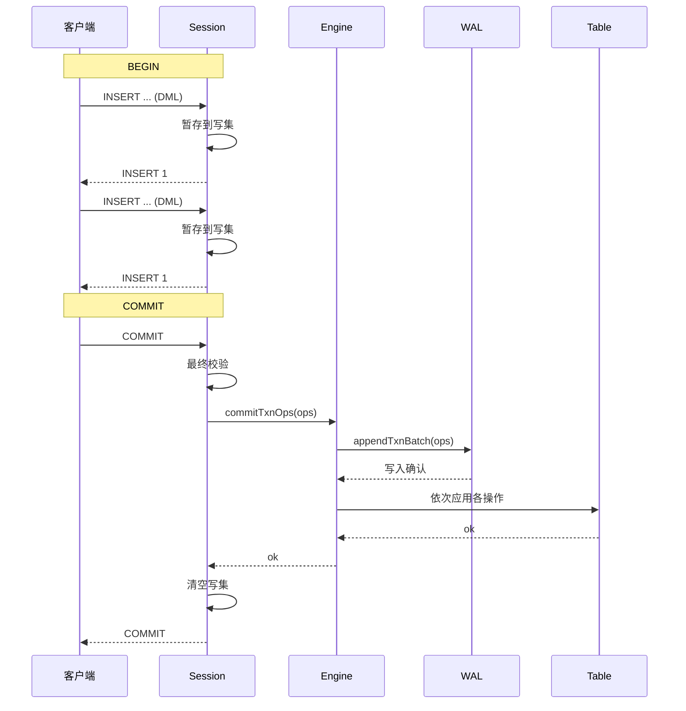
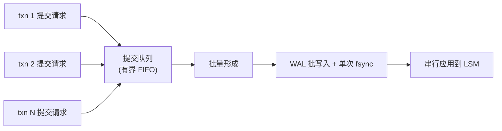

# 写入路径与 WriteBatch

> **关键文件：** `src/storage/engine.zig`（单写者引擎门面）、`src/storage/wal.zig`（`txn_batch` 记录）、`src/txn/session.zig`（事务写集）、`src/sql/exec/insert.zig`、`src/sql/exec/update.zig`、`src/sql/exec/delete.zig`

## 概述

Pico 的写入路径采用**单写者提交排序**（见 ADR-0005）：所有变更的提交与应用通过单写者路径串行化。写操作首先经过约束验证，然后持久化到 WAL，最后应用到内存表（或未来 LSM 结构）。显式事务的多个操作用 `WriteBatch` 的概念（在 Pico 中表现为 `txn_batch` WAL 记录）捆绑为原子单位。

本文件描述写入路径的 API、WriteBatch 的表示与语义、两阶段写入（事务中的暂存与提交）、以及标识单写者批处理的设计。

---

## 写入 API

### 单语句写入（自动提交）

每个 DML 语句在自动提交模式下经过以下路径：

```
客户端 → SQL 解析/执行 → Engine.DML() → Engine.validate()
                                        → Wal.append{Insert|Update|Delete}()
                                        → Table.{insert|update|delete}()
                                        → 返回结果
```

`Engine` 提供的 DML 方法：

| 方法 | 描述 |
|------|------|
| `insert(table, values)` | 插入一行，含约束校验 |
| `update(table, pk, values)` | 按主键更新 |
| `delete(table, pk)` | 按主键删除 |
| `addColumn`, `dropColumn`, `setDefault`, `setNotNull` | DDL 变更 |

所有方法遵循 `validate → WAL → apply` 的三段式顺序：

1. **验证**：检查约束（PK 唯一、unique、not null、类型匹配、列存在）。失败则提前返回错误，**不写入 WAL**。
2. **WAL 追加**：序列化操作并写入 WAL（需同步时执行 fsync）。
3. **应用**：将操作应用到内存表。



### 显式事务写入

显式事务（`BEGIN` / `COMMIT` / `ROLLBACK`）使用两阶段写入：

**暂存阶段（事务活跃期）：**

1. 每个 DML 操作暂存在 `Session` 的私有写集中（`ArrayList(WriteOp)`）。
2. 暂存时对**基础表**执行可见性校验：与已提交行比较 PK 唯一性、unique 约束等。
3. 暂存时对**写集内**执行增量校验：同一事务内先前暂存的操作可见，并参与后续操作的冲突判断。
4. 暂存的写集不对其他连接可见（MVCC 私有写集）。

**提交流程：**

```
客户端 → COMMIT → Session.commit()
                  → Session.validateAgainstWriteSet() (最终校验)
                  → toWalOp() (将写集转为 TxnOp 数组)
                  → Engine.commitTxnOps(ops)
                  → Wal.appendTxnBatch(ops) (一个原子帧)
                  → 对每个 op 应用 Table.{insert|update|delete}()
                  → 清空写集
                  → 返回 COMMIT 成功
```



**回滚流程：**

```
ROLLBACK → Session.rollback()
         → 清空写集（ArrayList 清空）
         → 返回 ROLLBACK
```

回滚不涉及 WAL 写入或引擎操作；仅丢弃内存中的私有写集。

---

## WriteBatch 模型

### Pico 中的 WriteBatch

RocksDB 的 `WriteBatch` 是将多个操作捆绑为原子单位的数据结构。Pico 中对应的概念是 **`txn_batch` WAL 记录**：

```
WAL 帧:
  [len: u32][crc32: u32][type_byte: txn_batch(9)]
  [n_ops: u16]
  [op_1_len: u32][op_1_payload]
  [op_2_len: u32][op_2_payload]
  ...
```

- 每个 `txn_batch` 帧包含一个或多个内嵌操作（insert/update/delete）。
- 帧层面一个 CRC 覆盖整个 payload。
- 恢复时，要么全部操作成功应用（帧完整且校验通过），要么全部丢弃（帧损坏/截断）。
- 这确保事务的**原子性**（要么全做，要么全不做）和**持久性**（确认后不丢失）。

### 与 RocksDB WriteBatch 的对比

| 特性 | RocksDB WriteBatch | Pico txn_batch |
|------|--------------------|-----------------|
| 序列号分配 | 8 字节 seq 占位符，写入前填充 | 无显式序列号（单写者隐式序列化） |
| 操作计数 | 4 字节 count | 2 字节 n_ops |
| 列族 | 内嵌 varint cf_id | 无列族（单数据库，表通过表名标识） |
| 保护信息 | 可选每键 8 字节校验和 | 帧级别 CRC32，不单独保护每个键 |
| Merge 操作 | 支持（kTypeMerge） | 不支持 |
| 范围删除 | 支持（kTypeRangeDeletion） | 不支持 |

### WriteBatch 的原子性边界

Pico 的原子性边界在以下层面保持一致：

- **自动提交单语句**：一个 WAL 帧 = 一个操作（insert/update/delete/DDL），隐式原子。
- **显式事务**：一个 `txn_batch` WAL 帧 = 整个写集，原子提交。
- **DDL 禁止在事务中**（当前实现）：DDL 不在显式事务中暂存，避免元数据与行数据在恢复时的顺序依赖复杂化。

---

## 两阶段写入详解

### 写集暂存

Session 的私有写集类型：

```zig
const WriteOp = union(enum) {
    insert: struct { table: []const u8, values: []value.Value },
    update: struct { table: []const u8, pk: value.Value, values: []value.Value },
    delete: struct { table: []const u8, pk: value.Value },
};
```

- 每个 `WriteOp` 是已暂存操作的完整记录（值已拷贝）。
- 暂存过程中，`visibleRow()` 同时查询基础表和已有写集，保证写集内的增量一致性。
- 暂存仅在事务状态下允许（Session 状态为 `active`）。

### 最终校验

`Session.commit()` 在生成 WAL 记录前执行最终校验：

1. 对所有写集中的操作进行约束重检（PK/unique 冲突）。
2. 读集（SELECT 中读取的行）的校验——若发现已被其他提交修改，则报序列化异常（目标特性；当前未实现读集追踪）。

### 转换为 WAL 操作

`Session.toWalOp()` 将 `ArrayList(WriteOp)` 转换为 `[]TxnOp`：

- 转换过程中释放暂存值的所有权（shallow copy → moved to WAL encoder）。
- `Engine.commitTxnOps()` 接受 `[]TxnOp` 作为参数。

---

## 单写者与 Group Commit（目标设计）

### 当前路径

当前实现中，`Engine` 本身是单写者门面：

- 每个 `commitTxnOps` 调用直接：
  1. `wal.appendTxnBatch(ops)` — 写入一帧（并可能同步）。
  2. 循环 `applyTxnOp(op)` — 串行应用各操作。
- 这提供了简单的正确性，但未做批处理优化。

### 目标：Group Commit 队列



**批处理规则：**

1. 队列中的提交请求被定期（或按数量阈值）收集为一个批。
2. 批内所有写集合并到一个 WAL 批写入（一个或多个帧，但共享一次 fsync）。
3. 分配单调递增的提交序号给批内的每个写集。
4. WAL 确认后，按提交序号顺序逐一应用到 LSM。
5. 在 LSM 确认前向客户端返回成功（默认耐久级别下，WAL 同步已确保持久性）。

**好处：**

- 高争用下 fsync 从每事务一次降为每批一次。
- 多个小事务共享写批的开销。

**当前状态：** 尚未实现。`Engine.commitTxnOps` 每调用一次执行一次 WAL 写入。引入 `commit` 模块时实现队列与批处理（见 ARCHITECTURE.md 的演进顺序）。

---

## 耐久级别与同步策略

| 级别 | `sync_on_append` | 行为 | 保证 |
|------|------------------|------|------|
| 严格（默认） | `true` | 每帧写入后 fsync | 进程崩溃 + 断电模型下不丢失已确认提交 |
| 异步 | `false` | 写入 OS 页缓存，批量同步 | 进程崩溃可能丢失最后若干未同步帧 |
| 手动 | 配置控制 | 应用调用 `SyncWAL()` 显式同步 | 应用层负责 |

- **严格模式**是默认值，也是生产环境的建议配置。
- 异步模式适合开发测试或明确接受数据丢失风险的场景。
- 耐久级别通过 `Engine.open()` 的 `sync_wal` 参数配置，应作为服务端配置项暴露。

---

## 错误处理与回滚路径

| 故障点 | 行为 |
|--------|------|
| 约束校验失败 | 操作未写入 WAL，返回明确错误 |
| WAL 追加失败 | 操作未持久化，引擎返回 I/O 错误 |
| WAL 同步失败 | 同上 |
| 内存表应用失败 | 已写入 WAL 但内存应用失败 → 内部不一致（当前非预期情况） |
| 事务提交时校验失败 | 写集丢弃，返回错误，无需 WAL 清理 |

**未来增强**（参考 RocksDB 的 WAL Truncation on Memtable Failure）：

当 WAL 写入成功但内存应用失败时，记录 WAL 截断位置。下次恢复时跳过该记录。因为当前实现中内存表应用是纯数据结构操作，失败只发生在 OOM 场景。

---

## 当前实现 vs 目标

| 特性 | 当前（Phase 0） | 目标 |
|------|----------------|------|
| 单写者路径 | `Engine` 直接串行处理 | 有界提交队列 + 批处理 |
| Group Commit | 无（每帧单次写入） | 批写入 + 共享 fsync |
| WriteBatch | DML 单操作帧 / 显式事务 txn_batch | 与 VDBE 执行程序集成的写集规划 |
| 提交序号 | 无（引擎隐式顺序） | 单调递增 commit_seq（MVCC 基础） |
| 两阶段写入 | Session 写集暂存 + Engine.commitTxnOps | 读集追踪 + 可串行化校验 |
| 写停滞 | 无 | 基于 WriteBufferManager 的写停滞 |
| 写放大观测 | 无 | 写放大、提交延迟、批大小指标 |

---

## 参考

- RocksDB [Write APIs and WriteBatch](https://github.com/facebook/rocksdb/blob/main/docs/components/write_flow/01_write_apis.md)：WriteBatch 二进制格式、值类型标签、保护信息。
- RocksDB [WriteThread and Group Commit](https://github.com/facebook/rocksdb/blob/main/docs/components/write_flow/02_write_thread.md)：无锁领导者选举、自适应等待、并行内存表写入。
- RocksDB [Write Modes](https://github.com/facebook/rocksdb/blob/main/docs/components/write_flow/06_write_modes.md)：正常/管道/双队列/无序四种写入模式。
- [ADR-0005 单写者 + MVCC 并发模型](../adr/0005-single-writer-mvcc.md)：并发模型选择与取舍。
- [ADR-0006 WAL 耐久性决策](../adr/0006-wal-durability-defaults.md)：同步策略。
- [WAL 与崩溃恢复](wal-and-recovery.md)：写入 WAL 的帧格式与恢复语义。
- [LSM 存储引擎设计](lsm-storage.md)：写入 LSM 的目标路径。
- [并发控制契约](concurrency-control.md)：MVCC 与提交顺序。
