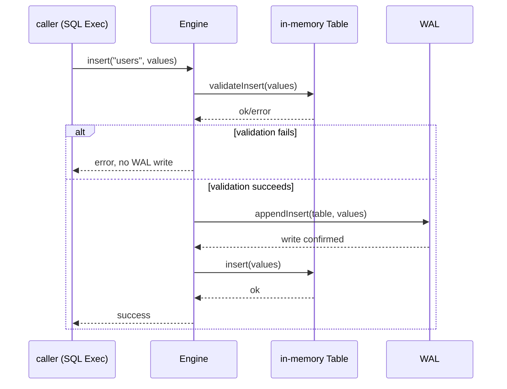
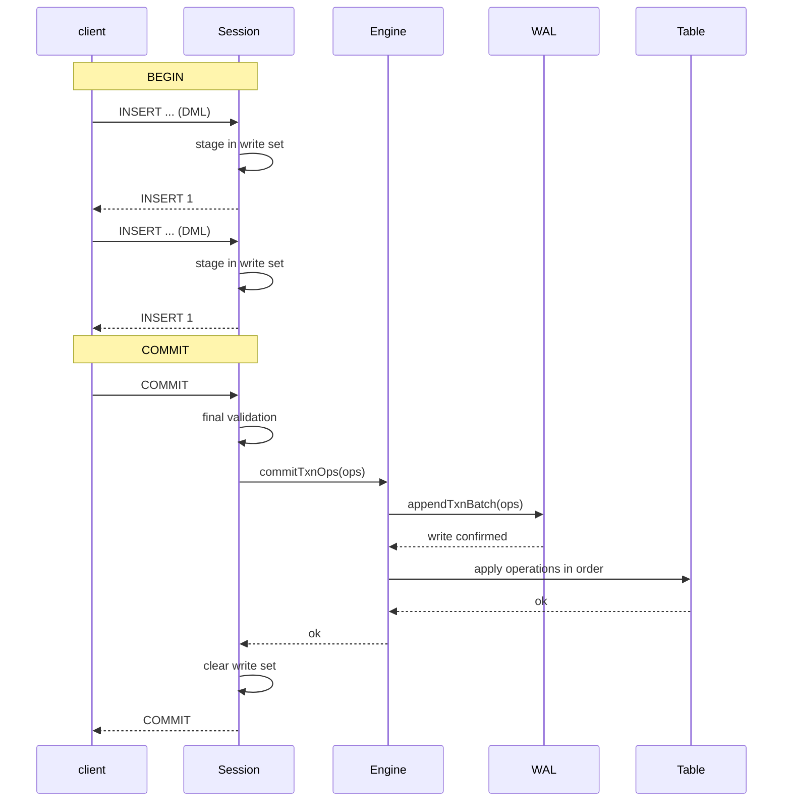
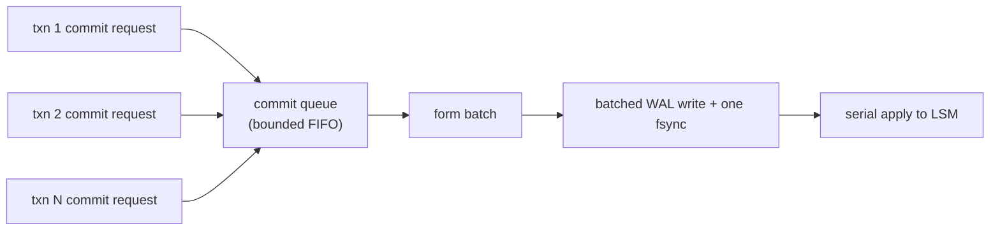

# Write Path and WriteBatch

> **Key files:** `src/storage/engine.zig` (single-writer engine facade), `src/storage/wal.zig` (`txn_batch` records), `src/txn/session.zig` (transaction write set), `src/sql/exec/insert.zig`, `src/sql/exec/update.zig`, `src/sql/exec/delete.zig`

## Overview

Pico uses **single-writer commit ordering** (see ADR-0005): one writer serializes the commit and
application of every change. A write is validated against constraints, persisted to WAL, and
then applied to the in-memory table (or a future LSM structure). Multiple operations in an
explicit transaction are bundled as an atomic `WriteBatch`, represented in Pico by a
`txn_batch` WAL record.

This document describes the write-path API, the WriteBatch representation and semantics, the two
write phases (transaction staging and commit), and the target single-writer batching design.

## Write API

### Single-Statement Writes (Autocommit)

Every DML statement in autocommit follows:

```
Client -> SQL parse/execute -> Engine.DML() -> Engine.validate()
                                           -> Wal.append{Insert|Update|Delete}()
                                           -> Table.{insert|update|delete}()
                                           -> return result
```

`Engine` provides:

| Method | Description |
|------|-------------|
| `insert(table, values)` | Insert one row, including constraint validation |
| `update(table, pk, values)` | Update by primary key |
| `delete(table, pk)` | Delete by primary key |
| `addColumn`, `dropColumn`, `setDefault`, `setNotNull` | DDL changes |

All methods follow `validate -> WAL -> apply`:

1. **Validate** constraints (PK uniqueness, `unique`, `not null`, type matching, and column existence). On failure return early and **do not write WAL**.
2. **Append WAL** by serializing the operation and writing it, including `fsync` when required.
3. **Apply** the operation to the in-memory table.



### Explicit Transaction Writes

Explicit transactions (`BEGIN` / `COMMIT` / `ROLLBACK`) use two write phases.

**Staging while the transaction is active:**

1. Each DML operation is staged in the `Session` private write set (`ArrayList(WriteOp)`).
2. Staging validates visibility against the **base table**, including PK and unique constraints against committed rows.
3. Staging performs incremental validation against the write set, so earlier operations in the same transaction affect later conflict checks.
4. The staged write set is invisible to other connections (a private MVCC write set).

**Commit:**

```
Client -> COMMIT -> Session.commit()
                   -> Session.validateAgainstWriteSet() (final validation)
                   -> toWalOp() (write set to TxnOp array)
                   -> Engine.commitTxnOps(ops)
                   -> Wal.appendTxnBatch(ops) (one atomic frame)
                   -> apply each op with Table.{insert|update|delete}()
                   -> clear write set
                   -> return COMMIT success
```



**Rollback:**

```
ROLLBACK -> Session.rollback()
         -> clear write set (clear ArrayList)
         -> return ROLLBACK
```

Rollback performs no WAL or engine operation; it discards the private in-memory write set.

## WriteBatch Model

### WriteBatch in Pico

RocksDB `WriteBatch` is a data structure that bundles operations into an atomic unit. Pico's
equivalent is the **`txn_batch` WAL record**:

```
WAL frame:
  [len: u32][crc32: u32][type_byte: txn_batch(9)]
  [n_ops: u16]
  [op_1_len: u32][op_1_payload]
  [op_2_len: u32][op_2_payload]
  ...
```

- Each `txn_batch` frame contains one or more nested `insert`/`update`/`delete` operations.
- One frame-level CRC covers the complete payload.
- Recovery either applies every operation in a complete, valid frame or discards the complete damaged/truncated frame.
- This provides transaction **atomicity** and **durability** once the commit is confirmed.

### Compared with RocksDB WriteBatch

| Feature | RocksDB WriteBatch | Pico `txn_batch` |
|------|--------------------|-----------------|
| Sequence allocation | 8-byte seq placeholder filled before write | No explicit sequence; implicitly serialized by the single writer |
| Operation count | 4-byte count | 2-byte `n_ops` |
| Column families | Embedded varint `cf_id` | None; tables are identified by name |
| Protection | Optional 8-byte checksum per key | Frame-level CRC32; keys are not protected individually |
| Merge | Supported (`kTypeMerge`) | Not supported |
| Range deletion | Supported (`kTypeRangeDeletion`) | Not supported |

### WriteBatch Atomicity Boundary

- **Autocommit statement**: one WAL frame equals one operation (DML or DDL), implicitly atomic.
- **Explicit transaction**: one `txn_batch` WAL frame equals the complete write set.
- **DDL is currently forbidden in transactions**: DDL is not staged in an explicit transaction, avoiding complex metadata/row ordering dependencies during recovery.

## Two-Phase Write Details

### Write-Set Staging

The Session private write-set type is:

```zig
const WriteOp = union(enum) {
    insert: struct { table: []const u8, values: []value.Value },
    update: struct { table: []const u8, pk: value.Value, values: []value.Value },
    delete: struct { table: []const u8, pk: value.Value },
};
```

- Each `WriteOp` is a complete staged record with copied values.
- During staging, `visibleRow()` queries both the base table and prior write-set operations to maintain incremental consistency.
- Staging is allowed only when Session state is `active`.

### Final Validation

`Session.commit()` performs final validation before creating the WAL record:

1. Recheck constraints for every write-set operation (PK/unique conflicts).
2. Validate the read set (rows read by SELECT); if another commit changed one, report a serialization failure (target feature; read-set tracking is not implemented yet).

### Conversion to WAL Operations

`Session.toWalOp()` converts `ArrayList(WriteOp)` to `[]TxnOp`:

- Conversion releases staged-value ownership (shallow copy -> moved to the WAL encoder).
- `Engine.commitTxnOps()` accepts `[]TxnOp`.

## Single Writer and Group Commit (Target)

### Current Path

`Engine` is currently the single-writer facade. Each `commitTxnOps` call directly appends one
frame with `wal.appendTxnBatch(ops)` (and may sync), then serially applies each `applyTxnOp(op)`.
This is simple and correct, but it has no batching optimization.

### Target: Group-Commit Queue



**Batch rules:**

1. Periodically or at a count threshold, collect queued commit requests into one batch.
2. Combine the batch's write sets into one WAL batch (one or more frames sharing one `fsync`).
3. Assign monotonically increasing commit sequences to each write set in the batch.
4. After WAL confirmation, apply each write set to LSM in sequence order.
5. Return success to clients before LSM confirmation; at the default durability level WAL sync already provides persistence.

**Benefits:** under high contention, `fsync` calls drop from once per transaction to once per batch,
and small transactions share batch-write overhead.

**Current status:** not implemented. Each `Engine.commitTxnOps` call performs one WAL write.
The `commit` module will add the queue and batching (see the evolution order in
`ARCHITECTURE.md`).

## Durability Levels and Sync Policy

| Level | `sync_on_append` | Behavior | Guarantee |
|------|------------------|----------|-----------|
| Strict (default) | `true` | `fsync` after each frame | Confirmed commits survive process crash and power-loss models |
| Async | `false` | Write to the OS page cache and sync in batches | A process crash may lose the last unsynced frames |
| Manual | Configuration-controlled | The application explicitly calls `SyncWAL()` | The application is responsible |

- **Strict** is the default and recommended production setting.
- Async is suitable for development/testing or explicitly accepted data-loss risk.
- `Engine.open()` configures the durability level through `sync_wal`; expose it as a server setting.

## Error Handling and Rollback Paths

| Failure point | Behavior |
|--------|------|
| Constraint validation fails | Operation is not written to WAL; return an explicit error |
| WAL append fails | Operation is not durable; engine returns an I/O error |
| WAL sync fails | Same |
| In-memory table apply fails | WAL already contains the operation but memory apply failed, an internal inconsistency (not expected currently) |
| Commit-time validation fails | Discard the write set and return an error; no WAL cleanup is required |

**Future enhancement** (following RocksDB WAL truncation on memtable failure): if WAL writing
succeeds but memory application fails, record the WAL truncation position and skip that record
during the next recovery. Current in-memory application is a pure data-structure operation,
so failure is currently expected only for OOM.

## Current Implementation vs Target

| Feature | Current (Phase 0) | Target |
|------|----------------|------|
| Single-writer path | `Engine` processes directly in sequence | Bounded commit queue + batching |
| Group Commit | None (one write per frame) | Batched writes + shared `fsync` |
| WriteBatch | Single-operation DML frames / explicit-transaction `txn_batch` | Write-set planning integrated with the VDBE execution program |
| Commit sequence | None (implicit engine order) | Monotonic `commit_seq` (MVCC foundation) |
| Two-phase write | Session staging + `Engine.commitTxnOps` | Read-set tracking + serializable validation |
| Write stall | None | Write stall based on `WriteBufferManager` |
| Write amplification metrics | None | Write amplification, commit latency, and batch-size metrics |

## References

- RocksDB [Write APIs and WriteBatch](https://github.com/facebook/rocksdb/blob/main/docs/components/write_flow/01_write_apis.md): binary format, value-type tags, and protection information.
- RocksDB [WriteThread and Group Commit](https://github.com/facebook/rocksdb/blob/main/docs/components/write_flow/02_write_thread.md): lock-free leader election, adaptive waiting, and parallel memtable writes.
- RocksDB [Write Modes](https://github.com/facebook/rocksdb/blob/main/docs/components/write_flow/06_write_modes.md): normal, pipelined, two-queue, and unordered write modes.
- [ADR-0005 Single writer + MVCC concurrency model](../adr/0005-single-writer-mvcc.md): concurrency-model tradeoffs.
- [ADR-0006 WAL durability decision](../adr/0006-wal-durability-defaults.md): sync policy.
- [WAL and crash recovery](wal-and-recovery.md): WAL frame format and recovery semantics.
- [LSM storage engine design](lsm-storage.md): target LSM write path.
- [Concurrency control contract](concurrency-control.md): MVCC and commit order.
