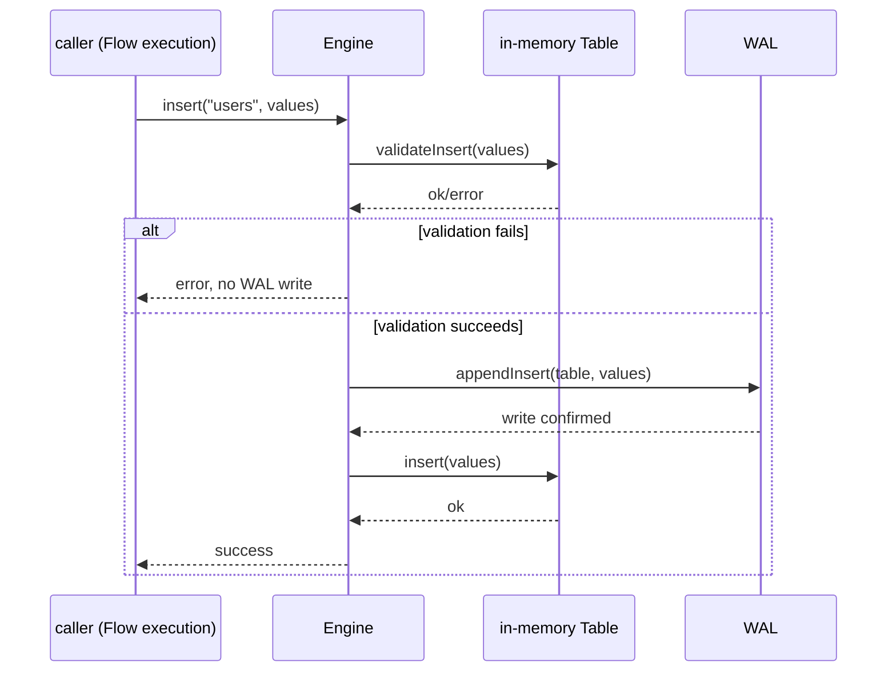
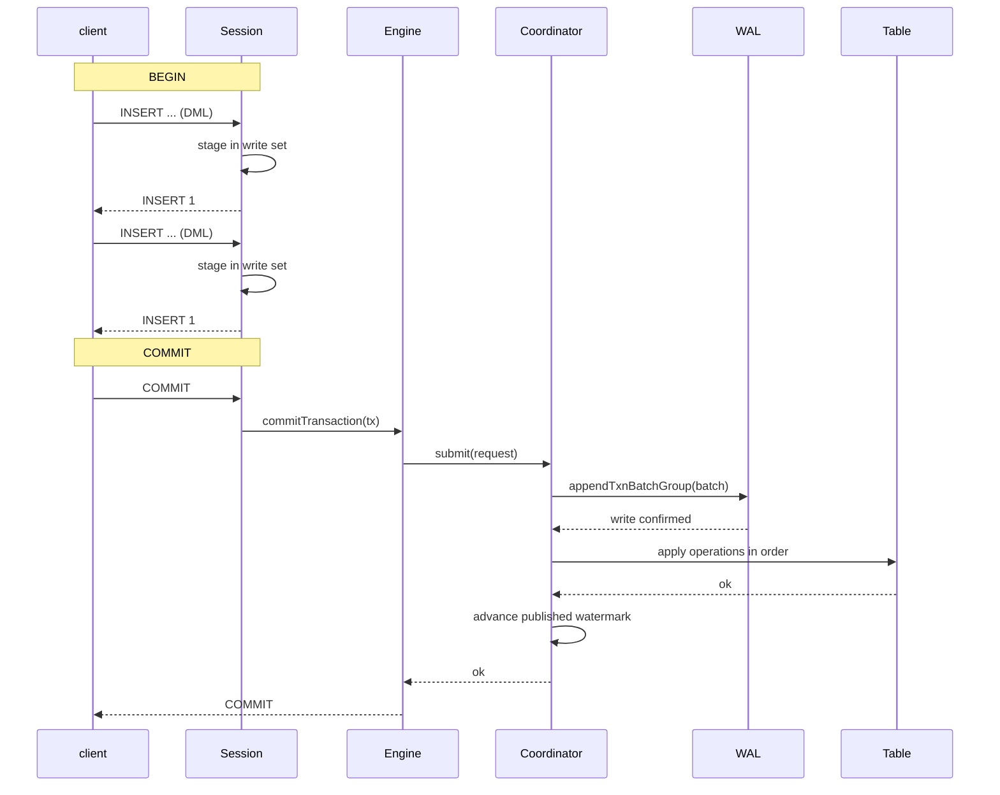
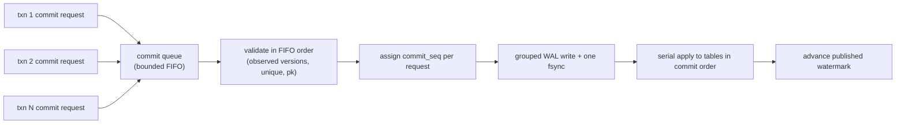

# Write Path and WriteBatch

> **Key files:** `src/txn/transaction.zig` (transaction ownership area), `src/commit/coordinator.zig` (single-writer commit coordinator), and `src/storage/engine.zig` (storage facade that wires them together). Public mutation execution through Runa Flow / Runa Query IR is not yet implemented; the transaction API and the Read Committed read path are exercised by deterministic engine tests.

## Overview

RunaDB uses **single-writer commit ordering** (see ADR-0005): one writer serializes the commit and
application of every change. A write is validated against constraints, persisted to WAL, and
then applied to the in-memory table (or a future LSM structure). Multiple operations in an
explicit transaction are bundled as an atomic `WriteBatch`, represented in RunaDB by a
`txn_batch` WAL record.

This document describes the write-path API, the WriteBatch representation and semantics, the two
write phases (transaction staging and commit), and the target single-writer batching design.

## Write API

### Single-Statement Writes (Autocommit)

Every DML statement in autocommit follows:

```
Validated mutation IR -> transaction write set -> Engine.validate()
                                           -> Wal.append{Insert|Update|Delete}()
                                           -> Table.{insert|update|delete}()
                                           -> return result
```

`Engine` provides:

| Method | Description |
|------|-------------|
| `insert(table, values)` | Insert one row, including constraint validation |
| `update(table, pk, values)` | Update by primary key |
| `delete(table, pk)` | Delete by primary key |
| `addColumn`, `dropColumn`, `setDefault`, `setNotNull` | DDL changes |

All methods follow `validate -> WAL -> apply`:

1. **Validate** constraints (PK uniqueness, `unique`, `not null`, type matching, and column existence). On failure return early and **do not write WAL**.
2. **Append WAL** by serializing the operation and writing it, including `fsync` when required.
3. **Apply** the operation to the in-memory table.



### Explicit Transaction Writes

Explicit transactions (`BEGIN` / `COMMIT` / `ROLLBACK`) use two write phases.

**Staging while the transaction is active:**

1. Each DML operation is staged in the `Transaction` private write set (`ArrayList(WriteOp)`).
2. Staging validates visibility against the **base table**, including PK and unique constraints against committed rows.
3. Staging performs incremental validation against the write set, so earlier operations in the same transaction affect later conflict checks.
4. The staged write set is invisible to other connections (a private MVCC write set).

**Commit:**

```
Client -> COMMIT -> Engine.commitTransaction(tx)
                   -> tx.toWalOps() (write set to TxnOp array)
                   -> Coordinator.submit(request) (bounded admission)
                   -> Coordinator.drain() (single durability round for the batch)
                   -> Wal.appendTxnBatchGroup() (one atomic frame per txn, shared fsync)
                   -> validate + assign commit_seq in FIFO order
                   -> apply each op with Table.{insert|update|delete}()
                   -> advance published watermark
                   -> return COMMIT success
```



**Rollback:**

```
ROLLBACK -> Transaction.rollback()
         -> clear write set (clear ArrayList)
         -> return ROLLBACK
```

Rollback performs no WAL or engine operation; it discards the private in-memory write set.

## WriteBatch Model

### `txn_batch` in RunaDB

RunaDB represents one explicit transaction as one atomic **`txn_batch` WAL record**. Since WAL format v5 the record also carries the commit sequence assigned by the single writer:

```
WAL frame:
  [len: u32][crc32: u32][type_byte: txn_batch(9)]
  [commit_seq: u64]
  [n_ops: u16]
  [op_1_len: u32][op_1_payload]
  [op_2_len: u32][op_2_payload]
  ...
```

- Each `txn_batch` frame contains one or more nested `insert`/`update`/`delete` operations.
- One frame-level CRC covers the complete payload.
- Recovery either applies every operation in a complete, valid frame or discards the complete damaged/truncated frame.
- This provides transaction **atomicity** and **durability** once the commit is confirmed.
- The `commit_seq` lets recovery rebuild the published MVCC watermark from the durable commit prefix.

### `txn_batch` Contract

| Field or property | RunaDB contract |
|------|----------------|
| Commit order | `commit_seq` is a monotonic 64-bit sequence allocated only by the single-writer commit coordinator at publication. Recovery rebuilds the published watermark from these records; a checkpoint persists it with `set_commit_seq`. |
| Operation count | `n_ops` is a 2-byte count. |
| Object identity | Every operation identifies its table by name; RunaDB has no storage namespace field in the record. |
| Integrity | One frame-level CRC32 protects the complete payload; keys are not protected independently. |
| Supported operations | Internal nested `insert`, `update`, and `delete` records only. No public mutation Request currently emits them. |

### WriteBatch Atomicity Boundary

- **Autocommit statement**: one transaction with a one-op write set; one `txn_batch` frame, implicitly atomic.
- **Explicit transaction**: one `txn_batch` WAL frame equals the complete write set.
- **DDL is currently forbidden in transactions**: DDL is not staged in an explicit transaction, avoiding complex metadata/row ordering dependencies during recovery.

## Two-Phase Write Details

### Write-Set Staging

The transaction private write-set type is (see `src/txn/transaction.zig`):

```zig
const WriteOp = struct {
    table: []u8,
    pk: value.Value,
    values: []value.Value,
    op: TxnOp.Tag,
    observed_version: ?u64,  // for update/delete targets
    bytes: u64,
};
```

- Each `WriteOp` is a complete staged record with copied values.
- During staging, the engine queries both the base table and prior write-set operations to maintain incremental consistency (read-your-writes).
- Staging is allowed only when the transaction state is `active`.

### Final Validation

`Engine.commitTransaction(tx)` performs the final validation at the coordinator before the WAL record is published:

1. The coordinator rechecks constraints for every write-set operation against the published tables plus the round shadow (PK/unique conflicts, including other requests accepted earlier in the same drain).
2. Update/delete targets are revalidated against their observed row versions; a changed version fails with `WriteWriteConflict`.
3. Read-set tracking for serializable validation is a target feature; it is not implemented yet.

### Conversion to WAL Operations

`Transaction.toWalOps()` converts `ArrayList(WriteOp)` to `[]TxnOp`:

- Conversion releases staged-value ownership (shallow copy -> moved to the WAL encoder).
- `Coordinator.Request` accepts `[]TxnOp` plus a parallel `[]?u64` observed-version array.

### Read Committed Read Path

Reads through an explicit transaction use Read Committed visibility (see
[concurrency control](concurrency-control.md)): the engine merges the private
write set over committed state instead of reading the live tables alone.

- `Engine.selectAllTx(tx, table)` returns committed rows with the transaction's
  own staged rows substituted in place: the effective (last staged) insert or
  update for a touched primary key supplies the row values, a staged delete
  hides the row, and private inserts that do not exist in committed state
  append new rows. Committed rows the transaction has not touched are cloned
  unchanged, so the result never aliases the write set or a live table.
- `Engine.selectByPkTx(tx, table, pk)` is the point-read form: a staged
  insert/update returns the write-set values, a staged delete returns no row,
  and otherwise the committed row is returned.
- `flow.executeTx` runs relation `emit` over the merged row set, applying the
  same projection, `where`, and `limit` pipeline as a committed read. Text cell
  values are copied so a result survives the merged read being released.

Because the single writer publishes only after WAL durability, a statement
read observes the latest committed state at its start; Read Committed does not
retain row history for the transaction, so two statements in one transaction
may observe intervening commits. Version retention for reads over older
snapshots is implemented (roadmap Phase 5): row versions carry a creation
commit sequence, superseded versions are retained with a deletion interval,
and a snapshot read interprets only versions committed at or before its
starting watermark. On-disk LSM storage remains Phase 5 target work.

## Single Writer and Group Commit

`Engine` routes every DML write through the commit coordinator in `src/commit/coordinator.zig`. A
drain collects all queued requests into one batch, validates them in FIFO order (including
observed-version write-write conflicts), assigns one `commit_seq` per accepted request, appends
all their `txn_batch` frames as one group (`wal.appendTxnBatchGroup`), then applies them in
commit order, advancing the published watermark after each. The WAL layer shares the durability
round across the whole batch, so concurrent small transactions amortize `fdatasync` without
merging their identity or reordering them.

### Implemented: Group-Commit Drain



**Batch rules:**

1. A drain collects the queued commit requests into one batch.
2. Each request keeps its own `commit_seq` and its own `txn_batch` frame; the frames share one `fsync` (`appendTxnBatchGroup`).
3. Commit sequences are assigned monotonically in FIFO order; a failed request never consumes a visible sequence.
4. After WAL confirmation, each write set is applied to the tables in sequence order.
5. The published watermark advances after each accepted request, so readers never observe a later commit before an earlier one.

**Benefits:** under high contention, `fsync` calls drop from once per transaction to once per batch,
and small transactions share batch-write overhead.

**Current status:** implemented for the engine transaction path and deterministically tested
(including the bounded queue and a group drain that shares one durability round). The `commit`
module owns the queue and sequence counters; `storage/engine` wires them to tables and WAL through
comptime hooks, keeping the coordinator independent of the engine module.

### Commit Request Contract (Target)

The boundary between `txn` and the single writer is a complete, immutable commit request. It
must contain enough logical information for the writer to make one deterministic decision; the
writer must not revisit the Connection, rerun Request source, or depend on a mutable execution object.

| Field | Owner before queueing | Purpose at the single writer |
| --- | --- | --- |
| `read_seq` | `txn` | Establishes which published write-range history must be checked. |
| Read conflict ranges | `txn` | Represents point, index, table, and catalog dependencies that could make the transaction's reads stale. |
| Write conflict ranges | `txn` | Is published into ordered conflict history after acceptance and protects later readers. |
| Observed-version stamps | `txn` | Revalidates rows targeted by update or delete against the published state. |
| Logical write set | `txn` | Supplies constraint validation, WAL encoding, and atomic catalog/table/index publication. |
| Durability level and result route | `connection` / `txn` | Determines the WAL persistence boundary and where a completion may be delivered; neither changes commit order. |

The writer processes requests in FIFO queue order. For each request it compares the read ranges
with writes published after `read_seq`, rechecks row and constraint invariants against earlier
accepted requests in the same round, and either rejects it or assigns the next `commit_seq`.
An accepted request contributes its write ranges before the next request is validated. Therefore,
two overlapping requests in one group-commit round have the same outcome they would have had if
the writer had processed them as separate rounds in that order.

### Write-Intensive Admission and Progress

The commit queue is a protection boundary, not an unbounded waiting room. It has explicit limits for request count and staged bytes; a request also has limits for operation count, encoded WAL size, conflict-range count, and conflict-range bytes. Connection and operation admission occurs before a strict transaction is issued a snapshot whenever possible; range limits are enforced as dependencies are collected and before a request enters the queue. When a limit is reached, RunaDB applies bounded backpressure and then rejects new work with an explicit retryable overload outcome rather than accepting unlimited memory growth or allowing a hot connection to monopolize the writer.

Group commit amortizes WAL sync only. It must not merge independent transactions, reorder accepted requests, skip per-transaction conflict/constraint validation, or make a group visible atomically as though it were one user transaction. Within a round, validate and assign commit sequences one request at a time, then write one or more complete transaction records before their shared strict durability round. A failed request does not prevent later independent requests from being considered, and never consumes a visible commit sequence.

Under sustained write load, RunaDB prioritizes predictable degradation:

1. Keep a small bounded batching window and a maximum batch byte/count budget, so queueing delay has an upper bound under normal admission.
2. Reserve queue capacity and WAL/I/O progress for commit, recovery, and manifest publication; compaction may prepare files concurrently but must yield before it exhausts the resources needed to make commits durable.
3. Reject oversized write sets before they can monopolize a group-commit round. Clients split independently valid work only when their application semantics permit it.
4. Measure hot primary-key, unique-index, and future strict-OCC range conflicts separately from queue or WAL saturation. Retries cannot fix a saturated device, and extra batching cannot fix a single hot logical key.
5. Return conflict and overload outcomes promptly. RunaDB Client drivers should retry only transactions declared retryable, using capped exponential backoff with jitter and an idempotency strategy for externally visible effects; the server never retries a transaction on the client's behalf.

Hot-key contention is primarily a data-model and workflow problem. Where application semantics allow it, distribute independently accumulated values across multiple rows and aggregate them later, or append independent work records and process their order-sensitive effects separately. These techniques preserve the normal strict path because they reduce overlap in logical write ranges; they are not permission to use stale reads, omit conflict ranges, or silently weaken constraints. Any future atomic-update operation or server-side aggregation must define its conflict ranges, interaction with reset/constraint operations, IR form, WAL representation, recovery behavior, and metrics before it is advertised in Runa Flow.

The first implementation should expose queue depth/bytes, admission rejections, queue wait, batch count/bytes, successful commits, conflict outcomes by kind, WAL append and sync latency, write-set size, and compaction backlog. Report these by durability level and at least p50/p95/p99, so a low-latency async workload cannot mask strict-durability tail latency. Any per-connection quota or fairness policy is runtime scheduling, not a change to commit order.

## Durability Levels and Sync Policy

| Level | `sync_on_append` | Behavior | Guarantee |
|------|------------------|----------|-----------|
| Strict (default) | `true` | Data-sync each durability round | Confirmed commits survive process crash and power-loss models |
| Async | `false` | Write to the OS page cache and sync in batches | A process crash may lose the last unsynced frames |
| Manual | Configuration-controlled | The application explicitly calls `SyncWAL()` | The application is responsible |

- **Strict** is the default and recommended production setting.
- Async is suitable for development/testing or explicitly accepted data-loss risk.
- `Engine.open()` configures the durability level through `sync_wal`; expose it as a server setting.

## Error Handling and Rollback Paths

| Failure point | Behavior |
|--------|------|
| Constraint validation fails | Operation is not written to WAL; return an explicit error |
| WAL append fails | Operation is not durable; engine returns an I/O error |
| WAL sync fails | Same |
| In-memory table apply fails | WAL already contains the operation but memory apply failed, an internal inconsistency (not expected currently) |
| Commit-time validation fails | Discard the write set and return an error; no WAL cleanup is required |

**Future enhancement**: if WAL writing succeeds but memory application fails, record the WAL
truncation position and exclude that record during the next recovery. Current in-memory
application is a pure data-structure operation, so failure is currently expected only for OOM.

## Current Implementation vs Target

| Feature | Current | Target |
|------|----------------|------|
| Single-writer path | Commit coordinator with a bounded queue and FIFO drain | Same, wired to the connection runtime |
| Group Commit | `appendTxnBatchGroup` shares one durability round across a drain batch | Engine commit queue + batched writes + shared `fsync` (implemented) |
| WriteBatch | `txn_batch` frames carrying `commit_seq` | Write-set planning integrated with validated Runa Query IR execution |
| Commit sequence | Monotonic `commit_seq` allocated by the coordinator, rebuilt from WAL on recovery | Same (MVCC foundation) |
| Two-phase write | `txn` write-set staging + coordinator commit | Read-set tracking + serializable validation |
| Conflict detection | Observed-version write-write conflicts, PK and unique revalidation in the round | Range-history strict-OCC |
| Write stall | Bounded admission (`CommitQueueFull`) and reserved-WAL-capacity admission (`WalReservationExhausted`, a retryable overload outcome) | Explicit retryable overload; LSM/compaction pressure feeds back before resource exhaustion |
| Write amplification metrics | Coordinator commit/conflict/rejection counters | Write amplification, queue/admission, conflict, commit-latency, and batch-size metrics |

## RunaDB Decisions

- [ADR-0005 Single writer + MVCC concurrency model](../adr/0005-single-writer-mvcc.md): concurrency-model tradeoffs.
- [ADR-0006 WAL durability decision](../adr/0006-wal-durability-defaults.md): sync policy.
- [WAL and crash recovery](wal-and-recovery.md): WAL frame format and recovery semantics.
- [LSM storage engine design](lsm-storage.md): target LSM write path.
- [Concurrency control contract](concurrency-control.md): MVCC and commit order.
